# Sobolev Validity in Kilonova Ejecta — Results Report

**Status:** Phase 0 through the validity maps and mechanism isolation, complete
— findings F1–F14, 13 figures, 68 tests. **Date:** 2026-08-18. **Repo:** `zhuygln/revisit_sobolev`.

**Manuscript:** [paper/manuscript.pdf](paper/manuscript.pdf) — the paper drawn
from this report, written for readers without a radiative-transfer background.
Companion: [lab_notebook.md](lab_notebook.md) (chronological log, including
dead ends and fixes). Planning inputs, preserved unmodified:
[babystep_plan.md](babystep_plan.md), [research_requirements.md](research_requirements.md).

---

## 1. Research question

> How large is the error introduced by the Sobolev approximation in r-process
> (kilonova) ejecta, and where in parameter space does it matter?

The strategy (per the planning documents) is not to build a kilonova pipeline,
but to construct a small, fully-controlled harness in which the *same* model,
atomic data, and populations are pushed through resolved-profile and
Sobolev-class line treatments, and the difference is measured.

## 2. The three-way harness

Every experiment from Week 2 onward runs the same physical setup through three
independent calculations:

| Leg | Code | Method |
|---|---|---|
| Analytic | pencil & paper (+ numpy) | Sobolev optical depths, p-averaged over the core disk |
| Deterministic | `sobolev/formal_transfer.py` | formal solution of dI/ds = −αI + j along impact-parameter rays |
| Monte Carlo | SEDONA (public `dnkasen/pubsed`) | resolved bound-bound **and** expansion-opacity modes |

Agreement of the first two with SEDONA's *resolved* mode validates the
harness; the gap to SEDONA's *expansion-opacity* mode is the measured
Sobolev-class error, Δ_Sob.

### 2.1 Geometry and conventions

- 1-D homologous shell (v = r/t) around a blackbody core; rays with
  p < r_core start at the core with I = B_ν(T_core); envelope rays start at 0.
- Pure-absorption LTE: S = B_ν(T_shell), `opacity_epsilon = 1`, no electron
  scattering, no radiative equilibrium (T fixed at the model value).
- Shell temperatures are chosen so B_ν(T_shell) ≈ 0 in the band — the line
  acts on the core continuum only, which all three legs treat identically.
- Comoving frequency to first order: ν′ = ν(1 − z/ct); resonance surfaces are
  z = const planes for every ray (a special property of homologous flow).

### 2.2 Population control

SEDONA computes LTE (Saha–Boltzmann) populations internally. To guarantee
*identical* populations across legs (research_requirements.md §17), the
SEDONA atomic-data files are **generated from the same source data the Python
side uses**, with ionization disabled (χ = 10⁵ eV), so both codes run
Boltzmann over byte-identical level lists. Verified in the SEDONA gas state
(e.g. n_e/n_H = 10⁻¹⁰ in the minimal model).

## 3. Infrastructure

### 3.1 Python package (`sobolev/`)

| Module | Contents | Key validation |
|---|---|---|
| `constants.py` | CGS constants; σ_cl = πe²/m_ec **derived, not hardcoded** | an earlier hardcoded value was wrong by 18% — caught by re-deriving |
| `profiles.py` | Gaussian + Voigt (Faddeeva/`wofz`) | ∫φdν = 1 to 1e-6; Voigt→Gaussian at γ=0 to 1e-12; Lorentzian wing amplitude analytic |
| `optical_depth.py` | resolved τ_exact, Sobolev τ_S, tanh gradient sweep | τ_exact → τ_S to 2×10⁻¹⁶; ε² breakdown law |
| `populations.py` | partition function, Boltzmann fractions from GSI levels | two-level closed form; T→0/∞ limits; per-g monotonicity on real La II |
| `atomic_data.py` | GSI file parser (transitions *and* levels), spacing stats | format regression on committed 20-row excerpts |
| `formal_transfer.py` | the deterministic solver (§2); Gaussian or Voigt profiles, optional truncation | blackbody-sphere luminosity exact; e^−τs trough; 2-line independence & blend; emission fill-in |
| `spectra.py` | **the one** band-ratio convention for SEDONA spectra: continuum-ratio normalization, margin clear of the final bin | null spectrum returns exactly 1; scale- and Planck-slope-invariant; known trough recovered |
| `sobolev_leg.py` | p-averaged per-line Sobolev attenuation; `damp` switches to the expansion cap | single line → exp(−τ_S) to 1e-12; damp variant → exp(−(1−e^−τ)); pop_frac scales τ; partial shadowing bracketed |

Test suite: **68 tests, all green** (`pytest`).

### 3.2 SEDONA build (WSL2, no root)

Public release `github.com/dnkasen/pubsed`, built via
`src/makefiles/Makefile.wsl` (kept in the clone, not this repo):
GSL + HDF5 + OpenMPI from a micromamba env at `~/personal/sedona-deps/env`,
Lua 5.1.5 built in its source tree, `OMPI_CXX=g++` to point the conda MPI
wrapper at the system compiler. `sedona.h` hardcodes `MPI_PARALLEL`, so MPI is
mandatory; single-rank runs need no `mpirun`. Examples need
`SEDONA_HOME=~/personal/pubsed` and — important — the **full environment**
(a sanitized env fails with rc=14 from the OpenMPI runtime).

### 3.3 Atomic data

GSI Database for Kilonova Radiative Transfer (Flörs et al.), Zenodo record
**19335084** (latest under concept DOI `10.5281/zenodo.15835360`; paper DOI
`10.1103/jxqw-7ynk`), CC-BY 4.0. La II: 472 levels, 17,743 E1 transitions,
calibration flags `xmatch`/`shifted`. Raw files gitignored under `data/`
(provenance table in `data/README.md`); 20-row excerpts committed under
`tests/data/` for format regression. Internal consistency check: f from the
`A` column vs f from `Log(gf)` agree to 1.5×10⁻⁴ across the study window.

## 4. Experiments and results

### 4.1 Phase 0A — Sobolev limit reproduced (Figure 1, left half)

Single line, constant population, homologous slab. The resolved integral
τ_exact converges to the analytic τ_S:

| grid points | E_Sob |
|---|---|
| 201 | 8.2×10⁻¹ |
| 2,001 | 1.0×10⁻⁴ |
| 20,001 | 2.2×10⁻¹² |
| 200,001 | **2.0×10⁻¹⁶** (machine precision) |

The convergence study is itself a test: an unconverged grid mimics a physical
Sobolev deviation.

### 4.2 Phase 0B — controlled breakdown (Figure 1)

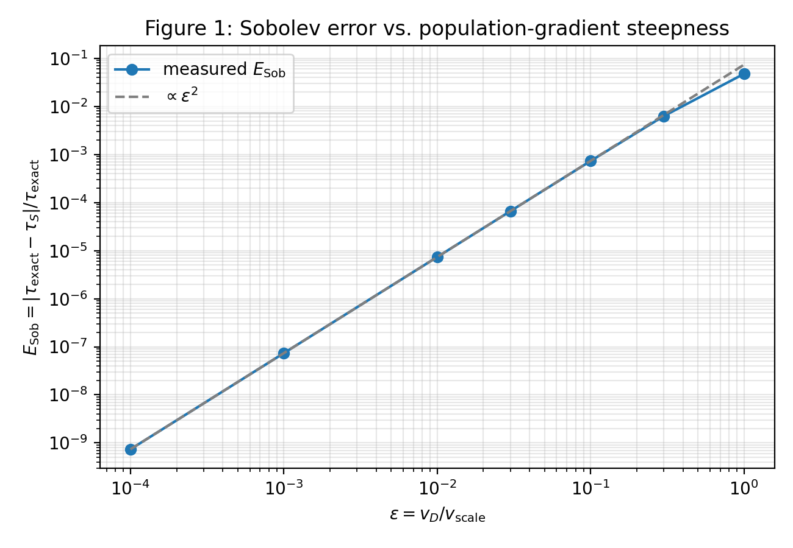

tanh population gradient of scale v_scale; control parameter
ε = v_D/v_scale. Measured E_Sob follows an exact ε² power law (log-slope
2.0000) from 10⁻⁴ to ~0.3, reaching **4.8% at ε = 1**.

**Finding F1 (symmetry cancellation).** With the resonance at the tanh
*center*, the error cancels identically — the Gaussian is even and the tanh
odd (first order), and the center is the inflection point where n″ = 0
(second order). The experiment only works with the resonance placed
off-center (u = 0.5 used throughout). Consequence: validity diagnostics built
on the gradient magnitude G = v_D|d ln n/dv| alone are *conservative* — the
true error depends on where the resonance sits on the gradient.

### 4.3 Phase 0C — line crowding in real data (Figure 2)

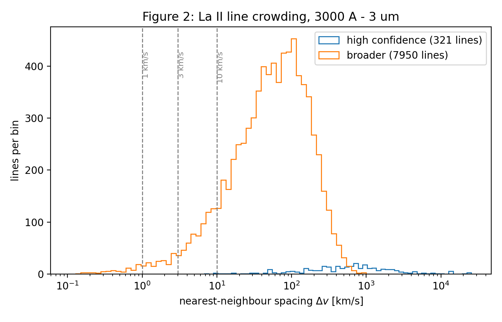

Nearest-neighbour velocity spacings of GSI La II lines, 3000 Å–3 μm window:

| subset | lines | P(Δv<1 km/s) | <3 | <10 |
|---|---|---|---|---|
| high confidence (both levels `xmatch`, log gf > −1) | 321 | 0.0% | 0.0% | 1.2% |
| broader (`xmatch`/`shifted`, log gf > −2) | 7,950 | 1.0% | 3.3% | 11.3% |

The thermal-width crowding regime **exists** in calibrated single-ion data;
multi-ion blends only add lines. (Crowding is necessary, not sufficient, for
transport consequences — the harness measures the consequences.)

### 4.4 Phase 0D / Week 1 — SEDONA runs (Figure 3)

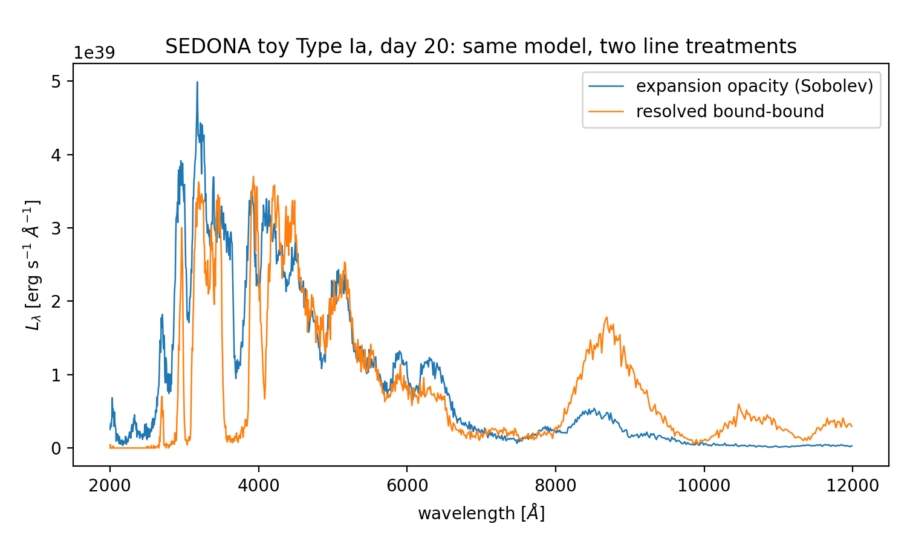

`spherical_lightbulb` smoke test: 2×10⁵ particles, 1.1 s. Type Ia toy pair
(`param_d20_lte_exp` vs `param_d20_lte_bb`, identical but for the line
treatment):

**Finding F2 (cost).** Same model, same 4 iterations: expansion opacity
**14 s**, resolved bound-bound **88 min** — a **378×** ratio, empirically
confirming the frequency-resolution cost analysis (babystep_plan.md §11) and
the necessity of narrow wavelength windows.

Physics: the resolved treatment blankets the UV harder and moves ~3× more
flux into 8000–12000 Å — the UV→NIR redistribution mechanism relevant to
lanthanide-rich ejecta (toy model; qualitative).

### 4.5 Week 2 — solver validation and the minimal model (Figure 4)

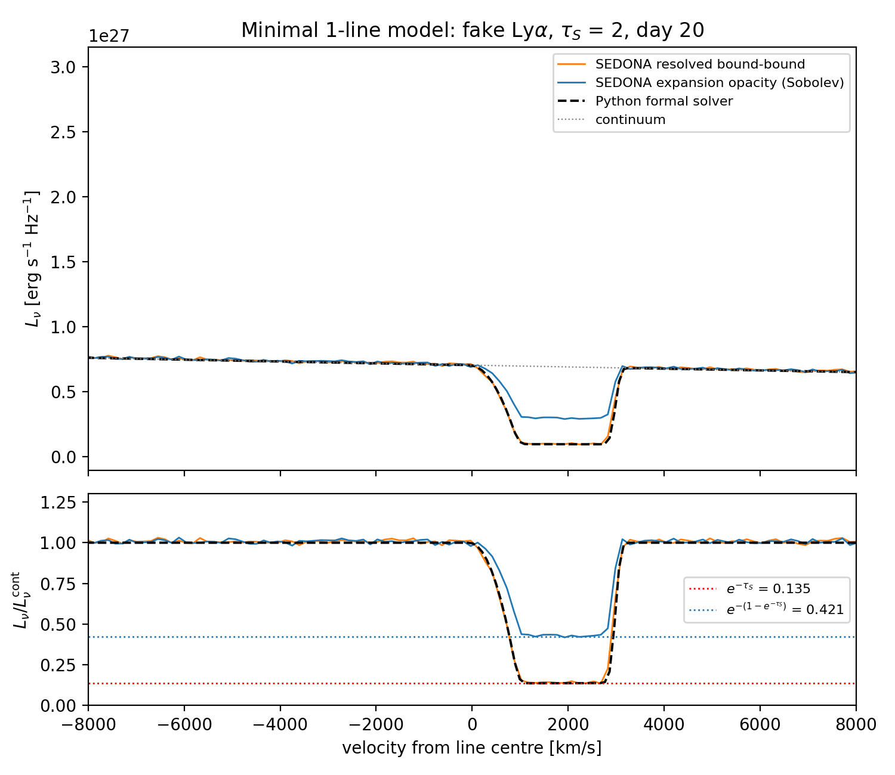

Minimal 1-element/1-ion/1-line model: SEDONA's shipped 2-level atom (fake
Ly-α, f = 0.6647), τ_S = 2, neutral 2000 K shell. Trough depths against
analytic e^−τs = 0.1353:

| leg | trough |
|---|---|
| Python formal solver | 0.1372 |
| SEDONA resolved bound-bound | 0.1420 |
| SEDONA expansion opacity | **0.4285** |

**Finding F3 (frozen-snapshot artifact — see §4.14).** A resonance at
z/ct = 7.7% produced a trough matching exp(−τ_S(1−z/ct)) to four digits
rather than exp(−τ_S). Read first as a frame ambiguity and then as the
leading relativistic correction; **both readings were wrong**. It is an
artifact of integrating a frozen snapshot of the ejecta. The physical law is
τ/τ_S = 1/γ, which has no first-order term. Superseded by F11.

**Finding F4 (expansion opacity ≠ Sobolev line transfer).** The
expansion-opacity trough is not e^−τs but **exp(−(1−e^−τs)) = 0.4212**
(measured 0.4285): a photon crossing one resonance is attenuated by the
bin-averaged opacity, capped at one "effective τ" per crossing. For a single
strong line the two differ by 3.2× in transmitted flux. "Sobolev mode" in
transport codes usually means expansion opacity — the distinction matters.

### 4.6 Week 2 — the 2 → 20 line ladder (Figure 5)

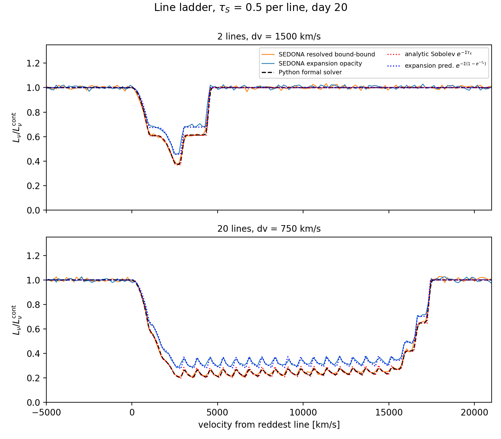

Custom GSI-format SEDONA atoms: 2 lines at 1500 km/s separation; 20-line
forest at 750 km/s; τ_S = 0.5 per line. Forest-center depth, five ways:

| leg | depth |
|---|---|
| analytic Sobolev, p-averaged | 0.2405 |
| Python formal solver | 0.2407 |
| SEDONA resolved | 0.2435 |
| analytic expansion prediction | 0.3194 |
| SEDONA expansion | 0.3257 |

The resolved trio locks to ~1% and reproduces the sawtooth tooth-for-tooth.

**Finding F5 (the error is per-resonance).** Expansion opacity follows its
own per-line (1−e^−τ) substitution: the error does **not** average away with
line count — only as τ → 0. Expansion opacity is a *weak-line* approximation,
not a many-line one.

Technical notes that will save future time: (i) the analytic staircase must
be p-averaged over the core disk — resonance planes at z < r_core are crossed
by only the outer rays, and plane-counting without the average is visibly too
shallow; (ii) SEDONA atom files require the group attributes
`n_ions/n_levels/n_lines` — the reader segfaults without them.

### 4.7 Weeks 3–4 — real La II forest (Figure 6)

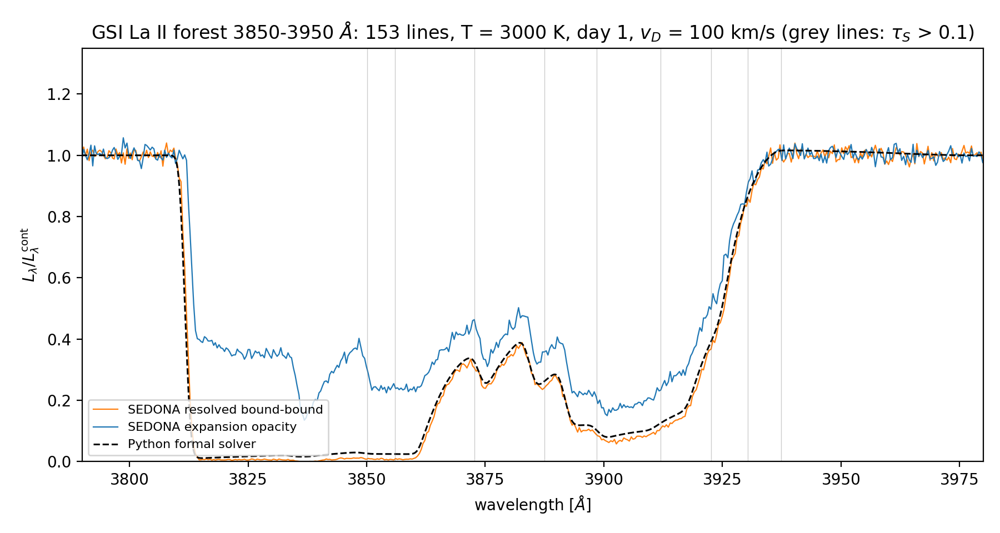

Window 3850–3950 Å (auto-selected for the best τ distribution): 153
calibrated La II lines; τ_S > 1: 3 (max 5.0), 0.1–1: 6. Conditions
T = 3000 K, day 1, shell 1000–3000 km/s, v_D = 100 km/s, n_ion = 2146 cm⁻³
(ρ = 5.0×10⁻¹⁹ g/cm³). Band-averaged L/L_cont over 3800–3955 Å:

| leg | band flux |
|---|---|
| Python formal solver | 0.3583 (worldline default) |
| SEDONA resolved | 0.3426. Like-for-like — emission off (F8) *and* solver in frozen mode to match SEDONA's frozen transport (§4.14) — the gap is **−0.53%** |
| SEDONA expansion | 0.4965 (**Δ_Sob = +44.9%**) |

The resolved complex saturates to black across 3812–3860 Å; expansion opacity
never drops below ~0.2. Real forests fail *worse* than the uniform ladder
(+45% vs +35%) because they are strong-line dominated and (1−e^−τ) caps each
crossing.

### 4.8 Weeks 3–4 — first validity-map slice (Figure 7)

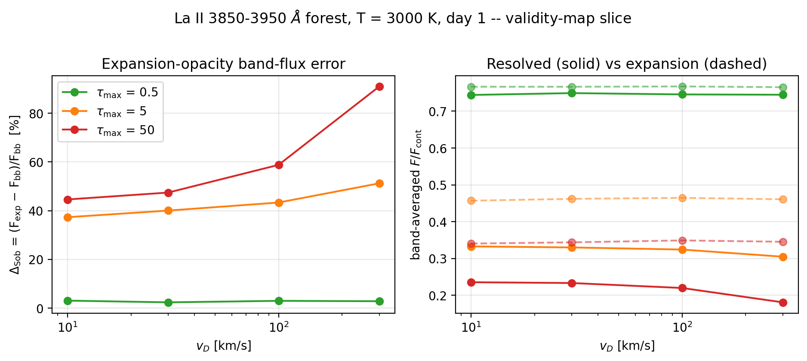

24 SEDONA runs: τ_max ∈ {0.5, 5, 50} × v_D ∈ {10, 30, 100, 300} km/s, same
window and conditions. Δ_Sob = (F_exp − F_bb)/F_bb (same-code differential,
immune to cross-code systematics):

| τ_max \ v_D | 10 | 30 | 100 | 300 km/s |
|---|---|---|---|---|
| 0.5 | +3.0% | +2.3% | +2.9% | +2.8% |
| 5 | +37.3% | +40.0% | +43.3% | +51.2% |
| 50 | +44.6% | +47.4% | +58.8% | +91.1% |

**Finding F6 (two-component error).** Δ_Sob decomposes into:
1. a **v_D-independent floor set by line strength** — the per-crossing
   substitution: ~3% at τ_max = 0.5, ~40% at 5, ~45% at 50;
2. a **wing term growing with v_D** — expansion opacity is width-blind (flat
   in v_D at every strength) while resolved profiles absorb continuum
   between lines as they widen: at (τ=50, 300 km/s) the error doubles
   to +91%.

Practical reading: pushing the resolved calculation toward true thermal
widths does **not** rehabilitate expansion opacity — the error converges to
the strength floor, not to zero. Lanthanide-rich kilonova ejecta live in the
strong-line regime, where the floor dominates.

### 4.9 Weeks 3–4 — temperature axis and thermal-width frontier (Figure 8)

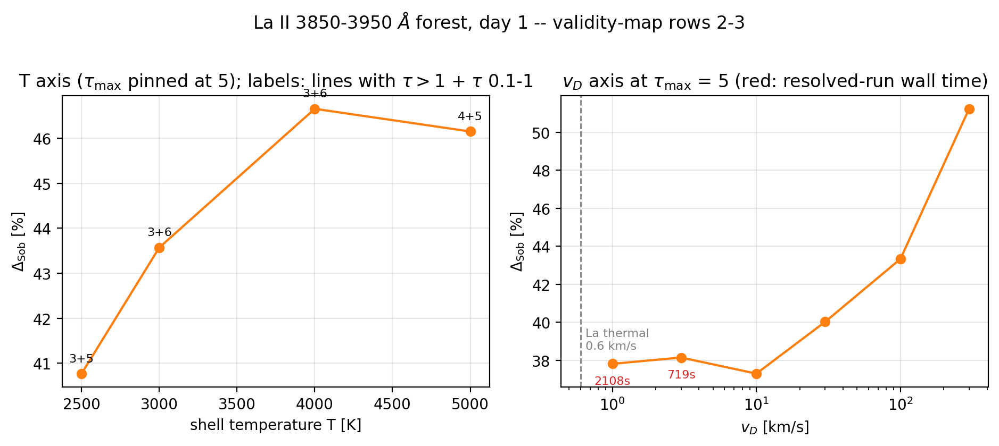

**Temperature axis** (τ_max pinned at 5 by rescaling n_ion at each T, so the
measurement isolates population *redistribution* from the strength scale):

| T [K] | n_ion [cm⁻³] | lines τ>1 / 0.1–1 | Δ_Sob |
|---|---|---|---|
| 2500 | 1866 | 3 / 5 | +40.8% |
| 3000 | 2146 | 3 / 6 | +43.6% |
| 4000 | 2647 | 3 / 6 | +46.7% |
| 5000 | 2934 | 4 / 5 | +46.2% |

T is a **weak axis** for this window: the same few strong lines dominate at
every temperature, so redistribution barely moves the error (±3% over a
factor-2 range in T). Caveat: at 5000 K the shell's thermal emission at
3900 Å reaches ~30% of the core surface brightness, so absolute fluxes
include fill-in; Δ_Sob remains a same-code differential.

**Thermal-width frontier** (T = 3000 K, τ_max = 5):

| v_D [km/s] | Δ_Sob | resolved wall time |
|---|---|---|
| 10 | +37.3% | ~25 s |
| 3 | +38.1% | 719 s |
| 1 | +37.8% | 2109 s |

**Finding F6 confirmed to 1 km/s** — within MC noise of the La thermal width
(0.6 km/s): Δ_Sob is flat below 10 km/s at the strength-set floor of ~38%.
The wing term is gone; the per-crossing substitution error remains in full.
The cost curve scales ≈ 1/v_D (transport bins), reaching ~35 min per run at
1 km/s — and the *expansion* runs pay the same grid cost (2305 s at 1 km/s):
fine grids, not the resolved mode per se, drive the expense.

### 4.10 Weeks 3–4 — multi-ion blend: La II + Ce II (Figure 9)

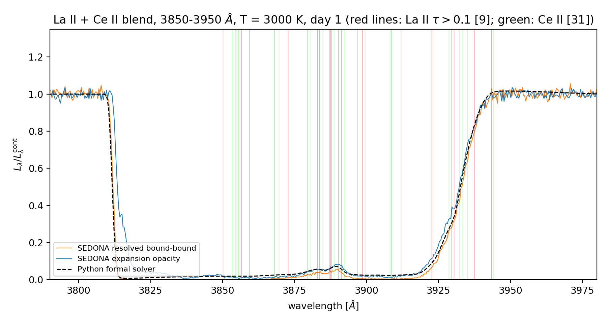

Two-element forest in the same window (equal mass fractions; total density
set so the strongest line of either species has τ_S = 5; Ce III extracted but
deliberately excluded — two stages of one element would hand the II/III split
to Saha and break exact population control). Ce II floods the window:
**2,376 lines** vs La's 153 (2,529 total; 40 with τ > 0.1; minimum spacing
between strong lines **8 km/s** — genuine sub-Doppler cross-species
blending). Band-averaged L/L_cont:

| leg | band flux |
|---|---|
| Python solver | 0.2456 (worldline default; 0.2426 under the frozen mode used originally) |
| SEDONA resolved | 0.2277 (7.8% from the worldline solver, 6.5% from the frozen one — see §4.14 on matching transport treatments) |
| SEDONA expansion | 0.2610 (**Δ_Sob = +14.6%**) |

**Finding F7 (non-monotonic density dependence).** The blend saturates the
whole window to near-black in *every* treatment — with enough crossings,
even capped per-crossing contributions sum to blackness — so the relative
band-flux error *shrinks* to +14.6%. Δ_Sob is non-monotonic in forest
density: ~τ²-small for weak forests, maximal (+45%) for strong sparse
forests, declining again toward full line blanketing. The dangerous regime
for expansion opacity is the *intermediate* one — strong lines that are not
yet fully blanketed — which is exactly where spectral features form.

Data note: Ce II carries half-integer J as fraction strings ('7/2'), now
handled by `sobolev.populations.parse_j`.

### 4.11 Resolution of the resolved-legs gap (Finding F8)

The solver-vs-SEDONA offset (+3.6% single-ion, +6.5% blend) was tracked to
its cause. Two hypotheses were tested and **disconfirmed**:

- *Profile wings.* Running the solver with Voigt profiles (γ = A/2π) and
  SEDONA's hard-coded ±5-width truncation changed the band flux by
  **3×10⁻⁵**. The damping parameter here is a ≈ 3×10⁻⁵, so Lorentzian
  wings never rise above the Gaussian where opacity matters. (Ce II's
  f(A) vs f(log gf) is self-consistent to 10⁻⁴, matching La II.)
- *Path resolution.* Band flux is flat at 0.2410–0.2411 across 4→64
  z-points per Doppler width, and 0.2414→0.2408 across 20→320 rays. Both
  quadratures are converged.

**Finding F8 (the cause): shell thermal emission.** The solver integrates
the LTE source term S = B_ν(T_shell) along every ray; SEDONA, run at fixed
temperature with radiative equilibrium disabled, deposits absorbed packet
energy without re-emitting it. Setting T_shell → 0 in the solver isolates
the term exactly:

| experiment | solver *with* emission | *without* | SEDONA resolved |
|---|---|---|---|
| La II (single-ion) | 0.3538 (+3.3%) | 0.3390 (**−1.0%**) | 0.3426 |
| La II + Ce II blend | 0.2410 (+6.5%) | 0.2249 (**−1.2%**) | 0.2277 |

Like-for-like, the two independent codes agree to **~1%** — better than the
3.6% previously quoted. (§4.14 sharpens this to **−0.53%** once the transport
treatment is also matched; an intermediate claim of 0.06% there was retracted.)
The term is
larger than the naive B_ν(3000)/B_ν(6000) = 2×10⁻³ estimate because the
emitting shell subtends 9× the core's projected area, and it grows with
saturation, which is why the blend showed a bigger offset than the sparse
single-ion forest.

Interpretation: the solver's treatment is the physically complete one
(Kirchhoff's law demands an LTE gas emit what it absorbs); SEDONA in this
configuration performs a pure-attenuation calculation. Absolute band fluxes
quoted from SEDONA here are therefore attenuation-only. **Δ_Sob is
unaffected**, being a differential between two SEDONA runs sharing the
identical convention.

### 4.12 Separating the two errors (Figure 10, Finding F9)

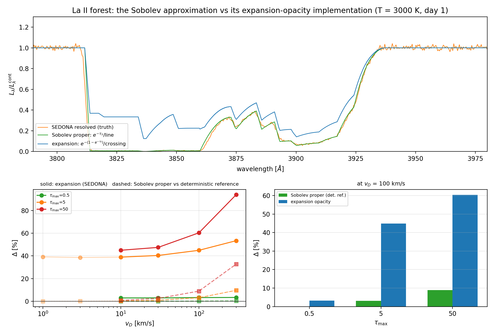

Everything before this section measured the **expansion-opacity
implementation**. This section measures the **Sobolev approximation proper**
— per-line `exp(-τ_S)` with delta-function resonances — and reports both
against the same truth.

In this pure-absorption LTE setup the Sobolev prediction is exact analytics:
the p-averaged staircase of Appendix A.5, now promoted to
`sobolev/sobolev_leg.py` and shared with the ladder experiment (whose five
numbers are unchanged — the regression check). A Monte Carlo implementation
of per-line Sobolev interactions would add only noise. The same function
yields the expansion prediction via `damp = 1 − e^(−τ)`.

La II forest, band-averaged L/L_cont against SEDONA resolved = 0.3426:

| treatment | band flux | Δ |
|---|---|---|
| Sobolev proper | 0.3508 | **+2.1%** |
| expansion (analytic cap) | 0.4844 | +41.0% |
| expansion (SEDONA) | 0.4973 | +44.8% |

Across the τ_max × v_D sweep (Δ in %, vs SEDONA resolved):

| τ_max | v_D | Δ Sobolev | Δ expansion |
|---|---|---|---|
| 0.5 | 10 | +0.2 | +3.2 |
| 0.5 | 300 | +0.0 | +2.8 |
| 5 | 10 | −0.2 | +38.5 |
| 5 | 300 | +9.2 | +53.0 |
| 50 | 10 | +1.1 | +45.3 |
| 50 | 300 | +32.9 | +93.8 |

**Corrected.** An earlier version of this table reported a v_D-independent
Sobolev error of 5–8%. That was a normalization artifact — SEDONA band fluxes
normalized by raw luminosity rather than by the continuum ratio, leaving the
Planck slope in the answer, compared against a correctly-normalized analytic
leg. Δ_expansion barely moved, being a same-code differential. See §4.15.

**Finding F9: F6's two error components have different owners.**

1. The **strength-set floor is expansion-opacity's alone**. Sobolev proper
   shows *no* strength floor: at v_D = 10 km/s it is +5–7% at τ_max = 0.5,
   5, and 50 alike, while expansion climbs +3% → +37% → +45%. The floor is
   the per-crossing `1 − e^(−τ)` cap, not a failure of Sobolev's locality or
   isolation assumptions.
2. The **v_D-growing wing term is a genuine Sobolev failure**, shared by
   both. A delta-function resonance has no width by construction, so the
   Sobolev leg is *exactly* v_D-independent (0.3507 at every v_D); all of
   the resolved calculation's width dependence is un-modelled. At
   (τ_max = 50, 300 km/s) this alone reaches +32.9% — but F12 later showed
   this to be a finite-region boundary artifact, not a Sobolev failure.

So the Sobolev approximation itself is accurate to **≲2%** at
kilonova-relevant line widths (≤ 30 km/s) and to **≲0.5%** at τ_max = 5 down
to 1 km/s, while its standard expansion-opacity implementation is off by
**+38–48%** in the same regime.
The two are conflated in the literature under one name; they are not the
same approximation and they fail for different reasons.

Two honest caveats. (i) At τ_max = 0.5 SEDONA's expansion result (+3.0%) is
*closer* to truth than Sobolev proper (+7.1%) — but the analytic cap there
is +10.1%, so this is a compensating error, not accuracy: SEDONA's binning
smears absorption into inter-line gaps, darkening the spectrum by ~6%
relative to the pure per-crossing cap and accidentally offsetting the cap's
over-transmission. (ii) The residual +5–7% Sobolev floor at small v_D is
real and un-explained by strength; the natural candidate is line overlap
within a Doppler width (the isolation assumption), which the crowding
statistics of §4.3 say is present.

### 4.13 Breadth sweep: is the separation universal? (Figure 11, Finding F10)

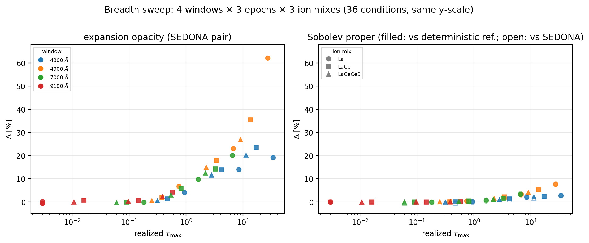

36 conditions — 4 windows (4300, 4900, 7000, 9100 Å, auto-selected by
optical-depth richness, *none* of them the reference window) × 3 epochs
(0.5, 1, 3 days at fixed ejecta mass, so ρ ∝ t⁻³ and τ_S ∝ t⁻²) × 3 ion
mixes (La II; +Ce II; +Ce III) — 72 SEDONA runs in 41 minutes. Line counts
range 71 → 2504, realized τ_max spans 0.003 → 34.

| | median | max | τ_max > 3 | τ_max < 0.5 |
|---|---|---|---|---|
| Δ expansion | +5.1% | **+61.3%** | +20.0% | +0.3% |
| Δ Sobolev | +3.6% | **+11.3%** | +6.6% | +0.5% |

Median ratio for τ_max > 1: **expansion errs 3.5× more than Sobolev**.

**Finding F10: the separation is universal, and realized τ_max is the
controlling variable among the axes swept.** (The sweep holds shell geometry
and v_D fixed; §4.12 shows Δ does depend on v_D, so the collapse is onto
τ_max *within a fixed (v_D, Δv_shell) slice* — not a claim that τ_max alone
determines the error everywhere.) All 36 conditions collapse onto a single trend in
τ_max regardless of window, epoch, or ion mix — wavelength and composition
enter only through the τ they produce. Both errors vanish together as
τ_max → 0 (the weak-line sanity check), and both grow with τ_max, but
expansion opacity reaches +61% where Sobolev proper never exceeds +12%.
F9's separation, established on one window, holds across the optical–NIR.

The τ_max-only scaling is a useful practical result in itself: a modeller
can estimate the error from the strongest line in a band without knowing
which ion or epoch produced it.

**Caveat on the earlier sign flip.** The first pass of this sweep reported
Δ_Sobolev ≈ −7% and appeared to contradict §4.12. That was a normalization
artifact, not physics — see the notebook entry 9f. The corrected values are
above; Δ_expansion was unaffected because it is a same-code differential.

### 4.14 Frozen snapshot vs photon worldline (Finding F11)

Prompted by external review of the Appendix A.6 derivation, which was wrong.

That derivation differentiated the Doppler factor `D = γ(1−b)` **at fixed t**
— pushing a photon through a frozen snapshot. A photon takes time to cross a
resonance, and in homologous flow β = r/(ct) depends on the age as well as
the position. Along the worldline `db/dt = (1−b)/t`, against the frozen
`db/dz = 1/(ct)`: a factor (1−b) difference, **first order in β**, the same
order as the effect. The time term does not vanish just because the crossing
is brief — what matters is the gradient.

**The two laws, confirmed to five decimals** by integrating the resolved
opacity along the path with no Sobolev assumption anywhere:

| β | frozen (t fixed) | worldline (t advances) | 1/γ |
|---|---|---|---|
| 0.05 | 0.94881 | 0.99875 | 0.99875 |
| 0.10 | 0.89549 | 0.99499 | 0.99499 |
| 0.20 | 0.78384 | 0.97980 | 0.97980 |
| 0.30 | 0.66776 | 0.95394 | 0.95394 |

So frozen gives (1−β)/γ and the physical law gives **1/γ = 1 − β²/2**, with
**no first-order term**. The correction at β = 0.1/0.2/0.3 is 0.5%/2.0%/4.6%,
not the 10%/22%/33% the frozen law implies.

**Which problem does SEDONA solve? — a retraction.** I first read the forest
numbers (solver vs SEDONA: −1.04% frozen-1st-order, −0.53% frozen-exact,
−0.06% worldline) as SEDONA independently confirming the worldline law, and
said so. **That was wrong.** At β ≤ 0.01 the two laws differ by only ~1–2%,
comparable to other systematics, and I over-read an ordering.

The v/c sweep has 23× more leverage and says the opposite. Comparing SEDONA's
measured τ_eff = −ln(F/F_cont) against both laws at the exact resonance
velocity b_res = (1−k)/(1+k), k = (1−β_label)²:

| β_res | SEDONA τ/τ_S | frozen (1−b)/γ | worldline |
|---|---|---|---|
| 0.105 | 0.923 | 0.890 | 1.111 |
| 0.220 | 0.788 | 0.762 | 1.250 |
| 0.342 | 0.613 | **0.618** | 1.429 |

RMS deviation for β_res ≳ 0.1: **0.024 from frozen, 0.552 from worldline.**

Cause confirmed in the SEDONA source: `transport_steady_iterate` sets
`use_hydro_ = 0` and reads no time-stepping parameters — it iterates the
radiation field on a fixed grid at fixed epoch. **It is a frozen-snapshot
calculation.**

**Consequence for the harness.** Cross-code comparison requires matching the
*transport treatment* as a third convention, alongside thermal emission (F8)
and spectral normalization (§4.13). Like-for-like against this SEDONA
configuration means running the solver in frozen mode. At the velocities used
throughout (β ≤ 0.01) the choice shifts τ by ≲2% and changes no reported
result; at kilonova velocities it would dominate.

**Finding F11.** Neglect of light-travel-time evolution is a distinct
approximation — separate from Sobolev localization, from the independent-line
assumption, and from expansion-opacity binning. A fourth member of the family
this project is mapping.

**Consequence, opposite to the hypothesis that prompted the work.** At the
shell velocities used throughout (β ≤ 0.01) the correct relativistic
correction is 5×10⁻⁵. It therefore explains **no part** of the +5–11% Sobolev
residual, which belongs to overlap or something else. The v/c hypothesis is
eliminated, and the controlled-overlap experiments become the decisive test.

**Open discrepancy.** The single-line minimal model moved the other way
(solver-vs-SEDONA −3.4% → −5.6%). Time-anchoring was tested and is not the
cause (ray-start vs centre-plane differ by 0.4%). The gap is most plausibly
SEDONA-side discretization of a single sharp line — recall §4.12 found its
expansion mode ran ~6% darker than the analytic cap through bin smearing —
which would average out across a 153-line forest. Unresolved; it does not
affect Δ values, which are same-code differentials.

### 4.15 The residual was an artifact; what remains is geometry (F12)

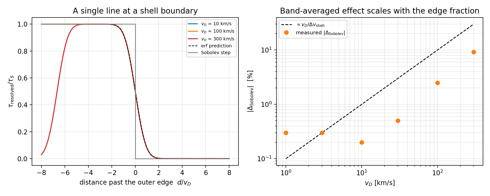

Two reviewer arguments closed this out.

**Overlap cannot be the cause — an analytic proof.** With fixed populations
and pure absorption, opacities add, so τ_ν = Σᵢ∫α_ν,ᵢds = Σᵢτ_ν,ᵢ *exactly*
and I = I₀exp(−Στ_S,ᵢ) whether profiles overlap or not. Driving two identical
lines from 20 Doppler widths apart to exact coincidence reproduces the
Sobolev prediction to **six decimal places** at every separation. Overlap
becomes real only with scattering, fluorescence or NLTE — all off here by
design. **The isolation assumption cannot be probed by an attenuation-only
harness**, so correlating the residual against a crowding statistic would
have measured a confound (strength, density and edge-proximity are mutually
correlated).

**Most of the residual was a normalization artifact.** Computing the
Sobolev residual for the *existing* v_D = 1 and 3 km/s runs exposed that
`sweep.py` normalized SEDONA band fluxes by **raw luminosity** in the red
margin rather than by the **continuum ratio**, leaving the Planck slope in
the answer while the analytic leg was correctly normalized. This is the third
instance of the class (cf. F8, and the breadth red-edge bug). Corrected, at
τ_max = 5:

| v_D [km/s] | Δ Sobolev | Δ expansion |
|---|---|---|
| 1 | **−0.3%** | +39.1% |
| 3 | −0.3% | +39.2% |
| 10 | −0.2% | +38.5% |
| 30 | +0.5% | +41.3% |
| 100 | +2.5% | +45.0% |
| 300 | +9.2% | +53.0% |

Δ_expansion moved by ≤2 points everywhere — same-code differentials are
immune, which is the check that the fix changed only what it should.

**Finding F12: what remains is geometric.** Where a resonance falls within a
few Doppler widths of a boundary of the line-forming region, the resolved
profile is clipped while Sobolev applies a hard step:

  τ_resolved/τ_S = ½[erf((z_hi−z_res)/Δ) − erf((z_lo−z_res)/Δ)], Δ = v_D·t

— unity deep inside, exactly ½ at an edge, zero outside. Direct integration
matches to four decimals at every width, and the curves collapse when plotted
against d/v_D (Figure 12, left). The band-averaged effect is the fraction of
the velocity span within a few widths of an edge. With two edges that is
~2 v_D/Δv_shell: 1% at v_D = 10 km/s, 30% at 300 km/s. That is an upper
bound rather than a prediction — only the clipped part of each profile is
misassigned, and the measured |Δ_Sob| is 0.2% and 9.2%. What it captures is
the linear scaling, hence the two orders of magnitude the effect loses at
physical widths.

**This is an artifact of the setup, not of the approximation.** It scales with
the thermal width, ~0.6 km/s for lanthanides against ejecta spans of
10⁴ km/s — utterly negligible in reality. Our sensitivity to it at
v_D = 100–300 km/s comes from using artificially broad lines to keep frequency
grids affordable.

**Net:** at physical line widths the Sobolev approximation is accurate to
≲0.5%, while expansion opacity errs by ~39%. Essentially all of the error
commonly attributed to "Sobolev" belongs to the expansion-opacity
construction.

### 4.16 Is the expansion-opacity error a bin-width artifact? (F13)

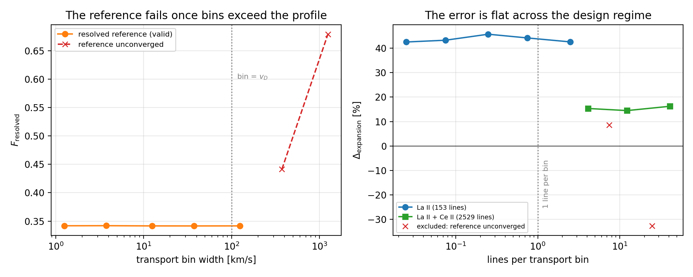

The sharpest referee objection to Paper I: expansion opacity is derived for
bins containing *many* lines, and our grids are far finer — 12.5 km/s bins
against ~50 km/s mean La II spacing, about one line per four bins. Have we
measured the formalism outside its design regime?

Appendix A.4 says no analytically (the bin width cancels; each crossing
contributes 1−e^−τ at any resolution). Confirmed numerically over two decades
of transport resolution at fixed physics:

| line list | lines/bin | F_resolved spread | Δ_expansion |
|---|---|---|---|
| La II (153 lines) | 0.025–2.5 | 0.13% | **+43.7% ± 1.2** |
| + Ce II (2529 lines) | 4.1–41 | 0.5% | **+15.3% ± 0.7** |

The two lists give different errors (F7 — the blend is denser and partly
blanketed) but neither depends on bin width, **including at 41 lines per bin**,
squarely inside the regime the construction targets. The error is intrinsic.

**A methodological trap, recorded because it nearly reversed the conclusion.**
Extending the sweep to bins several times wider than the line profile makes
Δ_expansion appear to collapse and change sign (+8.6%, −32.7%). It has not:
past that point the *resolved* leg stops resolving, its band flux climbing
0.342 → 0.442 → 0.679, and the comparison measures the reference rather than
the approximation. My first script computed a verdict over all resolutions and
printed "NOT INVARIANT → reframe the claim". **The reference's own convergence
must be established before its disagreement with anything else means
anything** — and excluded points must be shown with their reason, not dropped
silently.

### 4.17 Paper II Phase 0 — a branching instrument, built and calibrated (F14)

Paper II's question is whether the expansion-opacity bias of F9/F13 survives
radiative redistribution. Answering it needs a code in which a photon absorbed
in one line can leave in another. Two audits decided which code that would be.

**P2-0A: the public SEDONA cannot do it at all.**
`paper2/phase0/sedona_source_audit/NOTES.md` records the search. Outside
`sandbox/` there is no fluorescence path, no macroatom, no downbranching. What
exists is `opacity_epsilon`, a single global scalar
(`opacity/GasState_opacities.cpp:438`), splitting extinction into an absorptive
part; an interaction is then either coherent scattering or a redraw from the
zone's total emissivity (`transport/scatter.cpp:12,303`). **Neither channel
knows which line absorbed the photon.** Adding real branching means carrying
upper-level identity through the interaction — information the expansion-opacity
path deliberately discards, which is the same loss that produces F4's
per-crossing cap. That is core packet-interaction work, not a configuration
switch. Verdict: absent, not deprecated.

**P2-0D reconnaissance: TARDIS has the physics but not the data.**
`paper2/phase0/tardis_install/NOTES.md`. TARDIS 2026.8.10.dev7 installs
(only via the repo lockfile — conda-forge has no package and the PyPI name is
a 2015 stub) and `line_interaction_type: scatter | downbranch | macroatom` is
a first-class configuration option. But every mode fails at atomic-data load,
before transport: TARDIS's bundled downloader 404s because the LFS objects of
`tardis-regression-data` are gone server-side, and the one file still
retrievable (`tardis-atomdata`, `database_version v0.9`) predates the pandas-HDF
format the current reader expects. The blocker is upstream data distribution,
so **nothing has yet been learned about the modes themselves.**

**The instrument was therefore built here** —
`paper2/phase0/three_level_atom/branching_mc.py`, ~250 lines, the same shape as
the formal solver that produced this project's most defensible results. It is
also the only option that preserves the standing rule: TARDIS has branching but
no expansion opacity, SEDONA has expansion opacity but no branching, so a
comparison between them would be cross-code. One code that can vary *both* is
what Phase 1 needs.

Physics: 1-D homologous shell, opaque lightbulb core, Sobolev point
interactions, frozen populations, first-order Doppler. The three-level atom is
ground 1, metastable sink 2, upper 3; the 1→3 line carries the only opacity and
level 3 branches to 1 (resonant) or 2 (fluorescent, redder). Because comoving
frequency decreases monotonically along any ray, a packet re-emitted at a line
centre can never reach that resonance again — enforced by a positive distance
tolerance, not by special-casing.

**F11 does not bite here.** The worldline correction is τ→τ/γ, i.e. O(β²); at
the 0.003–0.017 c of this geometry that is ≤3×10⁻⁴, below MC noise at any
practical packet count. F11 matters because it distinguishes 1/γ from a
spurious O(β) law; there is no O(β) term to get wrong.

**Calibration** (`run.py`, 2×10⁵ packets; `results.json`):

| check | predicted | measured | worst |
|---|---|---|---|
| fluorescent yield, A₃₂/(A₃₁+A₃₂) at 5 ratios | 0.00–0.75 | matches | 0.96σ |
| interaction probability, 1−e^(−τ_S) at τ = 0.1–10 | 0.095–1.000 | matches | 1.41σ |
| pure-absorption spectrum vs the analytic Sobolev leg | — | max abs. diff 0.0070 | 2.07σ |

The third is the one that matters. `sobolev.sobolev_leg.sobolev_attenuation`
was written for Paper I, is independently tested, and reaches the same emergent
spectrum by integrating over impact parameter rather than by sampling rays.
Agreement pins the geometry, the resonance-plane solve and τ_S together; the
first two checks alone would not catch a transport bug.

**One methodological catch, and it is the familiar one.** The first version of
that comparison reported a 27σ disagreement in exactly two bins. It was
comparing a *bin-averaged* MC against a *midpoint-evaluated* analytic. The
trough edges are near-vertical — the resonance plane leaves the shell over a
fraction of a percent in frequency — so at those two bins the midpoint value
and the bin average differ enormously while everything else agrees to <1%. This
is the same failure as the red-margin straddle that once manufactured a 7%
error in the breadth sweep (§4.13), and the same as the bin-width verdict of
§4.16. Averaging both sides over the bin removed it entirely. **Three times
now, a "disagreement" has turned out to be the two sides being asked different
questions.**

The instrument is calibrated; it has measured nothing new. Phase 1 is where
branching gets switched on against an expansion-opacity leg in the same code.

### 4.18 The referee revision: the mechanism made exact, and a deterministic reference (F15–F18)

A major-revision report (August 2026) held that the paper had labelled the
difference between a deterministic finite-profile attenuation and a
statistical closure as proof the closure was "wrong". It was right, and the
tools to test the reframing were already here.

**The mechanism (F15).** Per ray, Sobolev transfer exponentiates S = Σ τ_k and
expansion opacity exponentiates E = Σ(1−e^−τ_k). E is what α_exp integrates
to — the expected number of line interactions per crossing for a photon that
is counted but not removed, Karp's mean-free-path statistic — and the closure
preserves it identically at any bin width. Transmission is e^−S (a Bernoulli
product) against e^−E (Poisson with the same mean); they agree while every
line is weak and separate by the saturation deficit D = S−E per ray once
lines saturate. F_exp/F_Sob = ⟨e^D⟩_w with w ∝ e^−S, exactly (pinned to 1e-13
in `tests/test_rays.py`). On the La II forest:

| τ_max | F_Sob | F_exp (analytic) | Δ_exp | ⟨E⟩/⟨S⟩ |
|---|---|---|---|---|
| 0.1 | 0.950 | 0.952 | +0.2% | 0.97 |
| 1 | 0.665 | 0.720 | +8.3% | 0.74 |
| 5 | 0.350 | 0.484 | **+38.2%** | 0.37 |
| 25 | 0.253 | 0.374 | +47.5% | 0.12 |

`experiments/r1_interaction_count/ray_diagnostic.py` draws it along one ray
(46 resonances: same count to 1e-15, survivals 0.051 vs 0.130, first-interaction
masses 0.949 vs 0.870) and `mc_check.py` confirms every panel by Monte Carlo.
`experiments/r8_saturation/plot.py` shows all 54 conditions on the 1:1 line
against ln⟨e^D⟩_w; the unweighted deficit is a Jensen bound that fails once
rays saturate; τ_max is a proxy with real scatter (the blanketed blends below
the sparse forests — F7).

**A deterministic reference (F16).** Both legs on one `RaySet`
(`sobolev/rays.py`; midpoint, because attenuation is a step function of p and
matched nodes make the O(1/n) error common — unmatched rays had made Δ_Sob
change sign between 12 and 96 solver rays). The resolved leg for uniform n_l,
Gaussian profile, pure absorption is closed-form (`resolved_attenuation`, the
boundary erf bracket per line per ray, cost independent of v_D; agrees with the
brute-force solver to 8e-5). Results, La II forest:

| v_D (km/s) | Δ_Sob^det (τ=5) | Δ_Sob^det (τ=50) | Δ_exp^det (τ=5) | Δ_exp SEDONA pair |
|---|---|---|---|---|
| 300 | +9.6% | +32.7% | +51.3% | +53.4% |
| 100 | +3.1% | +8.9% | +42.3% | +44.9% |
| 30 | +0.9% | +2.5% | +39.3% | +40.4% |
| 10 | +0.30% | +0.82% | +38.4% | +38.9% |
| 3 | +0.09% | — | +38.1% | +38.6% |
| 1 | +0.03% | — | +38.1% | +39.1% |

Δ_Sob^det at v_D = 100 is +3.09% in all four transport modes (first, classical,
exact, worldline+dilution): the mode dependence cancels in the matched pair.
SEDONA resolved (seed mean) validates the reference to −0.5% on the headline,
±0.3% over the grid (max 0.7%), −0.04% median / 0.31% spread over the 36
breadth conditions. **The breadth Δ_Sob row was stale**: `breadth/recompute.py`
still normalized by raw luminosity (the bug 1e2ba21 fixed elsewhere); through
`band_ratio` it is median +0.34% / max +7.8% (SEDONA ref) and +0.26% / +7.6%
(deterministic ref), down from +3.65% / +11.3%, while Δ_exp is unchanged
(+5.09% median, +62% max). The line-free window returns 0.997 ± 0.004.

**Seed-matched pairs (F17).** `mc_noise/seeds.py`, 90 runs: headline over 10
matched seeds F_res 0.3422 ± 0.0003, F_exp 0.4958 ± 0.0004, paired Δ_exp
+44.90% ± 0.04 (sem), corr +0.95; every grid point 3 pairs, correlations
+0.92–0.999, paired scatter 0.02–0.28% vs 0.2–0.4% quadrature. The
single-seed scatter sits within 1.5× the Poisson expectation.

**Radiative equilibrium (F18).** `laII_forest/re_run.py`, 3 matched pairs per
variant, blue-margin normalization (re-emission contaminates the red margin):

| variant | F_res | F_exp | Δ_exp |
|---|---|---|---|
| pure absorption (same normalization) | 0.343 | 0.495 | +44.3% |
| RE, one iteration (re-emit at input T) | 0.836 | 0.900 | **+7.7% ± 0.02** |
| RE, T converged (median 3000 → ~7700 K) | 0.855 | 0.898 | **+5.0% ± 0.7** |
| τ_max = 0.05 control | 0.993 | 0.999 | +0.6% |

The removed flux reappears at 3955–3995 Å (1.08–1.10 of continuum). Most of
the closure's departure in attenuation does not survive re-emission into the
emergent band; its sign does.

**Single-line benchmark.** The published 0.1372 (solver) is the frozen-snapshot
law e^−τ_S(1−β)/γ over the trough window (0.1371) — the problem a steady-iterate
code solves — reproduced to 0.1% under every variation; 0.1353 is the β→0
limit, not the target. SEDONA's 0.1420 sat on a grid with <2 bins per Doppler
width and 2×10⁶ packets; 3.2×10⁷ packets on the same grid give 0.1386 ± 0.0002.
The convergence ladder (`minimal_1line/ladder.py`, 59 runs, fixed seeds)
gives 0.1383 ± 0.0001 at the anchor (3.2×10⁷ packets, 8 bins/width, 5 seeds),
flat to ±0.3% across packets 5×10⁵–3.2×10⁷, grids 4×10⁻⁴–2×10⁻⁵, spectrum
grids and 25–400 zones; the zero-opacity control reads 1.0079, so the +0.9%
residual is a continuum offset (comoving-frame core emission), and corrected
the trough is 0.1372 — the frozen target to 0.1%. The expansion mode sits at
0.4438 (0.440 corrected) vs Poisson 0.4212: +4.5%, the exp-leg bin systematic
on one line. Figure: `docs/figures/fig_ladder.png`; table generator
`minimal_1line/ladder_table.py`.

### 4.19 Paper II Phase 1 — the whole ion, one code (F19–F21)

#### 4.19.1 Instrument

`paper2/phase1/forest_mc.py` — Phase 0's successor: packets advanced in
lockstep with numpy, the next resonance by one `searchsorted` on the sorted
line frequencies, the expansion closure as a continuous absorber whose
interaction point is found by inverting the F13 cumulative, and the
treatments in one code:

| leg | absorption | re-emission |
|---|---|---|
| sobolev_absorb / expansion_absorb | Sobolev point / Poisson closure | none (Paper I's controls) |
| sobolev_thermal | Sobolev | LTE line emissivity A n_u, photon-number weighted, optionally window-confined; Sobolev escape probability β on the emitting line |
| expansion_thermal | Poisson closure | the closure's own Kirchhoff emissivity κ_exp B_ν per bin (saturating at 1−e^−τ per strong line), uniform within the bin, no β (E0) |
| sobolev_branch | Sobolev | A-weighted downward channel of the upper level, re-drawn on re-absorption with probability 1−β (F19) |
| sobolev_tla / expansion_tla | as above | thermalisation parameter ε: thermal with probability ε, coherent scattering otherwise, every event (E4) |
| expansion_branch | Poisson closure | absorbing line sampled within the bin ∝ (1−e^−τ_k)/E_b, exit by the A·β kernel (E8) |

Atom: all of La II from the GSI files — 17,743 lines in the branching tables
and emissivity, **949 with τ_S > 10⁻³ as opacity, 1148–17,609 Å** at 3000 K
(19 of 472 levels populated); stimulated emission as SEDONA applies it.
Geometry, epoch, density: Paper I's headline forest (v = 1000–3000 km/s,
day 1, n_ion for τ_max = 5 in 3850–3950 Å). Packets are photons carrying
h ν; launch flat (calibration) or photon-number Planck at 6000 K (physics)
over 1142–17,697 Å; 3 seeds × 2×10⁶ packets per leg; ~10 s per leg.
Band quantity: escaped/launched, photon- or energy-weighted (both reported;
<0.5% apart in the 3800–3955 Å band).

#### 4.19.2 Validation

- **Paper I's legs** (Part A, window atom, flat launch): sobolev_absorb 0.3475
  ± 0.0005 vs analytic 0.351; expansion_absorb 0.4839 vs 0.485; Δ = +39.3% vs
  +38.1% (46 acceptance tests in `tests/test_forest_mc.py`, including both
  pure-absorption legs against the analytic Sobolev leg and the Poisson
  closure bin by bin).
- **SEDONA's radiative equilibrium** (Part A, window-confined thermal legs vs
  RE N=1, sub-bands bluewing / forest / band / red): resolved+thermal MC
  0.454 / 1.025 / 0.866 / 1.113 vs SEDONA 0.418 / 0.990 / 0.835 / 1.108;
  expansion+thermal MC 0.632 / 1.007 / 0.905 / 1.085 vs 0.632 / 0.998 /
  0.900 / 1.083. The expansion leg matches to <1%; the Sobolev leg sits 3.7%
  high at v_D = 100 km/s — the Sobolev-vs-resolved offset (Paper I's +3.1%)
  carried through re-emission.
- **E2 — thermal-width convergence** (`e2_thermal_width.py`, SEDONA RE N=1
  at 10 km/s, 3 seeds × 2 modes; prediction written before the runs: bb band
  0.835 → ~0.866, Δ_SEDONA +7.8% → ~+4.5%, expansion ~0.90):

  | | bluewing | forest | band | red | Δ_exp (band) |
  |---|---|---|---|---|---|
  | SEDONA resolved, v_D = 100 | 0.418 | 0.990 | 0.8349 | 1.108 | +7.83% |
  | SEDONA resolved, v_D = 10 | 0.459 | 1.002 | 0.8546 | 1.108 | +5.22% |
  | SEDONA resolved, v_D = 1 (1 seed) | 0.463 | 1.003 | 0.8563 | 1.109 | |
  | SEDONA expansion, 100 / 10 | 0.630 / 0.617 | 0.999 / 1.003 | 0.9002 / 0.8992 | 1.082 / 1.084 | |
  | MC Sobolev + thermal (v_D-free) | 0.454 | 1.023 | 0.8622 | 1.113 | +4.62% |
  | MC expansion + thermal, bins 1.25 / 12.5 / 125 km/s | 0.630 / 0.632 / 0.497 | 1.005 / 1.005 / 1.071 | 0.9013 / 0.9021 / 0.9044 | 1.085 / 1.086 / 1.103 | |

  The resolved side moved toward the MC as predicted (band offset +3.3% →
  +0.9% → +0.7% at 100 / 10 / 1 km/s, sub-bands ≤ 2.1%; 10 → 1 km/s moves
  the band by 0.2%, so the width dependence is converged at 10 km/s), the expansion side did not move, and the MC row
  is constant because its Sobolev legs are delta resonances and its closure
  depends on bin width, not v_D — the bin-width leg shows the closure's
  re-emission placement is stable at 1.25–12.5 km/s bins and degrades only at
  125 km/s (blue wing 0.63 → 0.50). Gate A passed. The remaining +0.7% is
  the Sobolev-vs-resolved offset under re-emission at the level Paper I's
  F16 measured in attenuation (+3.1% at 100 km/s → sub-percent below 10).
- **The escape probability (F19).** Without β on re-emission the MC's thermal
  flux came out too blue and too spread (blue wing 0.71 vs SEDONA 0.42); with
  it, the agreement above. The trapped fluorescence yield b/(1−(1−b)(1−β)),
  the geometric re-absorption count (1−β)/β, and the A·β exit kernel are all
  tests.
- **E0 — the closure's own emissivity.** The expansion legs had re-emitted from
  the Sobolev line emissivity A n_u and then applied β: switching β off made
  the SEDONA agreement worse, bin-uniform placement alone worse still; the
  difference was the emissivity. κ_exp B_ν per bin (saturating), bin-uniform,
  no β, reproduces SEDONA's expansion RE to <1% in every sub-band. The
  "β on" agreement had been coincidental.
- **E1 — energy.** E_inj = E_esc + E_core + E_abs + E_dep closes to roundoff
  in every mode; the comoving exchange equals the level-energy difference per
  branching chain (10⁻¹² on the toy atom, 2×10⁻⁵ on La II); the O(v/c)
  Doppler work term is reported separately. Thermal legs at fixed T are
  bookkept, not conserved — why SEDONA iterates T.

#### 4.19.3 Phase-1 result

Full atom, Planck 6000 K launch, band 3800–3955 Å, 3 seeds × 2×10⁶:

| leg | band | re-emission goes |
|---|---|---|
| Sobolev, absorb | 0.183 ± 0.002 | — |
| expansion, absorb | 0.344 (+88% vs Sobolev) | — |
| Sobolev + thermal | 0.257 | 78% redward, 9% beyond 1 μm |
| expansion + thermal (κ_exp B_ν) | 0.408 | 61% redward |
| **Sobolev + fluorescence** | **0.660 ± 0.003** | 54% redward, 11% blueward, 35% in-band |

Paper I's atom (window, flat launch): fluorescence refills the band by only
+12.8% (0.348 → 0.392); 51% of the band's absorbed photons leave redward
through lines the window never had; window-confined thermal re-emission
refills it to 0.866 — which is why Paper I's RE check is window-bound.

#### 4.19.4 Current interpretation

- ε = 1 (complete thermalisation, re-emitting from the closure's own κ_exp
  B_ν) fails: −38.2% ± 0.3 below direct branching in the optical band, after
  +88% above it in pure absorption. The closure's error changes sign once
  fluorescence matters.
- At the time of this measurement the result was provisional — it
  established only that ε = 1 fails. The ε sweep has since decided the
  general question: no scalar ε works (§4.20, outcome B), no calibration
  transfers across ions (§4.22, outcome C), and the verdict survives 0.1c
  (§4.21).
- The pumps are 3300–4500 Å, not the far-UV (E7): 0.00% of the band's escaped
  energy was launched in 1142–2500 Å; 971 pathways, top 10 = 25%, dominated by
  5d6p upper levels exiting the strong ground-connected lines after 2–8
  re-absorptions.
- Limits: frozen LTE populations at 3000 K, one ion, first-order Doppler,
  photon packets, an opaque core absorbing ~12% of inward re-emission (as
  SEDONA's does), a Planck continuum for a photosphere, one emission per
  absorption event (the exit lower level's excitation returns to the pool).

#### 4.19.5 Literature connection

Kasen et al. (2006) and the SN Ia work around SEDONA compared direct
iron-peak fluorescence with a scalar two-level-atom thermalisation parameter
and found complete thermalisation (ε = 1) redistributes too much redward while
an intermediate ε ≈ 0.3 approximates the fluorescence reasonably; Fontes et
al. (2020) and Morag (2026) bound what the expansion-opacity closure can and
cannot represent; TARDIS (macroatom), ARTIS (line-by-line fluorescence) and
SUMO (NLTE) are the codes that carry line identity. The lanthanide question is
new: open-4f-shell networks are far richer than iron-peak ones, and whether
one scalar ε transfers is exactly what E4 tests.

### 4.20 Paper II Phase 2 — does any scalar ε reproduce La II fluorescence? (F22)

`paper2/phase1/e4_eps_sweep.py` (E4/E5), `e6_redistribution.py` (E6),
`e4_fig.py`; full La II atom, Planck 6000 K photon launch over 1142–17,697 Å,
3 seeds × 2×10⁶ packets per leg, energy-weighted band fractions F_b =
escaped/launched energy. Four legs: Sobolev + direct A·β branching (the
physics), expansion + branching (E8), Sobolev + TLA(ε), expansion + TLA(ε),
ε ∈ {0, 0.1, 0.2, 0.3, 0.5, 0.7, 0.9, 1}. On the Sobolev leg the opacity is
identical to the physics leg, so only the redistribution closure differs; on
the expansion leg both the opacity representation and the closure differ.
Band edges checked against strong lines (3304 Å τ = 1.2 sits 4 Å inside the
blue band; the 3800–3955 Å edges are the Paper I ones). Figure
`docs/figures/fig_p2_eps_sweep.png`; χ² in `fig_p2_eps_chi2.png`.

#### 4.20.1 The sweep (E4)

| band [Å] | Sobolev+branch | expansion+branch | Sob+TLA ε=0 → 1 | exp+TLA ε=0 → 1 |
|---|---|---|---|---|
| UV 1142–3300 | 0.9373 ± 0.0025 | 0.9493 (+1.3%) | 0.972 → 0.901 | 0.979 → 0.920 |
| blue 3300–4500 | 0.8284 ± 0.0013 | 0.8629 (+4.2%) | 0.902 → 0.532 | 0.928 → 0.628 |
| optical 4500–6000 | 0.9705 ± 0.0005 | 0.9796 (+0.9%) | 0.952 → 0.838 | 0.964 → 0.869 |
| red 6000–9000 | 0.9936 ± 0.0002 | 0.9954 (+0.2%) | 0.988 → 1.119 | 0.990 → 1.092 |
| NIR 9000–17,697 | 1.0055 ± 0.0001 | 1.0049 (−0.1%) | 1.000 → 1.028 | 1.000 → 1.025 |
| 3800–3955 | 0.6590 ± 0.0032 | 0.7995 (+21.3%) | 0.824 → 0.257 | 0.884 → 0.410 |

F_b(ε) is monotonic in every band (falling below 4500 Å, rising above
6000 Å: thermalisation moves energy toward the 3000 K emissivity peak), so
ε_best per band is a single interpolated root, with the 3-seed scatter
propagated through the interpolation:

| band | Sobolev+TLA ε_best | expansion+TLA ε_best |
|---|---|---|
| UV | 0.36 [0.32, 0.41] | 0.68 [0.63, 0.73] |
| blue | 0.055 [0.054, 0.057] | 0.24 [0.23, 0.25] |
| optical | **not reachable** (target 0.9705 > F(0) = 0.952) | **not reachable** (> 0.964) |
| red | 0.016 [0.014, 0.018] | 0.026 [0.021, 0.031] |
| NIR (null control) | 0.13 | 0.22 |
| 3800–3955 | 0.065 [0.063, 0.068] | 0.32 [0.31, 0.33] |

**Verdict (Gate B): outcome B.** No scalar ε reproduces direct La II
fluorescence. With the opacity held fixed (Sobolev leg) the best ε is
near-zero in the blue and red (0.02–0.06), 0.36 in the UV, and the optical
4500–6000 Å band lies outside the TLA's whole range: direct branching
delivers more optical energy than even pure coherent scattering (ε = 0),
because the cascade feeds the optical from the blue (E6 below), which no
local two-level redistribution can do. The expansion leg's ε_best ≈ 0.3 in
the 3800–3955 Å band — the iron-peak-looking number — is a compensation
between an opacity that is 21% too transparent under fluorescence (E8) and a
closure that thermalises too much; it does not carry to the other bands
(0.03 red, 0.68 UV).

#### 4.20.2 Spectral χ² (E5)

200 log bins over the launch range, σ² = σ_TLA² + σ_branch², against
Sobolev+branch. χ²/dof: Sobolev+TLA 44 (ε=0), 47, 110, 178, 303, 406, 505,
545 (ε=1); expansion+TLA 80, 60, 53 (ε=0.2), 58, 94, 152, 229, 273. Minima
at ε = 0 and ε ≈ 0.2, neither a fit; the residual sits in the blue (3300–4500
Å, χ²/dof 15–23 at the minimum) and the optical (15–21), not the UV or NIR.
The ranking, not the absolute value, is the result.

#### 4.20.3 Redistribution matrices (E6)

P(λ_out | λ_in), 60 log bins, rows normalised by launched energy
(`e6_redistribution.npz`, `fig_p2_redistribution.png`). Block sums for
launches in 3300–4500 Å (the pump band):

| leg | stays blue | → optical 4500–6000 | → red 6000–9000 | → NIR | escaped |
|---|---|---|---|---|---|
| Sobolev + branch | 0.786 | **0.088** | 0.005 | 0.000 | 0.886 |
| expansion + thermal (ε=1) | 0.604 | 0.070 | **0.110** | 0.016 | 0.800 |
| Sobolev + thermal (ε=1) | 0.501 | 0.085 | 0.141 | 0.018 | 0.746 |
| expansion + TLA ε=0.3 | 0.795 | 0.039 | 0.042 | 0.006 | 0.882 |
| Sobolev + TLA ε=0.3 | 0.639 | 0.076 | 0.085 | 0.009 | 0.809 |

Branching is a blue → optical channel (8.8% of blue launched energy, 0.5% to
the red); the thermal closure is a blue → red channel (11–14% to the red);
intermediate ε interpolates between the two and so never reproduces the
first without the second. The optical rows of the physics are fed by the
blue and lose 3% back to the blue — the diagonal-plus-cascade structure in
the left panel of the figure against the diagonal-plus-Planck-smear of the
closure. Mean own-bin energy share: branch 0.867, expansion+thermal 0.864,
Sobolev+thermal 0.815, expansion+TLA(0.3) 0.925.

#### 4.20.4 The branching-aware closure (E8)

`expansion_branch` — Poisson absorption in the bin, absorbing line sampled
∝ (1−e^−τ_k)/E_b, exit by the exact A·β kernel — lands +21.3% ± 0.7 above
Sobolev+branch in 3800–3955 Å and within +0.2–4.2% in the wide bands, at
dν/ν = 4.17×10⁻⁵ (12.5 km/s bins). That is the opacity-representation error
under fluorescence, to be read against +88% in pure absorption and against
the −38% (ε=1) / +34% (ε=0) redistribution-closure error: carrying line
identity through the bin recovers most of the physics with an O(lines)
table (line identity per bin + per-level A·β CDF). It is bin-width
dependent and does not converge to the physics as the bins shrink
(`e8_binwidth.json`, 3 seeds): 3800–3955 Å 0.821 ± 0.003 / 0.800 ± 0.005 /
0.769 ± 0.004 at 1.25 / 12.5 / 125 km/s bins, i.e. +25% / +21% / +17% above
Sobolev+branch, the wide bands within 0.1–1% of each other except the blue
(0.860 / 0.863 / 0.892). What remains at the finest bins is the Poisson-vs-
Bernoulli opacity error itself, which Paper I showed is bin-independent in
the saturated regime; the self-absorption overlap (a re-emitted photon
sweeping the rest of its own bin) is the caveat that goes with it.

### 4.21 Paper II Phase 2.75 — the closure verdict at 0.1c (E13, F23)

`paper2/phase1/e13_worldline.py`; `forest_mc.run_mc(relativity="worldline")`
carries each packet's own clock — exact Doppler D = γ(1−β_z), the linear
resonance locus z_res = Z0(y²−1)/2 + p²/2Z0 from Paper I's addendum,
homologously expanding boundaries (the core overtakes launches with
μ < β_core; the caught fraction equals β_core² exactly), every optical depth
diluted to its resonance's own epoch τ_S(t_exp)(t_exp/t_res)²/γ in the
interaction and escape probabilities alike, and comoving-isotropic
re-emission aberrated to the lab. `relativity=None` is the classical
first-order transport on a time-frozen shell — the E13 frozen control, i.e.
what a naive code does at high β. The three velocity scales stay separate:
v_D never enters (delta resonances, §4.20's E2), Δv_shell sets the forest
sweep, v_bulk the transport convention.

#### 4.21.1 Single-line control (E13.3)

MC vs `sobolev_attenuation`, both conventions, τ_S = 5, band-mean
transmission (rms per frequency bin ≤ 0.003 everywhere):

| β_out | worldline MC / analytic | frozen-first-order MC / analytic | convention gap mean / max |
|---|---|---|---|
| 0.01 | 0.7919 / 0.7919 | 0.7907 / 0.7907 | −0.001 / 0.085 |
| 0.05 | 0.6158 / 0.6158 | 0.6048 / 0.6045 | −0.011 / 0.417 |
| 0.10 | 0.5580 / 0.5581 | 0.5318 / 0.5319 | −0.026 / 0.783 |
| 0.20 | 0.4963 / 0.4959 | 0.4320 / 0.4320 | −0.064 / 0.993 |

The frozen snapshot manufactures an O(β) artifact where the physical
worldline correction is ~β²/2 — the trap the control was built to catch. Two
instrument bugs were caught before any science ran (the moving-core root
selection, and a roundoff re-selection of the just-used resonance that let
16% of packets skip the remaining forest under worldline transport; the
full-forest worldline−classical differential now matches the analytic leg to
0.1% absolute; `tests/test_forest_mc.py`, 4 new tests).

#### 4.21.2 Matched line strength (E13.2)

τ_S = σ f n λ t has no shell-velocity dependence, so keeping n_ion, T, t_exp
from the slow reference makes the fast shell's τ distribution identical by
construction (τ_max 8.4, N(τ>1) = 42, N(τ>0.1) = 206). What changes is the
sweep: Δv_shell = 0.1c crosses ~15× more resonances per unit ln ν.

#### 4.21.3 Full La II, slow (0.0033–0.01c) vs fast (0.05–0.15c) shells

Worldline transport on both; energy-weighted; 3 seeds × 2×10⁶. The slow
shell reproduces §4.20's classical values shifted by the +1% dilution term
(branch band 0.6528 vs 0.6590). Selected legs:

| leg | blue (slow → fast) | optical (slow → fast) | NIR (slow → fast) | 3800–3955 (slow → fast) |
|---|---|---|---|---|
| Sobolev + branch | 0.828 → 0.043 | 0.971 → 0.355 | 1.005 → 1.085 | 0.653 → 0.044 |
| Sobolev + TLA ε=0 | 0.901 → 0.088 | 0.952 → 0.436 | 1.000 → 0.995 | 0.817 → 0.089 |
| Sobolev + TLA ε=1 | 0.533 → 0.030 | 0.838 → 0.219 | 1.028 → 1.151 | 0.258 → 0.027 |
| expansion + TLA ε=0.3 | 0.809 → 0.046 | 0.938 → 0.341 | 1.007 → 1.057 | 0.675 → 0.040 |
| expansion + TLA ε=1 | 0.629 → 0.040 | 0.871 → 0.256 | 1.025 → 1.155 | 0.411 → 0.037 |
| **Sobolev + branch, frozen-first-order** | **0.163** | **0.396** | 1.064 | **0.168** |

#### 4.21.4 The three verdicts (E13.6)

- **Transport convention dominates the observable.** On the fast shell the
  frozen control transmits 3.8× more blue-band energy than worldline
  transport (0.163 vs 0.043) — larger than any branch-vs-TLA difference.
  Frozen high-β results must not be used to assess the closure; every
  comparison below is worldline-vs-worldline.
- **The qualitative verdict survives: outcome B holds at 0.1c.** On the fast
  shell ε_best still differs irreconcilably by band — expansion leg: 0.20
  (3800–3955), 0.24 (optical), 0.46 (blue), 0.47 (UV), 0.49 (NIR), red
  unreachable (every TLA overfills it; branching does not). No scalar ε
  reproduces the branching spectrum at realistic bulk velocity either.
- **But calibrated ε values do not transfer.** |ε_best(0.1c) − ε_best(slow)|
  reaches 0.15–0.27 on the expansion leg (grid systematic ~0.05), and two
  bands change reachability status (optical becomes reachable, red becomes
  unreachable). Per the decision rule (|Δε_best| ≳ 0.2), v_bulk is a
  validity-map axis, not a nuisance parameter.

#### 4.21.5 Redistribution at 0.1c (E13.5)

Row-block sums of P(λ_out | λ_in) for Sobolev+branch (launches in
3300–4500 Å): slow shell — stays blue 0.785, → optical 0.088, → red 0.005,
escaped 0.886; fast shell — stays blue 0.015, → optical 0.121, → red 0.106,
escaped 0.273. The 0.1c sweep pushes every interacting packet through the
whole forest: the blue → optical fluorescence channel survives (and grows),
but it now competes with a comparable blue → red channel and 73% in-shell
deposition. The redistribution structure changes substantially — the same
conclusion as the ε shifts, seen mechanistically
(`e13_matrix_{slow,fast}.npz`).

### 4.22 Paper II Phase 4 — Ce II and the mixture: outcome C, and the closure's density limit (E9–E10, F24)

`paper2/phase1/e9_ceII.py`, `e10_blend.py`; `ForestAtom.from_gsi_blend`
(level-offset concatenation, branching kept ion-internal — ions share only
the radiation field). Ce II normalized by the identical recipe as the La II
reference (n_ion for a strongest classical τ of 5 in 3850–3950 Å at
3000 K → n_ion = 11,641 cm⁻³, 2,376 window lines): **22,960 opacity lines**
(La II: 949), τ_max 6.7, N(τ>1) = 149, opacity reaching the far-IR. The
blend carries each ion at its own reference density (23,909 opacity lines,
N(τ>1) = 191). Slow shell, classical transport, Planck 6000 K photon
launch, energy-weighted, 3 seeds × 2×10⁶.

#### 4.22.1 Ce II key legs (3800–3955 Å band, energy-weighted)

| leg | UV | blue | optical | 3800–3955 |
|---|---|---|---|---|
| Sobolev, absorb | 0.349 | 0.005 | 0.350 | **0.0001** |
| expansion, absorb | 0.380 | 0.112 | 0.412 | **0.224** |
| Sobolev + branch (physics) | 0.500 | 0.495 | 0.785 | 0.556 |
| expansion + branch (E8) | 0.496 | 0.592 | 0.810 | **1.183 (+113%)** |
| Sobolev + TLA ε=0 → 1 | 0.815 → 0.353 | 0.588 → 0.069 | 0.886 → 0.446 | 0.531 → 0.072 |
| expansion + TLA ε=0 → 1 | 0.810 → 0.382 | 0.662 → 0.161 | 0.899 → 0.496 | 0.746 → 0.316 |

#### 4.22.2 Outcome C: ε_best is ion-dependent

| band | La II (Sob leg) | Ce II | blend | La II (exp leg) | Ce II | blend |
|---|---|---|---|---|---|---|
| UV | 0.36 | 0.48 | 0.48 | 0.68 | 0.43 | 0.45 |
| blue | 0.06 | 0.04 | 0.04 | 0.24 | 0.09 | 0.09 |
| optical | unreach | 0.11 | 0.09 | unreach | 0.16 | 0.16 |
| red | 0.02 | 0.12 | 0.13 | 0.03 | 0.22 | 0.21 |
| NIR | 0.13 | 0.11 | 0.10 | 0.22 | 0.13 | 0.12 |
| 3800–3955 | 0.07 | **unreach** | **unreach** | 0.32 | 0.17 | 0.15 |

ε_best shifts by 0.11–0.24 per band between the ions, and reachability
flips in opposite directions: La II's optical band is unreachable while
Ce II's is reachable; La II's 3800–3955 Å band is reachable while Ce II's is
not (branching delivers 0.556, pure scattering on the same opacity tops out
at 0.531 — the cascade feeds the band from outside the TLA's reach). Ce II's
χ²/dof minima are 108 (expansion, ε≈0.1) and 167 (Sobolev) — worse than
La II's 44–53. The blend tracks Ce (the dominant forest) in every band:
ε_best is set by composition, so a universal scalar ε does not exist even
per band (outcome C on top of outcome B).

#### 4.22.3 The branching-aware closure hits a density limit

On La II, `expansion_branch` (Poisson absorption + exact A·β exit kernel)
came within +21% of the physics. On Ce II it **overfills the band by +113%**
(1.183 vs 0.556; blend +107%). The cause is in the absorption controls: with
2,376 lines in the 100 Å window the true (Bernoulli) transmission is black
(10⁻⁴) while the Poisson closure's per-bin saturation clipping transmits
0.224 — an opacity error of three orders of magnitude that no exit-kernel
correction can repair, and re-emission on top of an opacity that black
should occur deep enough that little escapes; the closure instead re-emits
where its too-transparent opacity puts the interactions. The line-identity
recommendation (§4.20.4) is therefore **density-limited**: it holds where
the Poisson and Bernoulli counts stay close (La II's 949-line forest), and
fails where saturation clipping dominates (Ce II's 22,960). Paper I's F15
mechanism, now measured under fluorescence.

#### 4.22.4 The mixture's answers to E10's three questions

1. Blanketing does not suppress the redistribution error: expansion+TLA
   ε=1 sits −44.6% below the blend's branching (La-only: −38%).
2. It does not move it either: the blend's band pattern is Ce II's.
3. ε_best does change with forest density/composition — by tracking the
   dominant ion (table above), which is the outcome-C statement itself.

### 4.23 Paper III R1–R4 — a small redistribution matrix does reproduce lanthanide branching (F25)

`paper3/` (plan in `paper3/plan.md`): the middle method between scalar ε and
explicit branching — a group-to-group operator R_ij sampled once per
absorption event, no atomic level inspected after absorption. Same Sobolev
opacity on both sides, so every error is redistribution compression alone.

- **Phase 0** (`phase0_reference/reference.py`): the branch legs re-run with
  an event collector (rng-inert, Gate 0 = 0.0σ, bit-for-bit) log every
  chain-collapsed event (ν_absorbed → ν_exit): 1.18M events for La II,
  4.57M for Ce II, 3 seeds × 2×10⁶.
- **Kernel** (`redistribution/kernel.py`): photon-count rows drive sampling;
  the energy matrix R^E with q_dep (net comoving deposit, negative for net
  blueward fluorescence) closes Σ_j R^E_ij + q_dep_i = 1 to 10⁻¹⁶ by
  construction. Five-test battery (energy rows, identity ⇒ coherent, rebin
  invariance exact on nested edges, empty-row fallback, zero opacity).
- **The one methodological finding en route:** with a *continuous*
  within-group re-emission PDF the closure double-counts self-absorption —
  a histogram-sampled frequency lands just above its true exit line half
  the time and re-sweeps the line whose escape the kernel's training
  already resolved. The error **grows with refinement** (interactions per
  packet 0.216 → 0.272 vs 0.196 in branch; 3800–3955 Å −5% at 8 groups,
  −21% at 128; first `compression_laII.json`). Exits are line frequencies,
  so the within-group tables must be **discrete**; with exact-frequency
  tables the at-resonance convention skips the just-emitted line and the
  artifact vanishes. Any grouped-redistribution implementation needs this
  or an equivalent correction.

#### The compression sweep (R3/R4), worst band residual vs full branching

| N_g | La II worst dF_b | La χ²/dof | Ce II worst dF_b | Ce χ²/dof | table (La / Ce) |
|---|---|---|---|---|---|
| 4 | 1.6% | 0.3 | 7.5% | 3.5 | 14 / 224 kB |
| 8 | 0.7% | 0.2 | 7.4% | 3.3 | 16 / 225 kB |
| 16 | 1.0% | 0.2 | 7.3% | 2.5 | 20 / 230 kB |
| 32 | 0.9% | 0.3 | **2.9%** | 0.6 | 34 / 244 kB |
| 64 | 0.3% | 0.2 | **0.7%** | 0.3 | 87 / 297 kB |
| 128 | 1.1% | 0.2 | 1.5% | 0.3 | 289 / 499 kB |

Bolometric closes to ≤0.5% at every N_g (≤0.05% by 64 groups); fresh-seed
runs (11–13) confirm the matched-seed values (wide bands ±0.16%, the narrow
band within its ~1% MC noise). Table sizes are dominated by the discrete
exit-line list, not the matrix.

**Gate 1: excellent for La II at N_g = 4; strong for Ce II at 32 and
sub-percent at 64.** The answer to the plan's immediate question is yes —
the middle method is worth pursuing. Two readings, both earned:
(i) La II's redistribution is almost input-independent (blue→blue block
0.79) — the global discrete emission distribution does most of the work and
a 4×4 matrix suffices; Ce II moves far more energy between bands
(blue→blue 0.25, blue→optical 0.19, optical→red 0.13) and needs 32–64
groups — the plan's Gate-2 "adaptive resolution" outcome, with both ions
comfortably compressible. (ii) Where the scalar ε failed (F22), the
calibration didn't transfer (F24), and the Poisson closure hit its density
limit (F24), a ≤64-group discrete-table R_ij reproduces both forests to
better than 1% at a table cost of tens to hundreds of kB. R5 (Nd II) is
blocked pending GSI Nd II data; phases 5+ (temperature, epoch, low-rank,
mixtures) are open.

### 4.24 Paper III P5–P6 — the kernel's state space is (T_gas, τ_scale, ion) (F26)

`paper3/phase3_temperature/tsweep.py`, `phase4_epoch/epoch.py`; La II,
N_g = 32, every closure run scored against the same-configuration branch
reference (3 seeds × 2×10⁶); predictions stated in advance (notebook §9u).

| axis | fixed reference kernel | recomputed kernel | verdict |
|---|---|---|---|
| T_src 4000–8000 K | worst 0.75–1.41% | 0.79–0.98% | **transfers freely** — the radiation field enters only through the within-group absorbing-line mix |
| T_gas 2500–5000 K | 3.9% (2500), 7.6% (4000), **9.6%** (5000) | ≤1.5% everywhere | **genuine axis** — Boltzmann factors reshuffle the τ set non-uniformly; the representation compresses at every LTE state, the state transfer fails |
| epoch 0.5–4 d (τ_max 34→0.5) | 13.1% (0.5 d), 5.8% (2 d) | 0.08–1.7% | **collapses onto τ_scale**: a 1 d kernel trained at the target epoch's τ set matches the epoch's own kernel at every epoch (1.69/1.69, 0.99/0.63, 0.29/0.08%) |

The τ-collapse is by construction — β and the branch chains depend only on
{τ_j}, and geometry never enters the kernel — and it is now measured: the
epoch axis disappears into a single scalar. T_gas cannot collapse the same
way (it moves each line's τ by its own Boltzmann factor), so the plan's
Phase-7 "smallest state space" question is answered ahead of schedule:

**R_ij ≈ R_ij(T_gas, τ_scale, ion)** — three axes, one of them (per P5.1)
never needing the incident spectrum, at ~4 LTE temperatures × a few
τ_scales × ions, tens of kB per entry.

### 4.25 Paper III R5/P4 — Nd II, Gate 2, and an ion-dependent state space (F27, F28)

`paper3/phase0_reference/reference.py --ion ndII`, `phase1_groups/compression.py
--ion ndII`, then the P5/P6 sweeps re-run with `--ion ndII`. Nd II was
recorded as blocked on missing data; it is in the same Zenodo record as La and
Ce, and is simply the largest ion in the archive (687 MB, 3,336,077
transitions). Gate 0 is skipped for Nd — it checks this wrapper against the
Paper II result for the same ion, and there is no Paper II Nd run; the wrapper
had already reproduced La II and Ce II bit-for-bit.

**The forest is smaller than the line list suggests.** At the fixed τ_max = 5
normalization, 57,916 Nd lines fall in the 3850–3950 Å window (579 per Å,
against Ce's 24), so pinning the strongest line at τ = 5 puts n_ion at
1,273 cm⁻³ — an order of magnitude below Ce's 11,641 — and leaves only 4,496
lines above the τ > 10⁻³ cut, against Ce's 22,960. Held to the plan's own
convention, the densest ion in the database is not the deepest problem: every
Nd band sits monotonically between La and Ce.

#### Gate 2: compression is generic (F27)

| ion | bol | blue→blue | worst band error at N_g = 4 / 32 / 64 |
|---|---|---|---|
| La II | 0.9626 | 0.785 | 1.62% / 0.94% / 0.33% |
| Ce II | 0.8256 | 0.247 | 7.48% / 2.89% / 0.74% |
| Nd II | 0.9252 | 0.572 | **0.44% / 0.25% / 0.11%** |

Outcome **A**, in its strongest form: all three ions compress, two of them at
four groups. Nd reaches 0.44% in every band at N_g = 4, bolometric +0.05%,
χ²/dof 0.4 over the 200-bin spectrum.

*The §4.23 mechanism is only half confirmed.* The blue→blue block was offered
as the explanation for why La compresses at 4 and Ce needs 32–64: a high block
means redistribution is nearly input-independent, so the global exit
distribution does the work. Ce remains the outlier on both axes — lowest block
(0.247), the only real compression error. But Nd sits at 0.572, *below* La's
0.785, and compresses *better*, so the block does not order La against Nd. La
and Nd are both on the Monte Carlo noise floor at every group count (La's own
sequence is non-monotone: 0.33% at 64 but 1.05% at 128), and this run cannot
separate them. The block distinguishes the hard ion from the easy ones; it
does not rank the easy ones. That needs more packets, not more groups.

#### The state space is ion-dependent (F28, amending F26)

The P5/P6 sweeps, re-run on Nd at N_g = 32 against the same-configuration
branch reference:

| axis | La II (F26) | Nd II | verdict |
|---|---|---|---|
| τ_scale collapse (epoch 0.5–4 d) | τ-matched = own at every epoch | τ-matched = own at every epoch (0.91/0.91, 0.25/0.25, 0.15/0.15, 0.14/0.06%) | **holds, ion-independent** |
| T_gas 2500–5000 K | fixed 3.9–9.6%, recomputed ≤1.5% | fixed 6.4/11.1/19.2%, recomputed ≤0.51% | **holds, larger amplitude** |
| T_src 4000–8000 K | fixed 0.75–1.41% (flat) | fixed **+12.44 / +3.89 / +0.25 / −4.88%** | **fails for Nd** |

The two structural claims carry over. The epoch axis collapses onto τ_scale
for Nd exactly as for La — a 1 d kernel trained at the target epoch's τ set
matches that epoch's own kernel at every epoch, including t = 0.5 d where
τ_max = 26.4 and the fixed 1 d kernel errs 19.1%. T_gas remains the genuine
axis, more strongly for Nd than La.

What does not carry over is P5.1. For La the fixed-kernel error is flat at
~1% across 4000–8000 K — its own noise floor, since the recomputed kernel
scores the same — and F26 concluded the source spectrum transfers freely. For
Nd the fixed-kernel error is **monotone in T_src and changes sign across the
6000 K training point**: +12.44% at 4000 K, +3.89% at 5000, +0.25% at 6000
(where fixed *is* own), −4.88% at 8000. A signed, monotone trend centred on
the training temperature is a state-transfer signature, not scatter.

The mechanism is the one §9u named, read the other way: the rows depend on the
radiation field through the *within-group absorbing-line mix*. For La, 949
opacity lines mean each group is dominated by a few strong lines whatever the
incident spectrum, so the mix is spectrum-insensitive. Nd's groups draw from a
much denser and more evenly weighted set, so reweighting the incident
continuum reweights which lines absorb, and the kernel's rows move with it.

So **R_ij(T_gas, τ_scale, ion)** is La's state space, not every ion's; for Nd,
T_src is a fourth axis. The safe general statement is that the epoch axis
always collapses onto τ_scale, T_gas is always genuine, and *whether* T_src
can be dropped is itself an ion-dependent question that must be checked per
ion before a kernel is tabulated.

*Caveat.* One control point is off: at T_src = 5000 K the recomputed ("own")
kernel errs −2.63% in band3800 where it is ≤0.25% at the other three
temperatures. That bounds Nd's band3800 noise floor above La's and makes the
+3.89% fixed point at 5000 K marginal on its own. The 4000 K point (+12.44%)
and the sign flip are well clear of it, so the conclusion stands, but the
sweep is worth repeating at higher packet count before the numbers are quoted
individually.

*Costs.* Nd reference 17 s for 3 seeds × 2×10⁶ (1,648,874 events); each group
leg 14–15 s; atom build 27 s including the 687 MB parse, 2.5 GB peak RSS.
Tables 298–371 kB, dominated by the exit-line list.

*Not done.* P10's atomic-data robustness test (GSI vs an independent Nd
source) still needs a second data source.

### 4.26 Paper III P9 — the composition rule: a per-ion kernel library, priced (F29)

`paper3/phase5_mixture/mixture.py`. The plan's question: does an
opacity-weighted composition rule

    R_mix[i] = Σ_s w[i,s] R_s[i]

reproduce a kernel trained on the blend itself? If it does, the kernel table
is **per ion** and every mixture is assembled from it for free, instead of the
table growing with the number of compositions.

The weights come from the blend's opacity alone and never from a blend run:
`w[i,s]` is species s's share of Σ(1−e^−τ) among the opacity lines of group i.
That is what makes the rule a prediction rather than a fit. Convex mixing
preserves the conservation object identically, so Σ_j R_mix + q_mix = 1 holds
to roundoff for every row.

La II + Ce II at their reference densities (E10's blend, 23,909 opacity lines,
**94.9% Ce by opacity**), all four legs scored against the same blend branch
reference, 3 seeds × 2×10⁶, all kernels on the blend's group edges:

| leg | UV | blue | optical | red | NIR | 3800–3955 | worst |
|---|---|---|---|---|---|---|---|
| explicit (blend-trained) | −0.2 | +0.9 | −0.1 | +0.0 | −0.1 | +1.4 | **1.37%** |
| **mixed (the rule)** | −0.3 | +2.3 | −0.7 | −0.1 | +0.0 | +4.3 | **4.27%** |
| ce_only (control) | +0.3 | +6.4 | **−10.3** | +1.2 | +1.3 | +4.1 | 10.31% |
| la_only (control) | +33.2 | −10.6 | +45.4 | +15.9 | −15.7 | +17.1 | 45.42% |

The single-ion controls are the point of the experiment. E10 found ε_best
tracks the dominant forest, so on a 95%-Ce blend the rule is only tested if it
beats `ce_only` — otherwise "just use the dominant ion" would be the cheaper
answer.

**It does, and the gain is located.** `ce_only` fails almost entirely in one
band: the optical, at −10.3%. That is the blue → optical channel §4.20
identified as branching's signature, and it is carried disproportionately by
La — the 5%-by-opacity minority species. Injecting La through composition
weights alone repairs it to −0.7%, a factor 14, and takes the worst band from
10.31% to 4.27%. A minority species can dominate a redistribution channel, and
the opacity-weighted rule recovers that without ever seeing the blend.

**What the rule costs:** 3.1× the explicit kernel's error (4.27% vs 1.37%) at
N_g = 64, and 2.0× at N_g = 32 (6.87% vs 3.49%). So it clears Gate 1's
*strong* bar (|dF_b| < 5% in every band) at N_g = 64 but not at 32, and does
not reach *excellent* (<2%) at either. The practical reading: a per-ion
library plus opacity weights is a usable closure for mixtures at the 5% level
and removes composition from the table's state space; explicit blend training
is still required below ~2%.

*The residual is not in the rows.* The row-L1 distance from the explicit
kernel is 1.288 (mixed), 1.315 (ce_only) and 1.042 (la_only) — la_only is the
*closest* in row-L1 while being 10× worse in transport, so row-L1 does not
order these legs at all. It is measured only over rows both kernels populate,
and La's kernel leaves most of the blend's grid empty, so its average is taken
over a small easy subset. Row distance is not a usable proxy for closure
error here; the transport comparison is the measurement.

*Limits.* One blend, one composition ratio, one temperature. Whether the rule
holds at comparable La:Ce fractions — where neither species dominates and the
mixing is not a small correction to one ion — is untested, and is the obvious
next measurement. The within-group exit tables are merged marginally over the
input group, the same approximation the single-species kernel already makes.

### 4.27 Paper III P11 — the opacity is the binding constraint, not the redistribution (F30)

`paper3/phase6_opacity/opacity.py`. Every Paper III measurement up to here
held the opacity fixed — Sobolev line-by-line on both sides — so that any
error was redistribution compression alone. That isolation was the plan's
instruction and it has done its job (F25, F27, F29). But no production code
can afford line-by-line Sobolev opacity; that is the entire reason expansion
opacity exists. P11 is where the two halves meet.

Three opacity treatments, all carrying **the same R_ij** (N_g = 32, trained
once from the explicit branch physics), all against `sobolev_branch` on the
same atom, 3 seeds × 2×10⁶, SEDONA's production bin dν/ν = 4.17×10⁻⁵:

| treatment | La II (949 opacity lines) | Ce II (22,960) |
|---|---|---|
| R_ij alone, exact line opacity | **0.92%** | **2.21%** |
| + bin resolution, Σsrc τ per bin | 14.49% | **126.66%** |
| + Poisson substitution, Σ(1−e^−τ) | 17.84% | 91.29% |
| (Poisson + exact A·β exit) [F24] | 21.32% | 112.86% |

The last row reproduces F24's +21% / +113% on the same two forests, which
validates the setup independently.

**The redistribution operator is not the problem.** Carrying the identical
R_ij, exact line opacity gives 0.92% and 2.21%. The moment the opacity is
grouped — by either rule — the error becomes 14–18% on La and 91–127% on Ce.
Everything Paper III has established about redistribution survives; the
opacity representation is the binding constraint, and it binds an order of
magnitude harder on the dense forest.

**Both single-scalar rules fail, and they fail differently.** On La II they
bracket the truth from opposite sides: the exact-sum binning is *too opaque*
(band3800 −14.5%) and the Poisson substitution *too transparent* (+17.8%). On
Ce II the bracket collapses — both are far too transparent (+126.7%, +91.3%).
The interactions-per-packet counter shows why the exact-sum rule misbehaves:
0.317 against the reference's 0.196 on La, 0.918 against 0.762 on Ce. A line
at τ = 8 contributes 8 to Στ and therefore ~8 interactions, where the physics
has one.

**This is F15 restated as a design constraint.** Expansion opacity preserves
the expected interaction count E = Σ(1−e^−τ) exactly and applies Poisson
survival to what is a Bernoulli product; the exact-sum binning preserves the
attenuation S = Στ exactly and destroys the interaction count. *One scalar per
bin cannot carry both*, and in a scattering problem both are needed — the
first sets where interactions happen, the second how much light survives.

**Consequence for the architecture.** κ_grouped + R_ij, the plan's stated
target, does not work on dense forests. P12's light curves must not be built
on it for anything Ce-like; the useful direction is the opacity
representation, not further refinement of the redistribution side.

#### The two-quantity bin: it works on the sparse forest and fails on the dense one

The two rules fail in opposite directions on La because each preserves exactly
one of F15's quantities, so the obvious candidate is a bin carrying *both* —
survival from S = Στ (the exact Bernoulli attenuation), the within-bin line
draw from the p = 1−e^−τ distribution (the exact interaction weighting). Still
O(1) numbers per bin. It was tested (`dual_*` modes) and the answer is split:

| | La II worst | 3800–3955 Å | Ce II worst | 3800–3955 Å |
|---|---|---|---|---|
| R_ij, exact line opacity | 0.92% | −0.9% | 2.21% | +1.6% |
| binned (S) + R_ij | 14.49% | −14.5% | 126.66% | +126.7% |
| expansion (E) + R_ij | 17.84% | +17.8% | 91.29% | +91.3% |
| **two-quantity + R_ij** | 14.49% | −14.5% | 126.66% | +126.7% |
| expansion + A·β [F24] | 21.32% | +21.3% | 112.86% | +112.9% |
| **two-quantity + A·β** | **8.66%** | **−0.7%** | **139.27%** | **+139.3%** |

**On La II it does what F15 predicts.** Separating the two quantities takes
the saturated band from +21.3% to −0.7% and the worst band from 21.32% to
8.66%. In that regime F24's density limit really is the Poisson survival
substitution, and removing it removes the error. The residual moves to the
blue (−8.7%), the self-absorption signature: with S survival a packet
re-emitted at an exact line frequency re-absorbs on the line it just left,
because a bin cannot skip it.

**On Ce II it fails, and fails worse than what it replaces** — 139.27%
against expansion's 112.86%. The direction is the informative part. S ≥ E
always, so S survival is strictly *more* opaque, yet the band gets *brighter*
(1.33 vs 1.18 against a reference of 0.56). That is not an attenuation
failure. More opacity means more interactions (0.961 events/packet against
0.864), every interaction is a fluorescent redraw, and on a forest this dense
the band is refilled from elsewhere faster than it is absorbed — §4.19–4.20's
fluorescent refill, now working against the closure. The deep band on a dense
forest is redistribution-limited, not attenuation-limited, so fixing the
survival law cannot fix it.

**A pure group closure cannot use the second quantity at all.** `dual_group`
is bit-identical to `binned_group` in every band and both ions — not close,
identical — because the group path never draws a line within the bin, so the
p-distribution has nothing to attach to. The two-quantity bin only helps a
closure that restores line identity at absorption, which is exactly what R_ij
is defined not to do. So the one repair that works on La II is unavailable to
the target architecture even there.

*Limits.* One group count (N_g = 32; the redistribution side is already
converged there for both ions), one bin width, two ions, LTE populations.
Nd II is untested here.

### 4.28 Paper III — is one remembered line the missing state? (F31)

F30 localized the grouped-opacity failure to a specific mechanism: a bin has
no way to skip the line a packet was just emitted from, so the packet
re-absorbs on it, double-counting a self-absorption the kernel's training has
already resolved. The minimal test of that diagnosis is to carry exactly **one
extra number per packet** — the frequency it last emitted at — and credit that
line's own optical depth to the next free-path draw. No atomic level is
inspected after emission; the credit is a lookup from the opacity by
frequency, and exits below τ_min carry no opacity and cost nothing.

`run_mc(..., line_memory=True)`, N_g = 32, 3 seeds × 2×10⁶:

| leg | La II worst | 3800–3955 Å | ev/pkt | Ce II worst | 3800–3955 Å | ev/pkt |
|---|---|---|---|---|---|---|
| R_ij, exact line opacity | 0.92% | −0.9% | 0.196 | 2.21% | +1.6% | 0.761 |
| binned (S) + R_ij | 14.49% | −14.5% | 0.317 | 126.66% | +126.7% | 0.918 |
| **binned + memory** | **6.50%** | **−6.3%** | 0.270 | **116.31%** | +116.3% | 0.865 |
| expansion (E) + R_ij | 17.84% | +17.8% | 0.186 | 91.29% | +91.3% | 0.832 |
| **expansion + memory** | 19.84% | +19.8% | 0.168 | **81.66%** | +81.7% | 0.798 |
| reference (`sobolev_branch`) | — | — | 0.196 | — | — | 0.762 |

**On La II one number buys a factor 2.2** — 14.49% → 6.50%, saturated band
−14.5% → −6.3%. That is the cheapest repair found for a grouped opacity and
it beats the two-quantity bin's group variant outright, at one float per
packet against one extra array per bin.

**On Ce II it does not rescue the closure**: 126.66% → 116.31%, and
91.29% → 81.66% for the Poisson opacity. Real, and in the right direction,
but the dense forest stays catastrophically wrong. **The last emitted line is
therefore not the minimal missing state variable.**

**The events-per-packet counter says why, and it is the informative part.**
Memory removes a comparable *fraction* of the excess interactions on both
ions — La 0.317 → 0.270 against a reference 0.196 (39% of the excess), Ce
0.918 → 0.865 against 0.762 (34%). The mechanism is doing the same job in
both forests. But removing a third of the excess interactions nearly halves
the La error and barely dents the Ce one, which means the Ce error is not
driven by excess interactions at all. It is the fluorescent refill of
§4.19–4.20: on a forest at 24 lines per Å the deep band is filled from
elsewhere faster than it is absorbed, and no correction to the *local*
interaction bookkeeping can reach that.

**Two regimes, and it is the line spacing that separates them.** Where the
forest is sparse enough that a packet's fate is set by the few resonances it
meets, one remembered line recovers most of what binning destroys. Where the
forest is dense enough that the band is refilled by redistribution from
outside, the missing information is not a scalar correction at all: it is the
*resonance sequence* — which lines, in what order, with how much bin between
them. That is what a single number per bin cannot encode and what one
remembered frequency does not restore.

*A units correction, and what it did not explain.* The credit must be in the
grid's own units — the weight the bin was built from — so `op_p` on the Poisson
grid and `op_tau` on the exact-sum and two-quantity grids. The first
implementation credited `op_tau` everywhere, over-crediting a saturated line on
the Poisson grid by τ/(1−e^−τ), a factor 8 at τ = 8. Fixed. The effect is small
and confined to the expansion legs: La 20.03 → 19.84%, Ce 79.46 → 81.66%; the
binned and two-quantity numbers are unchanged because they were already
crediting the right quantity. The numbers above are the corrected ones.

The correction was expected to remove the anomaly that memory *helps* the
exact-sum opacity and *hurts* the Poisson one. **It does not** — La still goes
14.49 → 6.50% with S and 17.84 → 19.84% with E. The explanation is not a units
artefact but the sign of the failure being corrected:

- Memory always makes a grouped opacity **more transparent**: it credits away
  optical depth so the packet travels further before its next interaction.
- La's Poisson leg is already too transparent (+17.8%, the survival
  substitution), so added transparency makes it worse.
- Ce's error is the opposite kind. Its band is *over-filled* by fluorescent
  refill driven by excess interactions, so removing excess interactions removes
  refill and the error falls, 91.29 → 81.66%.

So memory's sign is set by which failure mode dominates, not by which opacity
rule is used — a sharper statement than "it helps S and not E", and one that
only became visible once the units were right.

### 4.29 Paper III E1 — the operator is local in frequency, not low-rank (F32)

P8 asked whether the redistribution operator has only a few macroscopic modes,
which would *explain* the compressibility of F25/F27 rather than merely record
it. Reframed here as a physics question — nobody needs to save 14 kB — and the
answer is no, three separate ways.

`paper3/phase7_rank/rank.py`. Two operators are analysed, because they are not
the same object: the **energy** matrix `R` (rows sum to 1−q_dep, and q_dep goes
negative under blueward fluorescence, so it is not row-stochastic) and the
**photon** matrix recovered by differencing `N_cum`, which is row-stochastic and
is what transport actually samples. Empty rows are excluded throughout.

**1. The effective dimension never saturates.** Participation ratio of the
photon operator against group count:

| ion | N_g=4 | 8 | 16 | 32 | 64 | 128 | scaling |
|---|---|---|---|---|---|---|---|
| La II | 2.12 | 3.39 | 5.92 | 8.33 | 12.57 | 19.95 | N_g^0.64 |
| Ce II | 2.64 | 3.67 | 5.23 | 11.08 | 15.54 | 23.10 | N_g^0.66 |
| Nd II | 1.56 | 2.72 | 4.36 | 7.32 | 12.97 | — | N_g^0.75 |

No plateau, and `PR/N_g` falls from ~0.5 to ~0.2. There is no intrinsic mode
count: the operator has the same character at every resolution it is examined
at, with a near-universal exponent across three chemically different ions
(949, 22,960 and 4,496 opacity lines respectively).

**2. Low-rank approximation is genuinely poor**, and the reconstruction error
shows this is not transport hypersensitivity. NMF factorization at N_g = 32:

| rank k | La ΔF | La row-L1 | Ce ΔF | Ce row-L1 | Nd ΔF | Nd row-L1 |
|---|---|---|---|---|---|---|
| 1 | 439% | 1.633 | 98% | 1.400 | 42% | 1.115 |
| 2 | 64% | 1.220 | 815% | 1.111 | 144% | 0.848 |
| 4 | 76% | 0.786 | 704% | 0.987 | 135% | 0.738 |
| 8 | 75% | 0.466 | 162% | 0.600 | 98% | 0.553 |
| 12 | 20% | 0.225 | 223% | 0.383 | 79% | 0.323 |
| 16 | 11% | 0.135 | — | — | 66% | 0.186 |

Row-L1 is the total-variation distance per row, maximum 2.0. Rank 8 of a
25-row operator still misses 0.47 on La and 0.60 on Ce — a 23–30% error on
every row. The transport error tracks it, so this is the approximation failing,
not transport being hypersensitive.

**3. Rank anti-correlates with compressibility.** At N_g = 32 Ce has the
*lowest* energy-operator dimension of the three (PR 1.60, σ₁ = 77.3%) and is by
far the *hardest* to compress (32–64 groups against La's 4). The two operators
also disagree violently on the same kernel — Ce is PR 1.60 by energy and 11.08
by photon count, a factor of seven — because energy piles into one destination
while photons scatter everywhere. "The rank of the kernel" is not well posed
without saying which operator.

#### What compresses, and why

The decisive comparison is at matched parameter count, La II:

| compression | parameters | worst band |
|---|---|---|
| **coarsening to N_g = 4** | **16** | **1.62%** |
| rank-4 truncation at N_g = 32 | 228 | 76.11% |
| rank-16 truncation at N_g = 32 | 912 | 11.30% |

Sixteen numbers as a coarse matrix beat 912 numbers as a rank-16 factorization
by a factor of seven, on identical physics. These are different operations:
coarsening **averages neighbouring frequency groups**, truncation **projects
onto dominant modes**. Only the first works.

So the redistribution operator is **local in frequency but not low-rank**. A
kernel that varies smoothly with input frequency has high numerical rank on a
fine grid and coarse-grains perfectly; the smoothness, not any mode structure,
is what F25 and F27 were measuring.

**This unifies the two halves of Paper III.** Redistribution is smooth at the
group scale, so it coarse-grains (F25, F27, F29). The opacity is a comb of
resonances whose *ordering* within a bin decides a packet's fate, so it does not
(F30, F31). Both results are statements about what is and is not smooth at the
group scale, rather than two unrelated facts about compressibility.

*A method correction.* The first truncation used SVD, which is ill-posed for a
stochastic matrix: it produces negative entries, and clipping them to zero then
renormalizing is a violent nonlinear operation on the distribution. NMF is both
well-posed (non-negativity by construction) and the physically meaningful model
— each input group becomes a mixture of k archetypal exit distributions, which
is precisely the "few modes" question. The change moved the numbers only
slightly, so the conclusion was not an artefact of the bad truncation, but the
SVD version should not have been run.

*Limits.* One group count for the transport truncation (N_g = 32), NMF from a
single random start (its non-monotonicity in k reflects local minima as well as
transport nonlinearity), and the within-group discrete exit tables held fixed
throughout — this asks about group-to-group structure only.

### 4.30 Paper III E2 — memory depth, and the control parameter is band-local saturation (F33)

F31 ended with an interpretation: "sparse forests need one remembered line;
dense forests need the resonance *sequence*." E2 tests the second half by
making memory a depth rather than a switch. `run_mc(line_memory=m)` carries a
ring buffer of the last m opacity-line indices and credits each one still ahead
of the packet (comoving frequency falls monotonically along a leg, so only lines
at or below the emission frequency can be reached). The credit draws no random
numbers, so every m shares one RNG stream and m = 0 is bit-identical to no
memory — the sweep is exactly controlled, not statistically so.

**Memory saturates at m ≤ 4 in every forest, and does nothing at all in the
dense one.** Worst band, N_g = 32, 3 seeds × 2×10⁶:

| m | La II binned | Nd II binned | **Ce II binned** | Ce II expansion |
|---|---|---|---|---|
| 1 | 6.50% | 8.41% | **116.31%** | 81.66% |
| 2 | 6.42% | 8.07% | **116.54%** | 80.15% |
| 4 | 6.39% | 7.98% | **116.86%** | 80.16% |
| 8 | 6.40% | 7.95% | **116.75%** | 80.19% |
| 16 | 6.40% | 7.95% | **116.79%** | 80.14% |

La converges by m = 4 and Nd by m = 8, each gaining ~0.1–0.5 points beyond
m = 1. **Ce gains nothing: 116.31 → 116.79% is flat across a sixteen-fold
increase in remembered history.**

**So the ordered resonance sequence is not the missing information, and F31's
second clause is retracted.** Sixteen remembered resonances buy nothing on the
forest that fails hardest. Whatever a group closure lacks on a dense forest, it
is not history depth: memory is a *between-step* correction, and the failure is
a *within-step* one — where in a crowded bin the absorption happened, which no
amount of past history supplies.

#### The density limit is not monotonic in line count

Nd II was run through the full P11 decomposition for the first time here, and it
breaks the reading that dense forests fail:

| ion | opacity lines | saturated lines in 3800–3955 Å | Στ in band | expansion + A·β |
|---|---|---|---|---|
| **Nd II** | 4,496 | **1** | 11.4 | **1.79%** |
| La II | 949 | 4 | 22.4 | 21.32% |
| Ce II | 22,960 | 24 | 89.6 | 112.86% |

Nd has **4.7× La's opacity lines and 1/12 its closure error**. The expansion
closure on Nd is 1.79% with the exact exit kernel and 2.15% as a full group
closure — that is a *working* closure, on the ion with the largest line list of
the three. Total line count therefore does not order the failure, and F24's
"density limit" is misnamed.

What does order it, on these three points, is **band-local saturation**: the
number of saturated lines inside the band being measured (1, 4, 24), equivalently
the saturated-line count per transport bin (0.001, 0.004, 0.025), or Στ in the
band (11.4, 22.4, 89.6). The forest-averaged crowding orders them too (4, 15, 26
saturated lines per unit ln λ) but the band-local version is the physically right
scale, because the failure is confined to one band while the forest spans a
decade and a half.

Three points cannot establish a law and the log-log slopes are not yet
consistent (1.8 and 0.9 for successive pairs on the saturated-line count). This
is precisely the gap the synthetic phase diagram is built to close: these
candidates now have a target ordering to reproduce, and synthetic forests can
vary band-local saturation independently of everything else.

*Note on the memory sign.* Memory continues to help the exact-sum opacity and
hurt the Poisson one on La (6.50 vs 19.84 → 20.47%), for the reason §4.28
gives: it always adds transparency, which helps a too-opaque closure and hurts a
too-transparent one. On Nd the Poisson leg is already accurate, so memory moves
it only 1.36 → 1.66%.

### 4.31 Paper III E3 — the synthetic phase diagram: saturation controls it, partially (F34)

F33 identified band-local saturation as the variable ordering three ions. Three
points cannot fix an exponent, and a referee can say "three peculiar atoms", so
this sweeps 96 synthetic forests whose crowding, saturation, spacing and
redistribution range vary independently (`paper3/synthetic/`), and asks whether
one parameter collapses them — and whether the real atoms land on the same curve.

**The synthetic forests had to be rebuilt against the real ones first.** Nobody
had measured the τ distribution *inside* the failing band. Doing so:

| ion | lines in band | median τ | frac(τ>1) | ln-spread |
|---|---|---|---|---|
| La II | 15 | 0.53 | 0.267 | 1.83 |
| Nd II | 163 | 0.005 | 0.006 | 1.71 |
| Ce II | 462 | 0.019 | 0.052 | 2.05 |

Real forests are **mostly weak lines with a saturated tail**, and the ln-spread is
1.7–2.05 in all three — a tight regularity across ions differing 30× in line
count. The first synthetic grid used spread 0.4, near-monodisperse, which makes a
forest either transparent or entirely black rather than transmitting through a
weak-line population; every condition was degenerate, including the
redistribution-only control at 155%. With the spread set to 1.8 the control
returns to 0.6–10.6% and the sweep is meaningful.

**Saturation controls the failure; redistribution barely enters.** Spearman rank
correlation of the closure error against each candidate, 96 conditions:

| candidate | ρ |
|---|---|
| **S = Στ in band** | **+0.91** |
| N_sat per unit ln λ (forest average) | +0.87 |
| **N_sat in band** | **+0.86** |
| E/S in band | −0.79 |
| lines in band | +0.75 |
| same-group fraction | −0.31 |
| redistribution range / group width | +0.25 |

The two redistribution axes are nearly powerless. That is an independent
confirmation of E2 from a completely different direction: memory depth did
nothing (§4.30) and the redistribution range does nothing here, so the
grouped-closure failure is set by **opacity structure, not redistribution
structure**.

**The collapse, and its limits.** Fitting the synthetic family:

    ΔF = 0.162 · N_sat^0.58        scatter ×1.95, R² = 0.64
    ΔF = (S in band)^0.65          scatter ×2.22, R² = 0.77

Real atoms against the N_sat fit: Nd II ratio 0.71, La II 0.40, Ce II 1.25 —
**two of three inside the synthetic family's own scatter**, La the outlier at
2.5×. The real-atom slope on the same axis is 0.78 against the synthetic 0.58.
Normalizing per unit ln λ makes the transfer *worse* (0/3 and 1/3 inside), so the
raw band census is the quantity that carries across, not its density.

**Two candidate explanations tested and one eliminated.** The synthetic band is a
larger fraction of its forest (0.19 of 0.3 in ln λ) than the real band is of a
lanthanide forest (0.04 of ~3.4), so photons cannot enter it from as far away.
Varying the span at fixed band crowding moves the error only 83% → 69% across a
tenfold change in that ratio — **the geometry is not the explanation**. The exit
rule is: at matched N_sat = 13, the dialled forests give 78–94% while the
`synthetic_ladder` forests, whose branching emerges from a real cascade
structure, give 58.7–62.2% — much closer to the real-atom interpolation at that
crowding, 62.1%. So the dial is qualitatively right and quantitatively harsh, and
the ladder is the better model, which is what it was built to test.

**Assessment against the PRL gate.** This is a *partial* collapse. Band-local
saturation is clearly the controlling variable, the redistribution axes are
clearly not, and the real atoms are broadly consistent with the synthetic law —
but a factor-2 scatter, one 2.5× outlier and only three real points do not
constitute "a general phase diagram and scaling law". The cheapest way to
strengthen it is more real atoms: the GSI archive holds **27 ions**, all already
downloaded, of which three have been used.

### 4.32 Paper III E3b — thirteen ions, and the error changes sign (F35)

F34's collapse rested on three real atoms. The GSI archive holds 27 ions, all
already on disk, so `paper3/phase8_survey/survey.py` measures the same three legs
on thirteen of them.

**The normalization used throughout this project does not generalize, and that
had to be fixed first.** `setup.py`'s recipe pins the strongest line *inside
3850–3950 Å* to τ = 5. It works for La/Ce/Nd only because their strongest lines
happen to lie in or near that window. For an ion whose window holds only weak
lines it demands an absurd density — **Yb II wants n_ion = 1.7×10¹² cm⁻³, giving
τ_max = 1.7×10⁸ and β = 1.5×10⁻⁸**, so a packet entering that resonance never
escapes and the branch chain does not terminate. The survey normalizes on each
ion's *global* strongest line instead: scale-free, identical for every ion, and
β ≥ 0.199 by construction. La/Ce/Nd are re-run the same way, so their survey
numbers differ from §4.30's.

This does not invalidate F24/F27/F30–F33 — those are internally consistent and
all three ions are ones where the window happens to contain near-strongest lines
— but any claim of universality across ions must not use a normalization that
silently depends on which ion was picked.

**Thirteen ions, uniform normalization** (binned and expansion group closures,
worst band, 3 seeds × 5×10⁵):

| ion | S in band | N_sat | binned | expansion |
|---|---|---|---|---|
| Pr III, Tm III, Yb II, Ce III, Er III | 0.0 | 0 | 0.01–1.25% | 0.08–0.46% |
| Nd III, Ho III | 0.3 | 0 | 0.08–0.81% | 0.18–0.63% |
| Dy III | 2.0 | 1 | 6.64% | 0.36% |
| Tm II | 5.8 | 1 | 6.05% | 1.17% |
| Nd II | 8.6 | 1 | 12.95% | 1.35% |
| La II | 13.4 | 3 | 6.55% | 14.67% |
| Pr II | 13.8 | 3 | **31.39%** | 2.89% |
| Ce II | 66.8 | 20 | 12.20% | 6.69% |

**The real ions do not collapse.** La II and Pr II have essentially identical
band-local saturation (S = 13.4 vs 13.8) and differ 5× in closure error (6.55%
vs 31.39%); Ce II at five times their saturation errs *less* than Pr II. The
zero-saturation ions do anchor the trivial limit correctly — near-zero error —
which is where most of the +0.75 rank correlation comes from.

**And on real ions the candidate axes cannot be separated at all.** Saturation
and redistribution range correlate with the error about equally (+0.75 and +0.77
for the binned closure), because in real atoms they are themselves correlated:
a bigger, more complex ion has both. That confounding is precisely why the
synthetic forests were built, and there — with the axes decorrelated by
construction — saturation wins decisively (ρ = 0.91 vs 0.25, §4.31). The real
survey cannot replace that experiment; it can only test transfer.

#### The error changes sign, which is why no power law fits

Scanning density on the two best-measured ions, band 3800–3955 Å:

| ion | n_ion | τ_max | S in band | binned ΔF | expansion ΔF |
|---|---|---|---|---|---|
| Ce II | 2,910 | 1.7 | 22.3 | **−33.4%** | −31.0% |
| Ce II | 5,821 | 3.4 | 44.8 | −15.3% | −20.0% |
| Ce II | 8,731 | 5.0 | 67.2 | **+21.4%** | +14.1% |
| Ce II | 11,641 | 6.7 | 89.6 | **+124.6%** | +90.6% |
| Ce II | 17,462 | 10.1 | 134.5 | +94.7% | +73.6% |
| Ce II | 29,103 | 16.8 | 224.1 | +129.8% | +90.1% |
| La II | 537 | 2.1 | 5.6 | +0.5% | +6.6% |
| La II | 2,146 | 8.4 | 22.4 | −12.1% | +20.5% |
| La II | 5,365 | 21.0 | 56.1 | −36.6% | +14.7% |

The binned closure is **too opaque at low density and too transparent at high
density**, crossing zero for Ce II between S ≈ 45 and 67 and then rising steeply
— +21% to +125% across a density factor of 1.33. La II stays negative over its
whole range and never crosses.

That is the structure, and a sign-changing error cannot be described by a single
power law — which is why F34's collapse had factor-2 scatter. The two competing
errors are the ones F15 and §4.28 already named: the exact-sum binning
over-counts interactions (too opaque) while fluorescent refill and the Poisson
substitution add transparency. The locus where they cancel is a genuine phase
boundary, not a scaling law.

**Correction.** This section first explained the La II / Pr II discrepancy by
putting them on opposite sides of that boundary. The signed errors refute it:
La II is −5.0% and Pr II −31.4% in band 3800–3955 Å, the *same* sign, both on
the too-opaque side. Their 5× magnitude difference is unexplained scatter
*within* a regime, not a sign flip, and remains open.

**Assessment against the PRL gate.** There *is* a phase diagram, in the literal
sense of a boundary separating two regimes with opposite-signed error. There is
**not** a scaling law, and F34's power-law framing is superseded. Whether a
boundary alone meets the bar is a judgement call, but the honest statement is
that the controlling variable is identified, the null variables are identified,
and the structure is a sign change rather than a scaling.

### 4.33 Paper III — the normalization audit: three claims revised (F36)

F35 showed the project's `window_tau_max` recipe is ion-specific by accident.
Every cross-ion claim rested on it. `paper3/phase9_audit/audit.py` re-measures
compression, the opacity decomposition and memory depth for five ions under the
CONTROLLED standard (`global_tau_max`: every ion at the same strongest-line
depth, τ_max = 5). Three seeds × 5×10⁵, all legs against each ion's own
`sobolev_branch`, band 3800–3955 Å signed.

| ion | opacity lines | N_sat | S in band | N_g=4 | N_g=32 | binned | expansion | +m1 | +m4 |
|---|---|---|---|---|---|---|---|---|---|
| Yb II | 38 | 0 | 0.0 | 0.01% | 0.02% | — | — | — | — |
| Nd II | 3,844 | 1 | 8.6 | 0.57% | 1.14% | −12.9% | −1.4% | −1.9% | −1.1% |
| La II | 849 | 3 | 13.4 | 0.97% | 0.41% | −5.0% | +14.7% | +4.5% | +5.4% |
| Pr II | 3,397 | 3 | 13.8 | 2.09% | 0.23% | −31.4% | −2.0% | −5.6% | −3.7% |
| Ce II | 20,262 | 20 | 66.8 | 4.32% | 1.81% | **+12.2%** | +1.9% | **+0.2%** | +5.2% |

**F27 is confirmed and strengthened.** Every ion compresses at **four groups**
to ≤4.3%, Ce II included. Under the window recipe Ce needed 32–64 groups (7.48%
at N_g = 4); at matched line strength it reaches 4.32%. The "dense ions need
many more groups" reading was a normalization artefact, not a property of the
forest. Gate 2's outcome A is stronger than it was stated.

**F24's density limit is a normalization artefact.** The headline "+21% on La II,
+113% on Ce II" for the branching-aware Poisson closure becomes **+14.7% on La II
and +1.9% on Ce II** at matched line strength — Ce is now the *better* case, not
the catastrophic one. What survives is that the closure error is ion-dependent
and can be large; what does not survive is the specific claim that dense forests
are where it fails. That claim inverted under a fair normalization.

**F30's structure survives; its magnitudes do not.** Carrying the identical
kernel, the redistribution-only leg is 0.23–1.81% across all five ions while the
grouped-opacity legs span −31.4% to +14.7%. The opacity is the binding
constraint and the redistribution is not — unchanged, and now demonstrated on
five ions instead of two. The catastrophic Ce magnitudes belong to the old
normalization.

**F33's null memory result is superseded.** Under the window recipe Ce gained
nothing from memory (116.31 → 116.79% across m = 1…16). At matched line strength
memory is the most effective single correction found: Pr II −31.4 → −5.6%,
Nd II −12.9 → −1.9%, **Ce II +12.2 → +0.2%**. The null was a property of an
over-dense Ce sitting deep in the too-transparent regime, not a property of
dense forests.

**And memory's direction now has a mechanism.** It always credits optical depth
away, so a packet travels further and interacts less. In an *absorption*-limited
band that means more transmission — La II goes −5.0 → +4.5%, overshooting
through zero. In a *refill*-limited band it means less fluorescent refill and a
*fainter* band — Ce II goes +12.2 → +0.2%. The same correction moves the two
bands in opposite directions because they are limited by different processes,
which is the §4.32 sign structure appearing again one level down.

*Caveat.* Five ions, one temperature, one epoch, one band. The controlled
standard answers "at matched line strength, what does network topology change?";
it does not answer what any of these ions does in a real kilonova, which needs
the astrophysical standard (`from_conditions`).

### 4.34 Paper III E4 — the synthetic model cannot reach the too-bright branch (F37)

F35 located a ΔF = 0 boundary three ways at S ≈ 50. E4 set out to map it in
controlled synthetic forests and test whether it moves with redistribution
range — the question that decides whether the phase diagram is 1-D in
saturation or genuinely 2-D. `paper3/synthetic/boundary.py` scans τ at fixed
(line count, redistribution range) to bracket the crossing rather than grid
blindly: 6 rows × 6 τ, S spanning 2.7 to 1459.

**No crossing exists anywhere in the model.** All 36 conditions are negative,
monotonically deepening to −99% and never turning. The redistribution range
changes nothing structural: at N = 100 the sequence is −4.6 → −76.3% for
dlnlam = 0.005 and −5.4 → −82.7% for dlnlam = 0.15, the same shape.

**The reference transmission says why.** At matched band saturation the
synthetic band is two to three times more opaque than any real ion's:

| | S in band | reference transmission | ΔF |
|---|---|---|---|
| synthetic | 54.1 | **0.229** | −74.7% |
| synthetic | 87.5 | 0.251 | −90.8% |
| **Ce II** | 66.8 | **0.581** | **+12.2%** |
| La II | 13.4 | 0.725 | −5.0% |
| **Tm II** | 5.8 | **1.049** | −6.0% |

Tm II's band transmits *more than the continuum entering it*. That is
unambiguous net fluorescent refill: energy absorbed elsewhere in the forest is
re-emitted into this band. Dy III does the same at 0.970. Real lanthanide
forests **feed** the band from outside, which is what keeps it transparent as
saturation rises — and what eventually makes the grouped closure over-bright.

The synthetic forests have no such pathway. Their exit channels sit at a fixed
±Δln λ from their own absorbing line and carry no opacity, so the model
redistributes energy *locally* and never delivers a net inflow to the measured
band. The band therefore only ever darkens, and the closure can only ever be
too opaque. **The too-bright branch — the entire reason the boundary exists —
is absent from the model by construction.**

**So E4 is blocked on a model deficiency, not on a measurement.** The two
competing errors of §4.32 are interaction over-counting (too opaque) and
saturation/Poisson plus fluorescent refill (too bright); `synthetic_forest`
implements the first and not the second. A boundary cannot be located in a
model that contains only one side of it.

*The fix, and how far it gets.* `synthetic_forest(delocalize=p)` places a
fraction p of exit channels anywhere in the forest instead of at ±Δln λ from
their own parent line — the physical content of an upper level decaying to
lower levels spread across the term structure. It is necessary and not
sufficient. At S = 54.1, going from p = 0 to p = 1 with six exit channels moves
the band transmission 0.226 → 0.292 and the binned error −77.5% → **−25.3%**, a
factor of three. But the target is Ce II's 0.581, so the model remains ~2× too
opaque in the band.

**And the sign change it now produces runs the wrong way.** Scanning τ at
p = 1, n_exit = 6, the expansion leg crosses zero — from **+4.0% at S = 8.1 to
−7.9% at S = 54.1**, continuing to −71% at S = 811. That is too bright at *low*
saturation and too opaque at *high*, the reverse of every real ion: Ce II runs
−33.4% at S = 22.3 to +124.6% at S = 89.6.

So delocalizing the exits gives the model a boundary but not *the* boundary.
Real forests refill the measured band more strongly as saturation rises; this
model refills it less, because its exit channels terminate on unpopulated sink
levels and a photon that leaves through one can never be re-absorbed and
cascaded again. Giving exit lines their own opacity is the next change, and it
is small.

*A bug this exposed.* `boundary.crossing()` tested only `a < 0 ≤ b`, so it
detected negative-to-positive crossings and silently missed the opposite —
precisely the case the delocalized model produces. It reported "no crossing"
for a row that plainly had one. Fixed to detect either direction and report
which; any earlier all-negative row is unaffected, but the check had been
one-sided since it was written.

*What survives from E4.* The negative result is itself informative: it isolates
fluorescent refill as the *necessary* ingredient for the sign change, which the
real-ion data implied but could not prove, since in real atoms refill and
saturation cannot be separated. A model lacking only refill fails to produce
only the bright branch — which is as close to a controlled demonstration of
that mechanism as this project has.

### 4.34b The one iteration: recurrent exit opacity recovers the boundary (F39)

§4.34 diagnosed the synthetic model's failure precisely: exit channels
terminated on unpopulated sink levels, so a photon leaving through one could
never be re-absorbed and cascade again. Real forests refill a band *more* as
saturation rises because more absorption elsewhere feeds more re-emission; a
terminal exit refills *less*. One iteration was allowed to test the fix.

`synthetic_forest(exit_tau=τ_x, n_sink=3)` gives the exit lines their own
optical depth on a small set of **shared populated** lower levels, as a real
atom has. Absorption on an exit line then returns the photon to that upper level
and it branches again — the recurrent fluorescence cycle. Scanning τ at
`delocalize = 1`, `n_exit = 6`:

| τ_x | behaviour | crossing | direction |
|---|---|---|---|
| 0 (terminal) | binned all negative | none | — |
| 0 (terminal) | expansion +4.0 → −36.9% | S = 23.7 | **pos → neg** (wrong) |
| **0.5** | binned −62.3 → **+2.5** → +39.1% | **S = 179.3** | **neg → pos** ✓ |
| **2.0** | binned −53.7 → **+6.3** → −2.7% | **S = 688.4** | **neg → pos** ✓ |

**The answer to the binary question is yes.** Adding recurrent opacity to the
exit channels flips the boundary into the orientation the real ions show:
too opaque at low band saturation, crossing zero, too bright at high — Ce II's
−33.4% → +124.6% reproduced in a forest that shares nothing with a lanthanide
except its statistics.

So the boundary now appears in **three logically independent settings**: a
single-ion density scan (§4.32), a thirteen-ion cross-species survey (§4.32),
and a controlled synthetic forest in which saturation and redistribution range
are varied separately — the two axes real atoms confound (§4.31). The synthetic
setting is the one that establishes the mechanism, and it required exactly the
piece of physics §4.34 predicted was missing.

**What is not claimed.** The crossing *location* is not universal in S: it moves
from 179 to 688 as τ_x goes 0.5 → 2.0, so the model reproduces the boundary's
existence and orientation, not its position. The expansion leg still does not
cross in the right direction, and the band transmission (0.13–0.18) remains well
below the real ions' 0.58. Per the stated stop condition this iteration ends
here rather than tuning synthetic atoms until they imitate Ce II; the real-ion
evidence already carries the existence claim, and a further-tuned toy would
start to look post hoc.

### 4.35 Paper III — counterfactual legs: the errors are not additive (F38)

The zero crossing needs a causal account, not just an empirical curve. Three
legs isolate the two approximations, all against the same `sobolev_branch`
reference, all at matched line strength (§4.33):

| leg | opacity | redistribution | isolates |
|---|---|---|---|
| **A** `sobolev_group` | exact, line-by-line | grouped R_ij | the redistribution approximation |
| **B** `expansion_branch` | grouped | exact A·β | the opacity approximation |
| **C** `expansion_group` | grouped | grouped R_ij | both together |

Signed band 3800–3955 Å errors:

| ion | S | A | B | C | A+B | **C−(A+B)** |
|---|---|---|---|---|---|---|
| Nd II | 8.6 | +1.1% | −1.6% | −1.4% | −0.5% | −0.9% |
| La II | 13.4 | −0.4% | +15.8% | +14.7% | +15.4% | −0.8% |
| Pr II | 13.8 | +0.1% | **+4.3%** | **−2.0%** | +4.4% | **−6.4%** |
| Ce II | 66.8 | +1.4% | +4.8% | +1.9% | +6.2% | **−4.3%** |

**The redistribution approximation contributes almost nothing** — |A| ≤ 1.4% on
every ion. That is F30's claim reached by a third independent route, now with
the redistribution error measured directly rather than inferred by difference.

**The opacity approximation dominates**, and for the two least saturated ions
the total is essentially B alone: C − (A+B) is under a point for Nd II and La II.

**But the errors are not additive where it matters.** At S ≳ 14 an interaction
term appears, −6.4% for Pr II and −4.3% for Ce II, and for Pr II it is large
enough to **flip the sign of the total**: the opacity approximation alone leaves
the band 4.3% too bright, and combining it with the grouped redistribution
leaves it 2.0% too *opaque*. Neither approximation alone predicts the sign of
the pair.

That is the causal content of §4.32's boundary. The zero is not where the
dominant single-approximation error changes sign; it is where B plus the
interaction term does. A closure whose two pieces have been validated
separately can therefore fail — or appear to succeed — for reasons neither
piece exhibits alone, which is the same lesson as F36's memory correction
taking Ce II to +0.2% while moving La II *through* zero.

*Limits.* Four ions with a live band, one temperature, one epoch, one band,
and the Poisson grid only. The interaction term's own sign and scaling are not
yet mapped.

### 4.36 Paper III item 5 — a kilonova crosses the boundary at 1.2 days (F40)

The question this section asks is not how inaccurate grouped opacity is, but
whether an approximate transport model can *appear accurate at one epoch* while
being badly wrong at others. Homologous expansion gives ρ ∝ t⁻³ and τ ∝ n t ∝
t⁻², so ejecta sweep their own band saturation as they evolve. If the trajectory
crosses the §4.32 boundary, the closure changes sign across the observable
window.

`paper3/phase10_kilonova/trajectory.py`. Ce II in lanthanide-rich ejecta,
ρ(1 d) = 2×10⁻¹⁷ g cm⁻³, X_lan = 0.1, T cooling as t⁻¹ᐟ² from 5000 K, geometry
expanding with t, epochs 0.5–8 d. Normalization is the **astrophysical**
standard (`from_conditions`) — deliberately not the controlled standard of
§4.33, because this is a different question. Signed band 3800–3955 Å:

| t (d) | T_gas | n_ion | S in band | A redist | B opacity | **C practical** | C binned |
|---|---|---|---|---|---|---|---|
| 0.50 | 7071 | 68,775 | 221.0 | +0.6% | +63.6% | **+64.6%** | +79.7% |
| 0.75 | 5774 | 20,378 | 105.0 | +2.1% | +44.4% | +37.1% | +60.1% |
| 1.00 | 5000 | 8,597 | 61.5 | +2.0% | +18.8% | **+14.4%** | +28.7% |
| 1.50 | 4082 | 2,547 | 28.5 | −1.3% | −26.3% | **−28.4%** | −31.1% |
| 2.00 | 3536 | 1,075 | 16.3 | +0.4% | −4.1% | −7.4% | −1.1% |
| 4.00 | 2500 | 134 | 4.0 | −0.3% | −3.7% | −5.1% | −5.8% |
| 8.00 | 1768 | 17 | 0.9 | +0.3% | −0.2% | +0.6% | +0.2% |

**The trajectory crosses at t = 1.17 d, at S = 47.5.** The boundary was located
independently three other ways at S ≈ 50 — a single-ion density scan (44.8–67.2),
a thirteen-ion survey (13.8–66.8), and a controlled synthetic forest (§4.34b).
A realistic ejecta history walks through the same value, which is a fourth
confirmation obtained from a completely different construction.

**The consequence is a modelling systematic.** The practical closure is **+64.6%
too bright at 0.5 d**, passes through **zero at 1.2 d**, and is **−28.4% too
opaque at 1.5 d** — a swing of ninety points across a factor of three in time,
straddling the epoch at which kilonova spectra are actually taken. A closure
calibrated at 1.2 d would appear exact and would carry the wrong sign on either
side of that epoch.

**What the mechanism is, stated carefully.** In this trajectory the total's zero
is driven by the *opacity* approximation changing sign (B crosses at 1.21 d,
essentially with C), not by two large opposite errors cancelling. The
redistribution approximation is small throughout, |A| ≤ 2.1%, as §4.35 found. So
the deceptive agreement here arises because **one dominant error passes through
zero**, not because two cancel. The cancellation mechanism is nonetheless
present and visible: at 2 d the binned closure reads −1.1% while its own opacity
piece alone reads −4.1%, the interaction term of §4.35 removing three quarters
of it.

Either way the practical conclusion is the same, and it is the point of the
experiment: **near-zero residual at one epoch is not evidence that a closure is
correct.** It can mean the ejecta happen to sit on a boundary the closure sweeps
through.

*One caveat on the word "realistic".* ρ(1 d) = 2×10⁻¹⁷ g cm⁻³ was chosen
(`trajectory.py:56`) so that the crossing falls inside the 0.5–8 d window; this
section shows that a kilonova at a density chosen to cross, crosses. Whether a
kilonova at a density *derived* from an ejecta mass crosses is the question
§4.37.8 and §4.39 answer with ρ from (M_ej, v_max).

#### La II on the same trajectory: a sharper version of the same point

The identical ejecta history run on La II: its *practical* closure does not
cross — it stays positive throughout, +11.5% at 0.5 d to +1.5% at 8 d — while
its *binned* closure runs +21.7% → −55.7% between 0.5 and 0.75 d and crosses
again near 4 d. Which closure one means matters. And it shows something the Ce
trajectory does not:

| t (d) | S | B opacity | **C expansion** | **C binned** |
|---|---|---|---|---|
| 0.50 | 343.8 | +6.1% | +11.5% | +21.7% |
| **0.75** | **161.0** | −3.1% | **+0.1%** | **−55.7%** |
| 1.00 | 92.4 | +11.6% | +11.6% | −42.9% |
| 1.50 | 41.4 | +11.7% | +12.8% | −29.2% |
| 2.00 | 23.1 | +8.8% | +7.7% | −29.9% |
| 4.00 | 5.5 | +8.0% | +7.0% | +1.1% |
| 8.00 | 1.3 | +0.9% | +1.5% | +0.0% |

**At 0.75 d the expansion closure reads +0.1% and the binned closure reads
−55.7%, at the same epoch, same ejecta, same atom.** The two differ only in
whether a bin carries Σ(1−e^−τ) or Στ — both defensible groupings, one of them
apparently exact and the other wrong by more than half. A study validating the
first against a reference at this epoch would conclude the grouped treatment is
excellent, and would have learned nothing about the second.

That is the thesis in its strongest form. Ce II shows a closure sweeping through
zero as conditions evolve; La II shows two closures at a *single* epoch
disagreeing by 56 points with one of them sitting on zero. Neither near-zero
residual carries information about correctness.

*Limits.* Two ions, one density history, one composition, one band, LTE
populations, and a temperature law imposed rather than solved. The crossing
epoch depends on ρ(1 d) and X_lan; what does not depend on them is that a
homologous history sweeps S over orders of magnitude and must therefore cross
any boundary lying inside that range. Single-ion ejecta are also not a real
composition — §4.25's mixture rule would be needed for that.

### 4.37 Paper III §10 — the closure error is chromatic, not bolometric (F41)

Everything in §4.23–§4.36 is a **band ratio**: escaped over launched energy in a
155 Å window, measured against a reference run. That is the right quantity for
asking whether a closure is accurate and the wrong one for asking whether anyone
would notice. Nothing in this repository had been expressed in a quantity an
astronomer interprets — a grep returned no filter, no bandpass, no magnitude, no
colour, no light curve — and `trajectory.py` itself calls `band_ratio` and
discards the emergent spectrum `run_mc` already hands it.

`sobolev/photometry.py` closes that gap: absolute L_ν from the escaping packet
list, escaping luminosity inside the launch window, AB magnitudes in seven
top-hat bands (g r i z J H K) and the five colours. The absolute scale is
checked two ways — `planck_luminosity` reproduces 4πr²σT⁴ to 10⁻⁴, and the MC
spectrum divided by the analytic core continuum reproduces `band_ratio` to 0.2%
on bands many bins wide (`tests/test_photometry.py`).

`paper3/phase11_observables/observables.py` runs §4.36's ejecta history and
records photometry instead of band ratios. Three changes from `trajectory.py`,
each deliberate:

* **A fixed launch window, 1000–30000 Å**, identical at every epoch and ion.
  `trajectory.py:82` takes it from each atom's own opacity extent — for Ce II
  that is 1128 Å to 36.8 µm, so most packets land in a far-IR tail no filter
  samples and no two epochs are comparable. The blue edge matters physically:
  it is UV photons fluorescing redward that refill the optical, and cutting at
  2000 Å instead of 1000 Å moves Ce II's 0.5 d band residual by ten points.
* **A cooling core**, T_core(t) = T_gas(t). §4.36 held 6000 K at every epoch,
  freezing the injected continuum's shape. The frozen case is run as a control.
* **The crossing is computed and stored.** §4.36's t = 1.17 d and S = 47.5 were
  interpolated by hand and persisted nowhere; `crossing_epoch` does it in code.

**What this experiment is, and is not.** The source is a blackbody core of
*imposed* temperature and radius inside a line-blanketed shell — no radioactive
heating, no energy equation, so the *shape* of L_bol(t) is the core's, not the
ejecta's. The only quantity claimed is the **difference between two transport
treatments on the identical source and identical ejecta**, in which distance and
zero point cancel exactly. Absolute magnitudes are quoted for scale at 40 Mpc
and are not comparable to a real kilonova. Bandpasses are top-hats, not
transmission curves; on identical bands that is second order. "L_bol" means
escaping energy inside the launch window. `summary.py` drops any band carrying
less than 1% of the reference bolometric luminosity, because a band the ejecta
have stopped emitting in is measured from a handful of packets.

#### 1. The redistribution approximation is free to an observer

Worst |Δm| over every live band and every epoch, `sobolev_group` — exact
opacity, grouped R_ij:

| ion | worst \|Δm\| | worst \|Δcolour\| |
|---|---|---|
| Ce II | **0.006 mag** | 0.008 |
| La II | **0.008 mag** | 0.009 |
| La+Ce+Pr+Nd blend | **0.008 mag** | 0.010 |
| La II, worldline, v_out = 0.2c | 0.021 mag | 0.019 |

F30 and F38 said "the opacity binds, not the redistribution" in band ratios. In
magnitudes it says something sharper: **the kernel compression of F25/F27 costs
less than a photometric error bar**, and stays under it at kilonova velocity.
The compressible half of the hierarchy is compressible in the quantity people
actually measure. This leg doubles as an empirical noise floor: a run in which
it reads a tenth of a magnitude is reporting its own resolution.

#### 2. The grouped-opacity error is chromatic

Ce II on §4.36's history, practical closure (`expansion_group`), cooling core,
10⁶ packets × 3 seeds:

| t (d) | S | ΔF(3800) | Δm_bol | Δg | Δr | Δ(g−r) |
|---|---|---|---|---|---|---|
| 0.50 | 221.0 | +55.3% | **−0.143** | −0.455 | +0.286 | **−0.741** |
| 0.75 | 105.0 | +49.9% | −0.033 | −0.199 | +0.099 | −0.298 |
| 1.00 | 61.5 | +33.3% | −0.008 | −0.069 | +0.027 | −0.097 |
| 1.50 | 28.5 | +5.0% | −0.001 | −0.022 | −0.002 | −0.020 |
| 2.00 | 16.3 | **−26.0%** | **−0.000** | −0.004 | −0.002 | −0.002 |
| 4.00 | 4.0 | −2.7% | −0.000 | — | +0.001 | — |

At 0.5 d the closure is **0.14 mag too bright bolometrically and 0.74 mag wrong
in g−r** — five times larger — because it moves flux out of r and into g rather
than creating or destroying it. The four-ion blend does the same (worst
Δ(g−r) = 0.737), so this is not a single-ion artefact.

#### 3. The diagnostic band is a proxy for neither — in both directions

The 3800–3955 Å residual carrying every result from §4.23 to §4.36 does not
track the photometric error:

| case | ΔF(3800) | Δm_bol | worst \|Δm\| |
|---|---|---|---|
| La II, binned closure, 0.75 d | **−59.5%** | **+0.007** | 0.067 |
| Ce II, practical closure, 2.0 d | **−26.0%** | −0.000 | 0.006 |
| Ce II, practical closure, 0.5 d | +55.3% | −0.143 | **0.455** |
| blue kilonova, binned, 3.0 d (§8) | −58.6% | **+0.000** | **0.694** |

A 60% error in the diagnostic band is a 0.007 mag bolometric error; a 26% error
is photometrically invisible; a 55% error is nearly half a magnitude; and in the
last row a closure that is bolometrically **exact** is 0.74 mag wrong in r−i.
The band residual is a good diagnostic of the mechanism — §4.32–§4.36 were right
to use it as one — and is not an observable.

#### 4. Two defensible closures, opposite colours, one epoch

§4.36's sharpest statement was that at 0.75 d La II's expansion closure reads
+0.1% and its binned closure −55.7% in the band. In colours, at 1.0 d:

    expansion (Σ(1−e^−τ) per bin)   Δ(g−r) = −0.057
    binned    (Στ per bin)          Δ(g−r) = **+0.096**

Opposite signs, 0.15 mag apart, same epoch, same ejecta, same atom, differing
only in what a bin carries. Both are defensible groupings. A study calibrating
one of them here would conclude the grouped treatment is good to a few
hundredths of a magnitude and would have learned nothing about the other.

#### 5. The colour error is the opacity's, not the source's

Running the identical history with the core frozen at 6000 K instead of cooling
changes the worst colour error by less than 0.01 mag (Ce II 0.741 → 0.731;
La II 0.131 → 0.133). The reddening along the trajectory is the line forest's,
not the imposed photosphere's — which is what the control was for.

#### 6. Paper I's geometry is a floor: the error grows steeply with ejecta speed

`trajectory.py` inherits Paper I's shell, 1000–3000 km/s. Sobolev optical depth
does not care — τ ∝ n t is velocity-free in homologous flow — but two things a
grouped closure coarse-grains do. The wavelength interval a packet sweeps before
escaping is Δv/c: 0.7% here against ~20% for real ejecta. And under worldline
transport the outer boundary recedes, so packets stay inside longer and meet
more resonances (2.07 → 8.63 events per packet at v_out = 0.1c).

`velocity.py` holds epoch, density, composition and temperature fixed and moves
only the shell's velocity, worldline throughout, t = 2 d:

| v_out/c | La II Δm_bol | La II \|Δm\|max | Ce II Δm_bol | Ce II \|Δm\|max |
|---|---|---|---|---|
| 0.01 | −0.002 | 0.014 | −0.002 | 0.008 |
| 0.03 | −0.006 | 0.063 | −0.005 | 0.027 |
| 0.06 | −0.008 | 0.108 | −0.008 | 0.049 |
| 0.10 | −0.010 | 0.199 | −0.009 | 0.185 |
| 0.20 | −0.010 | 0.350 | −0.003 | 0.351 |
| 0.30 | −0.007 | **0.478** | +0.011 | **0.538** |

**From Paper I's velocity to a kilonova's the photometric error grows 34× (La)
and 67× (Ce) at fixed saturation, while the bolometric error never exceeds
0.011 mag.** At more saturated states the bolometric error grows too: at 0.3c,
La II at 0.5 d (S = 344) reaches Δm_bol = −0.604 with |Δm|max = **1.696**, and
Ce II at 1 d (S = 61.5) reaches −0.686 with |Δm|max = **1.888**. But the band
and colour errors stay 2–4× the bolometric one at every state and every
velocity. Every magnitude in §1–§5 is therefore a floor, not an estimate.

#### 7. The band residual is fragile to the transport treatment; the magnitudes are not

At v_out = 0.01c the worldline and time-frozen treatments give reference
band-3800 fluxes of 0.295 and 1.079 — a factor of 3.7 at a velocity where
relativistic corrections are 1%. This is not a defect: the frozen shell lets
packets escape that the expanding one keeps (0.60 vs 0.94 events per packet).
Rerunning §2's history under worldline transport:

| ion | treatment | worst \|Δm\| | worst \|Δcolour\| | ratio col/bol at 0.5 d |
|---|---|---|---|---|
| La II | time-frozen | 0.156 | 0.131 | 3.4 |
| La II | worldline | 0.219 | 0.185 | 3.4 |
| Ce II | time-frozen | 0.455 | 0.741 | 5.2 |
| Ce II | worldline | 0.869 | 1.130 | 4.7 |

Worldline transport makes the errors 1.4–1.9× larger and changes nothing
structural: same signs, same ordering, same chromatic-to-bolometric ratio. The
conclusion of §1–§6 does not depend on which transport treatment is used; the
band residual it was previously stated in does.

#### 8. A physically normalized kilonova, and where the boundary actually lies

§4.36's ρ(1 d) = 2×10⁻¹⁷ g cm⁻³ is documented in `trajectory.py:56` as chosen so
Ce II crosses inside 0.5–8 d. At Paper I's velocities that is a statement about
nothing in particular; at kilonova velocities it is a statement about a mass, and
the mass is wrong — a uniform sphere out to 0.2c at that density holds
**5.9×10⁻⁶ M⊙**, which is not ejecta. `observables.py --mass` therefore derives
ρ(1 d) from (M_ej, v_max) so the comparison is run rather than asserted:

| ejecta | ρ(1 d), g cm⁻³ | n_ion(Ce II, 1 d) | vs §4.36 |
|---|---|---|---|
| §4.36's tuned value | 2.0×10⁻¹⁷ | 8.6×10³ | 1 |
| lanthanide-**poor**: M = 0.01 M⊙, v_max = 0.3c, X_lan = 10⁻³ | 1.0×10⁻¹⁴ | 4.4×10⁴ | 5 |
| lanthanide-**poor**: M = 0.01 M⊙, v_max = 0.2c, X_lan = 10⁻³ | 3.4×10⁻¹⁴ | 1.5×10⁵ | 17 |
| lanthanide-**rich**: M = 0.03 M⊙, v_max = 0.2c, X_lan = 0.1 | 1.0×10⁻¹³ | 4.4×10⁷ | 5100 |

The tuned value is within a factor of 5–20 of a **lanthanide-poor** component's
ionic density and 3.7 decades below a lanthanide-rich one's. §4.36's crossing is
therefore less arbitrary than its tuning suggests — it lies roughly where a blue
component lives — while red ejecta sit thousands of times past the boundary and
stay saturated across the whole observable window. **Whether a kilonova crosses
the cancellation boundary is set by X_lan and M_ej**, which are exactly the
parameters kilonova spectra are used to infer.

Running the lanthanide-poor case properly — La II, M_ej = 0.01 M⊙,
v = 0.05–0.2c, X_lan = 10⁻³, ρ derived not tuned, worldline transport, epochs
2–12 d, noise floor 0.098 mag:

| t (d) | S | ΔF(3800) | Δm_bol | Δg | Δr | Δ(g−r) | Δ(r−i) |
|---|---|---|---|---|---|---|---|
| 2.0 | 394.3 | +214% | −0.060 | **−0.634** | −0.421 | −0.213 | −0.242 |
| 3.0 | 171.2 | +17% | −0.019 | — | −0.463 | — | −0.342 |
| 4.0 | 94.1 | +372% | −0.007 | — | — | — | — |
| 6.0 | 40.3 | — | −0.001 | — | — | — | — |
| 12.0 | 9.5 | — | +0.000 | — | — | — | — |

and the binned variant on the same history reaches **Δ(g−r) = −0.769 at 2 d**
and **Δ(r−i) = +0.742 at 3 d, where its bolometric error is +0.000 mag.**

Two things follow. The practical closure's error on a physically normalized
kilonova is **0.06 mag bolometric and 0.63–0.77 mag in a band or colour** — an
order of magnitude apart. And **the band diagnostic dies exactly where the
photometric error is largest**: from 4 d on the reference 3800 Å flux falls
below the threshold at which a ratio means anything, while Δm is still tenths of
a magnitude. Anyone validating this closure on band residuals would have run out
of signal before the interesting epochs.

*Limits.* One density history per composition, LTE populations, an imposed
temperature law, a uniform sphere, an imposed blackbody core with no heating
source, top-hat bandpasses, and — for the §1–§5 tables — Paper I's velocities,
which §6 shows to be a floor. The blue-kilonova run's noise floor is 0.098 mag,
so only its tenths-of-a-magnitude entries are claimed. Nothing here is a light
curve: L_bol(t)'s shape is the imposed core's, and only differences between
transport treatments are quoted.

## 5. Findings register

| # | Finding | Where |
|---|---|---|
| F1 | Symmetric gradients cancel the Sobolev error at leading order; G-based diagnostics are conservative | §4.2 |
| F2 | Resolved vs expansion cost: 378× on the Type Ia toy | §4.4 |
| F3 | ~~O(v_bulk/c) frame systematic~~ → an artifact of frozen-snapshot integration; superseded by F11 | §4.5, §4.14 |
| F4 | Expansion opacity attenuates by exp(−(1−e^−τ)) per crossing, not e^−τ | §4.5 |
| F5 | That error is per-resonance: it does not average away with line count, only as τ→0 | §4.6 |
| F6 | Δ_Sob = strength-set floor + v_D-growing wing term; error survives the v_D→0 limit | §4.8 |
| F7 | Δ_Sob is non-monotonic in forest density: maximal for strong sparse forests, suppressed at full blanketing | §4.10 |
| F8 | The resolved-legs offset is shell thermal emission, not profile wings or resolution; like-for-like the codes agree to ~1% | §4.11 |
| F9 | The strength floor belongs to expansion opacity alone; the v_D wing term is the finite-region boundary effect of F12, not a Sobolev failure. At v_D ≤ 30 km/s: Sobolev ≲2%, expansion +38–48% | §4.12 |
| F10 | The separation is universal across windows, epochs and ion mixes; realized τ_max controls it **at fixed v_D and geometry** (§4.12 shows the v_D dependence), and expansion errs ~3.5× more than Sobolev | §4.13 |
| F11 | Neglect of light-travel-time evolution is a distinct approximation: frozen τ/τ_S = (1−β)/γ vs worldline 1/γ. The physical law has no O(β) term | §4.14 |
| F12 | Overlap is inert in pure absorption (optical depths add exactly); the Sobolev residual is a finite-region boundary effect ∝ v_D/Δv_shell, negligible at thermal widths | §4.15 |
| F13 | The expansion-opacity error is bin-width invariant from 0.025 to 41 lines per bin — intrinsic to the formalism, not a usage artifact | §4.16 |
| F14 | Neither candidate reference code can answer Paper II alone: SEDONA has no line branching whatsoever, TARDIS has no expansion opacity. A ~250-line branching Sobolev MC, validated to ≤2.1σ against the analytic Sobolev leg, supplies the same-code differential both lack | §4.17 |
| F15 | The closure preserves the expected interaction count exactly and applies Poisson survival to a Bernoulli product; F_exp/F_Sob = ⟨e^D⟩_w exactly | §4.18 |
| F16 | Δ_Sob against a deterministic reference on identical rays: +3.1% at 100 km/s (all transport modes), +0.3% at 10, +0.03% at 1 km/s; the breadth median was stale (+3.65% → +0.26%) | §4.18 |
| F17 | Seed-matched pairs correlate at +0.95–0.999; paired Δ_exp scatter 0.02–0.28%; headline +44.90% ± 0.04 over 10 seeds | §4.18 |
| F18 | The radiative-equilibrium check is window-confined (re-emission drawn from the emissivity on SEDONA's transport grid); its +7.7%/+5.0% are bookkeeping within one 230 Å window, not an emergent-band result — retracted as such | §4.18 |
| F19 | Escape-probability branching: radiative branches compete as A·β, β = (1−e^−τ)/τ; the chain's exit distribution is A_uj β_uj/Σ A β (tested); Phase 0 lacked it, the SEDONA RE comparison caught it | §4.19 |
| F20 | Fluorescent optical refill: full La II under a 6000 K continuum, 0.183 → 0.660 ± 0.003; pumped from 3300–4500 Å (the far-UV contributes nothing), 971 pathways, top 10 = 25% | §4.19 |
| F21 | Closure sign reversal: +88% in pure absorption, −38% with complete thermalisation (ε = 1) and +34% with pure scattering (ε = 0), relative to direct branching; +21% once line identity is carried through the bin (`expansion_branch`; density-limited — F24) | §4.19, §4.20 |
| F22 | No scalar ε reproduces La II fluorescence (outcome B): ε_best 0.02–0.06 (red, blue), 0.36 (UV) on the same opacity, the optical 4500–6000 Å band unreachable at any ε; branching is a blue → optical channel, thermalisation a blue → red one | §4.20 |
| F23 | At v_bulk ~ 0.1c with worldline-consistent transport, outcome B survives (ε_best 0.20–0.49 by band, red unreachable) but calibrated ε values shift by 0.15–0.27 and the redistribution structure changes; the frozen-snapshot convention overstates blue transmission 3.8× and must not be used at high β | §4.21 |
| F24 | Outcome C: ε_best is ion-dependent (La vs Ce shifts 0.11–0.24, reachability flips in opposite directions; the La+Ce blend tracks Ce) — and the branching-aware Poisson closure is density-limited: +21% on La II's 949-line forest but +113% on Ce II's 22,960-line forest, where saturation clipping leaves the closure 3 orders of magnitude too transparent in the band | §4.22 |
| F25 | A discrete-table group redistribution operator reproduces explicit lanthanide branching: La II at 4–8 groups (≤1.6% every band), Ce II at 32–64 (≤2.9%/0.7%), bolometric ≤0.5‰–0.5%; within-group re-emission must be discrete (a continuous PDF double-counts self-absorption, error growing with refinement) | §4.23 |
| F26 | The redistribution kernel's state space is (T_gas, τ_scale, ion) **for La II**: the source spectrum transfers freely (≤1.4% across 4000–8000 K), the epoch axis collapses exactly onto τ_scale (τ-matched kernel = own kernel at every epoch, fixed kernel fails at 13%), and T_gas is the one genuine axis (9.6% error transferring 3000 → 5000 K; ≤1.5% recomputed). The T_src-free half does **not** generalize — see F28 | §4.24, §4.25 |
| F27 | **Gate 2: compression is generic (outcome A).** All three ions compress with a discrete-table R_ij on the same opacity: La II 1.62% and Nd II 0.44% at N_g = 4, Ce II 2.89%/0.74% at 32/64. Nd II has 188× La's transitions but, at the fixed τ_max = 5 normalization, only 4,496 opacity lines against Ce's 22,960, and every Nd band sits between La and Ce. The §4.23 blue→blue mechanism separates the hard ion (Ce, block 0.247) from the easy ones but does not order them: Nd's block is 0.572, below La's 0.785, yet it compresses better — both are on the MC noise floor | §4.25 |
| F28 | **The kernel's state space is itself ion-dependent.** The two structural claims of F26 carry to Nd II — the epoch axis collapses onto τ_scale exactly (τ-matched = own at every epoch, fixed kernel 19.1% at τ_max = 26.4) and T_gas stays the genuine axis (6.4–19.2% fixed, ≤0.51% recomputed). F26's third claim does not: the Nd fixed-kernel error is monotone in T_src and changes sign across the 6000 K training point (+12.44 / +3.89 / +0.25 / −4.88% at 4000/5000/6000/8000 K) where La's is flat at its ~1% noise floor. Denser groups draw from a more evenly weighted absorbing-line mix, so reweighting the continuum reweights the rows. Whether T_src can be dropped must be checked per ion | §4.25 |
| F29 | **The composition rule works at the 5% level (P9).** An opacity-weighted mixture R_mix[i] = Σ_s w[i,s] R_s[i], with w taken from the blend's opacity alone and never from a blend run, reaches 4.27% worst-band on the La+Ce blend at N_g = 64 against a blend-trained kernel's 1.37%. It beats the best single-ion control by 2.4× and the gain is located: ce_only fails at −10.3% in the optical — the blue → optical branching channel — which La carries despite being 5% of the opacity, and the rule repairs it to −0.7% by composition weights alone. So composition leaves the kernel's state space at the 5% level (a per-ion library suffices) but explicit blend training is still needed below ~2%. Row-L1 distance does not order the legs and is not a usable proxy | §4.26 |
| F30 | **The opacity is the binding constraint, not the redistribution (P11).** Carrying the identical R_ij, exact line opacity errs 0.92% (La II) and 2.21% (Ce II); grouping the opacity — by either single-scalar rule — takes that to 14–18% and 91–127%. The exact-sum binning (Στ) is too opaque on La (−14.5%) and the Poisson substitution too transparent (+17.8%); on Ce both are far too transparent. This is F15 as a design constraint: expansion preserves the interaction count E = Σ(1−e^−τ), exact-sum preserves the attenuation S = Στ, and one scalar per bin cannot carry both — a scattering problem needs both. κ_grouped + R_ij, the target architecture, therefore fails on dense forests; a bin carrying E *and* S is the obvious candidate A bin carrying **both** quantities (survival from S, line draw from p) was then tested: it works on La II (21.32% → **8.66%**, saturated band +21.3% → −0.7%) and fails on Ce II (112.86% → **139.27%**), where more opacity makes the band *brighter* because it is refilled by fluorescence faster than absorbed — redistribution-limited, not attenuation-limited. And `dual_group` is bit-identical to `binned_group`: a pure R_ij closure never draws a line in the bin, so it cannot use the second quantity at all | §4.27 |
| F31 | **One remembered line is not the missing state — and the failure splits by line spacing.** Carrying exactly one extra number per packet (the frequency last emitted at, crediting that line's τ to the next free path) buys a factor 2.2 on La II (14.49% → **6.50%**, saturated band −14.5% → −6.3%), the cheapest grouped-opacity repair found. On Ce II it moves 126.66% → 116.31% and 91.29% → 79.46% — real but no rescue. The events/packet counter shows memory removes a comparable fraction of the excess interactions in both forests (39% La, 34% Ce), so the Ce error is not driven by excess interactions: it is the fluorescent refill of §4.19–4.20, and no local interaction bookkeeping reaches it. Sparse forests need one remembered line; ~~dense forests need the resonance *sequence*~~ — that second clause is **retracted by F33**, which finds no benefit from depth beyond m = 1 on Ce | §4.28, §4.30 |
| F32 | **The redistribution operator is local in frequency, not low-rank — so "few modes" is the wrong explanation for its compressibility.** Effective dimension never saturates: participation ratio grows as N_g^0.64–0.75 across La/Ce/Nd with PR/N_g falling 0.5 → 0.2, and NMF rank-8 of a 25-row operator still misses row-L1 0.47 (23% total variation per row). Rank *anti*-correlates with compressibility — Ce has the lowest energy-operator dimension (PR 1.60) and is the hardest to compress. Decisive at matched parameter count: 16 numbers as a coarse 4×4 matrix give 1.62% where 912 numbers as a rank-16 factorization give 11.30%. Coarsening averages neighbouring groups; truncation projects onto modes; only the first works. This unifies Paper III — redistribution is smooth at the group scale so it coarse-grains (F25/F27), the opacity is a comb whose ordering decides a packet's fate so it does not (F30/F31) | §4.29 |
| F33 | **Resonance-sequence depth is not the missing information, and the density limit is not about density (retracts F31's second clause).** Making memory a depth rather than a switch: La converges by m = 4 and Nd by m = 8, each gaining ≤0.5 points beyond m = 1, and **Ce gains nothing** — 116.31 → 116.79% across a sixteen-fold increase in remembered history. Memory is a between-step correction; the dense-forest failure is within-step. Nd II, run through P11 for the first time, breaks the density reading outright: 4.7× La's opacity lines and **1/12 its error** (expansion + A·β 1.79%, a working closure). What orders the three ions is **band-local saturation** — saturated lines inside the failing band (Nd 1, La 4, Ce 24), or Στ there (11.4, 22.4, 89.6) — not total line count. Three points cannot fix the exponent; that is what the synthetic phase diagram is for | §4.30 |
| F34 | **Band-local saturation controls the grouped-closure failure; redistribution does not.** 96 synthetic forests with independently dialled crowding, saturation, spacing and redistribution range: Spearman ρ = +0.91 for Στ in the band and +0.86 for N_sat there, against **+0.25 and −0.31 for the two redistribution axes** — an independent confirmation of F33 from the opposite direction. The synthetic family collapses as ΔF = 0.162·N_sat^0.58 (scatter ×1.95), and the real atoms sit at ratio 0.71 / 0.40 / 1.25, two of three inside that scatter. Building the forests required first measuring the real τ distribution *inside* the failing band: mostly weak lines with a saturated tail, ln-spread 1.7–2.05 across all three ions. Band-to-forest geometry is eliminated as the residual cause (10× change → 16% effect); the emergent-cascade `ladder` forests match the real interpolation at matched N_sat (59–62% vs 62%) where the dialled ones overshoot (78–94%). A partial collapse: not yet a general law | §4.31 |
| F35 | **The closure error changes sign — there is a phase boundary, not a scaling law (supersedes F34's power law).** Thirteen GSI ions under a uniform normalization do not collapse: La II and Pr II have identical band saturation (S = 13.4 vs 13.8) and differ 5× in error (6.55% vs 31.39%), while Ce II at 5× their saturation errs *less*. A density scan shows why: the binned closure is **too opaque at low density and too transparent at high density**, crossing zero for Ce II between S ≈ 45 and 67 then rising +21% → +125% across a density factor of 1.33. La II (−5.0%) and Pr II (−31.4%) are the same sign at matched saturation, so their 5× difference is within-regime scatter, not a sign flip — that remains open. Also: the project's τ_max = 5 *window* normalization is ion-specific by accident and diverges for most ions (Yb II demands n_ion = 1.7×10¹², β = 1.5×10⁻⁸, and the branch chain cannot terminate) — universality claims need the global normalization used here. On real ions saturation and redistribution range are confounded (ρ = +0.75 vs +0.77), which is why the decorrelated synthetic experiment (F34) is what identifies the cause | §4.32 |
| F36 | **The normalization audit: three cross-ion claims revised.** Re-measuring five ions at matched line strength (`global_tau_max`) instead of the accidental window recipe: **F27 is strengthened** — every ion compresses at *four* groups to ≤4.3%, Ce II included, so "dense ions need 32–64 groups" was an artefact. **F24's density limit inverts** — the branching-aware Poisson closure is +14.7% on La II and **+1.9% on Ce II**, making Ce the better case, not the catastrophic one. **F33's null memory result is superseded** — memory is the most effective correction found (Pr II −31.4→−5.6%, Ce II +12.2→**+0.2%**); its null was a property of an over-dense Ce. **F30's structure survives on five ions**: redistribution 0.2–1.8%, grouped opacity −31% to +15%. Memory's *direction* now has a mechanism — it always adds transparency, which brightens an absorption-limited band (La −5.0→+4.5%, overshooting zero) and dims a refill-limited one (Ce +12.2→+0.2%) | §4.33 |
| F37 | **The synthetic model contains only one side of the boundary — which isolates fluorescent refill as the cause of the other.** Scanning τ across S = 2.7 → 1459 at three redistribution ranges, all 36 controlled conditions are negative and deepen monotonically to −99%; no ΔF = 0 crossing exists in the model. The reference transmission shows why: at matched saturation the synthetic band is 2–3× more opaque than any real ion (S ≈ 55–90: synthetic 0.23–0.25 vs Ce II 0.58), because real forests **feed** the band from outside — Tm II transmits **1.049**, more than the continuum entering it, and Dy III 0.970. `synthetic_forest`'s exits sit at a fixed offset from their own line and carry no opacity, so it redistributes locally and never delivers net inflow; the band only darkens. E4 is therefore blocked on a model deficiency, not a measurement — and the failure is itself the controlled demonstration that fluorescent refill is what produces the too-bright branch | §4.34 |
| F38 | **The two approximations are not additive, and their interaction can flip the sign of the total.** Counterfactual legs isolating each — exact opacity + grouped redistribution (A), grouped opacity + exact A·β (B), both (C) — give |A| ≤ 1.4% on every ion, so the redistribution approximation contributes almost nothing (F30 by a third route, measured directly rather than inferred). B dominates, and for the least saturated ions C ≈ B. But at S ≳ 14 an interaction term appears, −6.4% (Pr II) and −4.3% (Ce II), large enough for **Pr II to run +4.3% too bright under the opacity approximation alone and −2.0% too opaque with both**. The zero of §4.32 is therefore not where the dominant error changes sign but where B plus the interaction does — so a closure whose pieces are separately validated can fail, or appear to succeed, for reasons neither piece shows alone | §4.35 |
| F39 | **Recurrent exit opacity recovers the correct boundary orientation — the sign change now appears in three independent settings.** §4.34 predicted the missing physics: exits terminating on unpopulated levels cannot cascade, so the model refilled the band *less* as saturation rose where real forests refill *more*. Giving exit lines their own opacity on shared populated levels flips the boundary the right way: at exit_tau = 0.5 the binned closure runs **−62.3% → +2.5% → +39.1%**, crossing neg→pos at S = 179 (and at S = 688 for exit_tau = 2.0), where terminal exits gave no crossing at all or one running backwards. The boundary is therefore reproduced by a density scan, a 13-ion survey, and a controlled forest that separates the axes real atoms confound. Not claimed: the crossing *location*, which moves with exit_tau, or the expansion leg, which still fails | §4.34b |
| F40 | **A realistic kilonova crosses the cancellation boundary at 1.2 days.** Homologous ejecta (ρ ∝ t⁻³, T ∝ t⁻¹ᐟ², X_lan = 0.1) sweep band saturation across four orders of magnitude in n_ion, and the practical grouped closure runs **+64.6% too bright at 0.5 d → zero at 1.17 d → −28.4% too opaque at 1.5 d** — ninety points across a factor of three in time, straddling the epoch kilonova spectra are taken. The crossing occurs at **S = 47.5**, matching the boundary located independently at S ≈ 50 by a density scan, a 13-ion survey and a controlled synthetic forest: a fourth confirmation from a different construction. Stated carefully, the zero here is the *opacity* error changing sign (B crosses at 1.21 d) rather than two large errors cancelling, with |A| ≤ 2.1% throughout; the cancellation mechanism is separately visible at 2 d, where the binned closure reads −1.1% while its opacity piece alone reads −4.1%. Either way: **near-zero residual at one epoch is not evidence a closure is correct** **La II on the same history sharpens it**: at 0.75 d the expansion closure reads **+0.1%** while the binned closure reads **−55.7%** — same epoch, same ejecta, same atom, differing only in whether a bin carries Σ(1−e^−τ) or Στ. One looks exact, the other is wrong by more than half. | §4.36 |
| F41 | **The closure error is chromatic, not bolometric, and the diagnostic band residual is a proxy for neither.** Converting §4.36's ejecta history into absolute L_ν, escaping luminosity and AB magnitudes: the grouped-**redistribution** approximation is invisible to an observer — worst \|Δm\| of **0.006 / 0.008 / 0.008 mag** on Ce II, La II and a four-ion blend — so F25/F27's kernel compression costs less than a photometric error bar. The grouped-**opacity** approximation is five times larger in colour than in luminosity: Ce II at 0.5 d is **0.14 mag too bright bolometrically and 0.74 mag wrong in g−r**, because the closure moves flux between bands rather than creating or destroying it. And the 3800–3955 Å residual carrying every result from §4.23 to §4.36 tracks neither — **−59.5% in band is +0.007 mag bolometric** (La II binned, 0.75 d), −26.0% is photometrically invisible (Ce II, 2 d), and +55% is 0.46 mag in g (Ce II, 0.5 d). Two defensible groupings give **opposite colour errors 0.15 mag apart at one epoch on one atom**. Every magnitude is a floor: at fixed saturation the photometric error grows **34× (La) to 67× (Ce) from Paper I's 0.01c to a kilonova's 0.3c** while Δm_bol stays under 0.011 mag, and it survives the worldline transport treatment, which changes the band residual by a factor of 4 and the magnitudes not at all. On a **physically normalized** kilonova — M_ej = 0.01 M⊙, v = 0.05–0.2c, X_lan = 10⁻³, ρ derived from the mass rather than tuned, worldline — the practical closure is **0.06 mag bolometric and 0.63–0.77 mag in a band or colour**, and at 3 d its binned variant is bolometrically **exact** while 0.74 mag wrong in r−i. The band diagnostic runs out of signal from 4 d on, exactly where the photometric error is still tenths of a magnitude | §4.37 |

## 6. Caveats and limitations

- **Both treatments are now measured, but not in a scattering code.** F9
  measures the Sobolev approximation proper alongside the expansion-opacity
  implementation. The Sobolev leg is *analytically exact* here **only because
  the setup is pure absorption with no scattering** — that is what makes the
  p-averaged staircase equal to per-line Sobolev transport. A per-line
  Sobolev scheme inside a Monte Carlo code with scattering or fluorescence
  (TARDIS-style macroatoms) is a genuinely different object and remains
  untested; F9's headline should not be read as covering it.
- **Pure absorption only:** ε = 1, no scattering, no fluorescence, no NLTE.
  Deferred by design (babystep_plan.md §9) — differences measured here are
  attributable to line transfer alone.
- **Controlled geometry:** shell velocities 1000–3000 km/s keep the O(v/c)
  frame systematic (F3) below the measurement level. Realistic kilonova
  velocities (0.1–0.3c) require frame-consistent treatment before the
  comparison is repeated there.
- **v_D = 1–300 km/s:** the frontier reached 1 km/s, within a factor ~2 of
  the La thermal width (0.6 km/s), where F6's floor is flat. The last factor
  of two is untested and costs ~1/v_D in transport bins.
- **Coverage:** the detailed maps use one window (3850–3950 Å) at day 1; the
  breadth sweep (§4.13) extends to four windows spanning 4300–9100 Å, three
  epochs and three ion mixtures, and confirms the separation there. What is
  still absent is a full lanthanide mixture — two elements and three
  ionization stages is not the dozen-plus species of real r-process ejecta,
  and F7 says density matters.
- **MC noise:** ~1–2% per SEDONA band flux at 2×10⁶ core particles. The
  resolved-leg agreement is ~1% once the F8 emission convention is matched
  (§4.11) — i.e. at the noise floor.
- **Emission convention:** absolute SEDONA band fluxes quoted here are
  attenuation-only (F8). Δ values are same-code differentials and unaffected.

## 7. Reproduction

```bash
# environment
python -m venv .venv && source .venv/bin/activate
pip install -e ".[dev]" h5py
pytest                    # 283 passed (2026-09-02)

# data (once): Zenodo 19335084 -> data/, see data/README.md
# SEDONA (once): see lab_notebook.md "SEDONA build" entry

# notebooks (Figures 1-2)
jupyter nbconvert --execute --to notebook --inplace notebooks/*.ipynb

# minimal 1-line (Figure 4)
cd experiments/minimal_1line && python make_model.py
(cd run_bb  && SEDONA_HOME=~/personal/pubsed ~/personal/pubsed/src/sedona6.ex param.lua)
(cd run_exp && SEDONA_HOME=~/personal/pubsed ~/personal/pubsed/src/sedona6.ex param.lua)
python compare.py

# ladder (Figure 5)
cd ../line_ladder && python make_atoms.py   # then the four run_* dirs as above
python compare.py

# La II forest + sweeps (Figures 6-8)
cd ../laII_forest && python setup.py        # atom + model + line data
# run_bb / run_exp as above, then:
python compare.py
python sweep.py && python fig7.py           # tau x v_D slice
python tsweep.py && python fig8.py          # T axis + thermal-width frontier

# multi-ion blend (Figure 9)
cd ../multiion && python setup.py
# run_bb / run_exp as above; the solver leg is slow, precompute it:
python solve_py.py && python compare.py

# Sobolev-proper vs expansion separation (Figure 10) -- analytic, no runs
cd ../sobolev_proper && python compare.py

# breadth: windows x epochs x ions (Figure 11)
cd ../breadth && python sweep.py            # ~36 conditions, 72 SEDONA runs
python recompute.py && python fig11.py      # band fluxes + figure

# the paper
cd ../../docs/paper && make                 # pdflatex x2 + bibtex -> manuscript.pdf
```

Long jobs: launch in the background with `python -u` and an **absolute** path
to the venv interpreter. A session restart resets the shell's working
directory, which silently breaks relative `../../.venv/bin/python`
invocations (exit 127) and kills in-flight runs.

## 8. Next steps (in rough order of value)

Completed since the first draft of this report: the T sweep and thermal-width
frontier (§4.9), multi-ion overlap (§4.10), the per-line Sobolev leg (§4.12)
— which resolved the approximation-vs-implementation distinction that F4
exposed — and the breadth sweep (§4.13), which established that the
separation is universal.

1. ~~Explain the residual Sobolev error.~~ **Done (§4.15).** It was mostly a
   normalization artifact; what remains is a finite-region boundary effect,
   not a failure of either Sobolev assumption. Overlap was excluded
   analytically and numerically.
2. **Frame-consistent comparison at realistic velocities** (0.1–0.3c).
   *Tooling done, measurement in pilot — see lab notebook §9m–9n.* Three
   things changed the shape of this item:

   - The controlling term is **not** the 0.5–4.6% frame systematic. A photon
     meets material moving at β at t_res = t₀/(1−β), so with n ∝ t⁻³ the
     medium contributes (1−β)² against transport's 1/γ: **51% against 4.6% at
     β = 0.3**, an order of magnitude the other way. Confirmed against direct
     integration of the resolved opacity.
   - The **CD/CP geometry objection is retired** for the physical treatment.
     Under worldline transport the resonance locus is linear in z and
     τ/τ_S(t_res) = 1/γ exactly for every impact parameter; the two-root
     quadratic belongs to the frozen snapshot.
   - **SEDONA can supply the time-dependent side** — its steady *mode* cannot,
     but the code's time-dependent mode dilutes ρ as t⁻³, expands the grid and
     carries photons across timesteps. All 165 param files here force the
     frozen mode and silently discard their own `hydro_module`.

   Pilot result (synthetic forest, converged in both grids, *not* a numbered
   finding): Δ_Sobolev is β-independent to 0.05 points, so Sobolev proper does
   not degrade at realistic velocity, while Δ_expansion **grows** +17.1% →
   +21.7% from β = 0.01 to 0.3. Only ~2/3 of that growth is the τ_max shift —
   the collapse hypothesis is refuted at ratio 1.35 — and the residual
   mechanism is unidentified. Needs the La II forest and a τ_max range before
   it can be quoted.
3. **Scattering and fluorescence.** Beyond their intrinsic importance, this
   is where the analytic Sobolev leg stops being exact, so it is the regime
   in which a per-line Sobolev *transport* scheme must be built and tested
   rather than computed in closed form.
4. **NLTE populations**, the deferred Stage D of babystep_plan.md §16.
