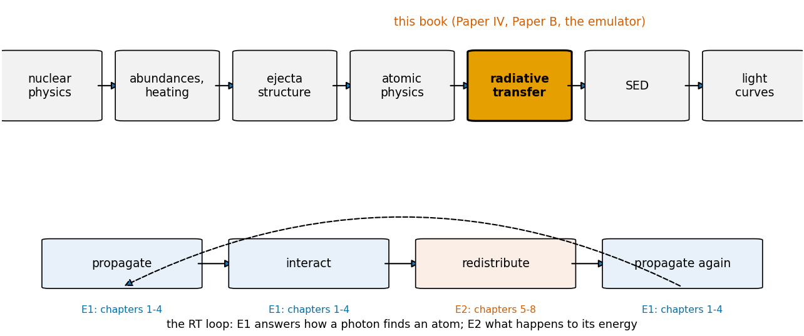

# The entire kilonova chain {#sec-chain .unnumbered}

## Question

Where, in the chain that turns a neutron-star merger into a light curve, does
radiative transfer sit, and what does the transfer step actually do to a
photon? Everything in this book lives inside one box of that chain.

## Theory

A kilonova is the end of a chain:

$$
\text{nuclear physics}
\rightarrow
\text{abundances and heating}
\rightarrow
\text{ejecta structure}
\rightarrow
\text{atomic physics}
\rightarrow
\boxed{\text{radiative transfer}}
\rightarrow
\text{SED}
\rightarrow
\text{light curves}.
$$

The r-process sets the abundances and the radioactive heating; the merger
sets the mass, velocity and density structure of the ejecta; atomic physics
turns abundances, density and temperature into a forest of tens of millions
of bound–bound transitions. Radiative transfer takes that forest and the
heating and produces the spectral energy distribution, whose band integrals
are the light curves.

Inside the transfer box the same loop runs for every packet of radiation:

$$
\boxed{
\text{propagate}
\rightarrow
\text{interact}
\rightarrow
\text{redistribute}
\rightarrow
\text{propagate again}.
}
$$

*Propagate*: move through the expanding gas until something happens.
*Interact*: something happens, with a probability the opacity sets.
*Redistribute*: decide what comes out of the interaction, at which frequency,
in which direction, with how much energy. Then propagate again.

Part I of this book (chapters 1–4) is about the first two verbs. It ends
exactly where a packet, sweeping through a forest of lines in an expanding
medium, finds its next resonance and flips the coin that decides whether it
interacts. Part II is about the third verb, redistribution, and about the
energy bookkeeping that the third verb makes necessary. Part III builds the
effective model of redistribution, a matrix $R_{ij}$, and asks when it is
enough. Part IV puts the pieces back together into a toy transport
calculation and then maps every toy to its production counterpart.

## Limiting cases

If nothing interacts, the transfer box is the identity: the SED at the
surface is the emissivity of the heating. If everything interacts and
thermalises, the emergent spectrum is a blackbody at the temperature of the
last interaction, whatever the atoms were. Real kilonovae sit between the
two, and the whole point of the treatment of opacity and redistribution is to
say how far between.

## Numerical model

There is none in this chapter, only the map. The one thing the map fixes is
vocabulary: an *opacity* is what sets the probability of interacting; a
*redistribution* is what sets the outcome; the *closure* of a coarse-grained
opacity is how far its light curve sits from the resolved calculation. The
research papers of this repository live in that vocabulary. Paper IV asked
how well two coarse opacities survive when redistribution is explicit
fluorescence. Paper B, the calculation this book leads to, asks how much of
the redistribution physics an effective matrix can carry. The emulator asks
whether a learned map can carry the rest.

## Demo

The animation below is the whole of Part I in one picture: packets random
walking through a disc of absorbing gas until they leave. Each step is a
draw from the exponential distribution of chapter 2; each turn is an
interaction that, in this chapter, only changes direction.

```{python}
#| echo: false
from pathlib import Path
from IPython.display import HTML
HTML(Path("../videos/mc_walk.html").read_text())
```

## Visualization

{#fig-chain}

## Validation

Nothing to validate yet. The first quantitative statement is chapter 1's.

## What approximation did we introduce?

The map itself is an approximation: it separates steps that are coupled. The
heating depends on the thermalisation of decay products, which depends on
the density structure; the atomic level populations depend on the radiation
field that the transfer computes. The book keeps the steps separate on
purpose, and chapter 11 is where the coupling first enters, as a state
dependence of the redistribution.

## How does this map to revisit_sobolev?

The transfer loop is the main loop of `paper2/phase1/forest_mc.py::run_mc`.
Its mode string, `<opacity>_<outcome>`, is the two verbs *interact* and
*redistribute* named explicitly: the opacity treatment decides where a
packet interacts, the outcome treatment decides what comes out. The ejecta
structures the production code transports come from `sobolev/ejecta.py`
and, for the secular-ejecta benchmark, from `sobolev/xkn.py`.

## What would fail if our assumption were wrong?

If the transfer box were a small correction, coarse-graining the opacity and
simplifying redistribution would both be harmless and this book would be
short. Paper IV found that under explicit fluorescence two coarse opacities
disagree in colour by several tenths of a magnitude on the same ejecta, so
the box is not a small correction, and how it is coarse-grained matters.

## Exercises

1. Before reading chapter 1, write down what you expect the transmitted
   fraction of light through a slab of optical depth $\tau = 1$ to be, and
   through $\tau = 3$. Chapter 1 will tell you whether you were right.
2. In the animation, count how many steps a typical packet takes to leave.
   Chapter 2 will let you predict that number from the disc's radius in mean
   free paths.
