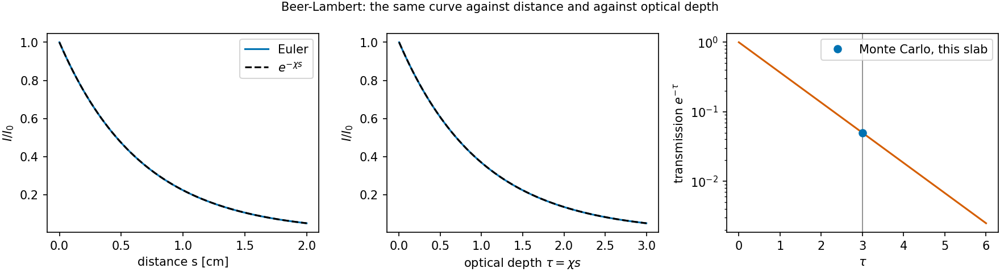

# The transfer equation and Beer–Lambert {#sec-transfer}

```{python}
#| echo: false
import sys, pathlib
sys.path.insert(0, str(pathlib.Path("../src").resolve()))
from rtedu import results
R = results.load("ch01")
```

## Question

What does "optical depth" mean, and why does a beam of light through an
absorbing slab decay as $e^{-\tau}$?

## Theory

The equation of radiative transfer for the specific intensity $I_\nu$ along a
direction $\mathbf n$ is

$$
\frac{1}{c}\frac{\partial I_\nu}{\partial t}
+
\mathbf n\cdot\nabla I_\nu
=
\eta_\nu-\chi_\nu I_\nu ,
$$

with $\eta_\nu$ the emissivity and $\chi_\nu$ the opacity per unit length.
Strip it to a steady beam in a medium that absorbs but does not emit:

$$
\frac{dI}{ds}=-\chi I ,
$$

whose solution is

$$
\boxed{I(s)=I_0e^{-\chi s}=I_0e^{-\tau}},
\qquad
\tau(s)=\int_0^s \chi\,ds' .
$$

The optical depth $\tau$ is the natural coordinate: it counts distance in
units of the mean free path $1/\chi$, and the transmitted fraction depends on
nothing else.

## Limiting cases

For $\tau \ll 1$, $I/I_0 \simeq 1 - \tau$: the slab is transparent and
removes a fraction $\tau$. For $\tau \gg 1$ the slab is opaque and the
transmitted fraction is exponentially small. At $\tau = 1$ exactly a
fraction $1/e$ gets through.

## Numerical model

A plane-parallel slab of geometric depth $d$ and constant opacity $\chi$,
illuminated normally. The notebook integrates $dI/ds = -\chi I$ with an
explicit Euler step and compares with the closed form; then it sends packets
through the same slab with the Monte Carlo method of chapter 2, as a preview.

## Demo

::: {.result}
The slab has $\chi d = $ `{python} f"{R['tau_total']:.2f}"`. The Euler
integration with `{python} f"{R['n_steps']}"` steps gives a transmitted
fraction of `{python} f"{R['transmission_euler']:.4f}"` against the exact
`{python} f"{R['transmission_exact']:.4f}"`, a relative error of
`{python} f"{R['euler_rel_error']:.1e}"`, the truncation error of the
scheme. The Monte Carlo preview with `{python} f"{R['mc_n']:,}"` packets
transmits `{python} f"{R['transmission_mc']:.4f}"`, within the binomial
uncertainty `{python} f"{R['mc_sigma']:.4f}"` of the same number.
:::

## Visualization

{#fig-beer}

## Validation

The Euler curve sits on $e^{-\chi s}$ to the scheme's truncation error, and
`rtedu.slab.Slab.transmission` is the closed form; the notebook asserts both.
The physics as a test is `tests/test_rtedu_slab.py::test_beer_lambert`.

## What approximation did we introduce?

No emission, no scattering, no frequency dependence, no time dependence, a
constant opacity. Each is lifted in turn: chapter 3 adds frequency
dependence and elastic scattering, chapter 4 the expansion that makes the
opacity a function of position through the Doppler shift.

## How does this map to revisit_sobolev?

The Monte Carlo transport of the production code never integrates this
equation; it samples it, as chapter 2 explains. But every one of its legs
reduces to Beer–Lambert on a single line: the analytic attenuation of a line
in `sobolev/sobolev_leg.py::sobolev_attenuation` is $e^{-\tau_S}$, and the
regression test `tests/test_forest_mc.py` checks that the bin legs of the
transport reproduce the analytic attenuation of an uneven forest.

## What would fail if our assumption were wrong?

If the medium emitted as well as absorbed, $I$ would relax toward
$\eta/\chi$ instead of zero; the transmitted fraction would no longer be
$e^{-\tau}$ but $e^{-\tau}$ plus the slab's own emission. That is the source
term the light-curve chapters of the production code carry as radioactive
heating injected per shell.

## Exercises

1. Halve the opacity and double the depth. Predict the transmission before
   running the notebook.
2. Replace the Euler step by the exact update $I_{k+1} = I_k e^{-\chi \Delta s}$.
   Why is the result now exact to roundoff for any step size?
