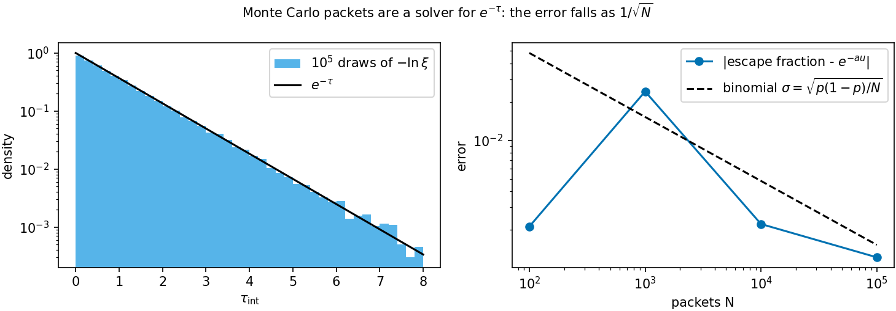

# Why Monte Carlo gives the same answer {#sec-mc}

```{python}
#| echo: false
import sys, pathlib
sys.path.insert(0, str(pathlib.Path("../src").resolve()))
from rtedu import results
R = results.load("ch02")
```

## Question

If a slab transmits $e^{-\tau}$ of a beam, how can sending discrete packets
through it, one at a time, give the same number?

## Theory

Chapter 1 says the intensity surviving to optical depth $\tau$ is
$e^{-\tau}$ of the intensity at zero. Read that as a statement about one
packet: the probability that its first interaction lies beyond $\tau$ is

$$
P(\tau_{\rm int}>\tau)=e^{-\tau}.
$$

So $\tau_{\rm int}$ is exponentially distributed, and if $\xi$ is uniform on
$(0,1)$ then

$$
\boxed{\tau_{\rm MC}=-\ln\xi}
$$

is a draw from that distribution. A packet is transmitted through a slab of
depth $\tau$ exactly when its draw exceeds $\tau$; the transmitted fraction
of many packets estimates $e^{-\tau}$ with the binomial uncertainty
$\sqrt{p(1-p)/N}$.

## Limiting cases

One packet gives 0 or 1. As $N \to \infty$ the estimate converges to
$e^{-\tau}$ as $N^{-1/2}$; there is no faster route, and no bias.

## Numerical model

The slab of chapter 1, $\tau = $ `{python} f"{R['tau_slab']:.1f}"`, and
$10^2$, $10^3$, $10^4$, $10^5$ packets. The notebook's transport is one line:
draw $\tau_{\rm int}$, compare with $\tau$.

## Demo

::: {.result}
The escape fractions are `{python} ", ".join(f"{R['fractions'][str(N)]:.4f}" for N in R['Ns'])` for
$N = 10^2, 10^3, 10^4, 10^5$, against the exact `{python} f"{R['p_exact']:.4f}"`;
the errors `{python} ", ".join(f"{R['errors'][str(N)]:.4f}" for N in R['Ns'])` sit at the binomial
uncertainties `{python} ", ".join(f"{R['sigmas'][str(N)]:.4f}" for N in R['Ns'])`.
The `{python} f"{R['ks_n']:,}"` sampled depths have mean
`{python} f"{R['draws_mean']:.4f}"` and variance `{python} f"{R['draws_var']:.4f}"`
(both 1 for the unit exponential), and their Kolmogorov statistic against <!-- literal-ok -->
$1 - e^{-\tau}$ is `{python} f"{R['ks_D']:.4f}"`, below the one-per-cent
critical value `{python} f"{R['ks_crit']:.4f}"`.
:::

## Visualization

{#fig-mc}

The animation of chapter 0 is the same draw in two dimensions: exponential
step lengths, isotropic turns.

## Validation

`rtedu.packets.sample_tau` is the draw; `propagate_slab` with no scattering
is the single-draw experiment; the notebook asserts both agree with the
one-line version on the same seed. The physics as a test is
`tests/test_rtedu_packets.py::test_tau_sampling_is_exponential`, which
states the Kolmogorov bound and the standard errors of the mean and
variance it checks.

## What approximation did we introduce?

None beyond chapter 1's; the Monte Carlo method is an unbiased estimator of
the same integral. What it adds is noise, and the discipline of never
reading a difference smaller than the noise. That discipline is the "gray"
outcome of the research papers: a reading whose difference lies inside the
packet noise is not read.

## How does this map to revisit_sobolev?

`forest_mc.py::run_mc` draws exactly this $-\ln\xi$ for the continuous
opacity of the expansion-opacity legs, and for a Sobolev line it flips the
coin of chapter 4 instead. The production light curves quote their packet
noise next to every difference; the reading rule that made two of Paper IV's
outcomes Gray is the $1/\sqrt{N}$ of this chapter.

## What would fail if our assumption were wrong?

If the draws were not exponential, the escape fraction would converge to the
wrong number with the right $1/\sqrt{N}$ scaling, which is why the test
checks the distribution and not only the mean.

## Exercises

1. Predict the number of packets needed to measure $e^{-3}$ to ten per
   cent, then check with the notebook.
2. Replace $-\ln\xi$ by $-\ln(1 - \xi)$. Does anything change? Why is one of
   the two forms safer when $\xi$ can be exactly zero?
