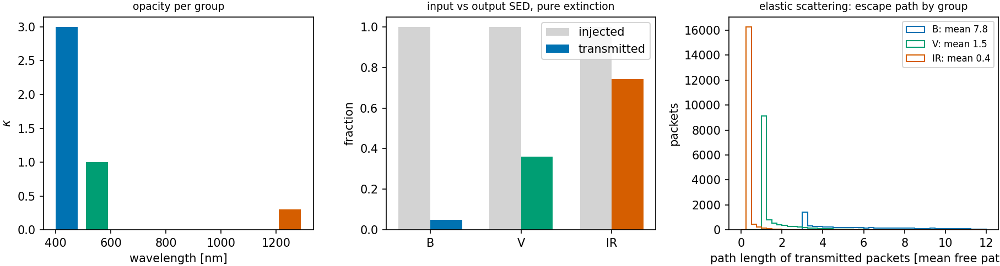

# Adding frequency, without redistribution {#sec-frequency}

```{python}
#| echo: false
import sys, pathlib
sys.path.insert(0, str(pathlib.Path("../src").resolve()))
from rtedu import results
R = results.load("ch03")
```

## Question

If the opacity depends on frequency, what happens to a spectrum sent
through the slab, when no interaction ever changes a packet's frequency?

## Theory

Give the packets three frequency groups, $B$, $V$ and $IR$, with

$$
\kappa_B>\kappa_V>\kappa_{IR}.
$$

Each group obeys chapter 1 on its own:

$$
I_g = I_{g,0}\,e^{-\tau_g}, \qquad \tau_g = \kappa_g d .
$$

Pure extinction reddens the emergent spectrum, because the bluer groups are
removed more. Now let every interaction re-emit the packet isotropically at
the *same* frequency: elastic scattering. Nothing is absorbed, but a bluer
packet interacts more often before it leaves and walks a longer path. The
ladder this chapter climbs is

$$
\text{absorption}
\rightarrow
\text{elastic scattering}
\rightarrow
\text{(chapter 4) a line resonance}
\rightarrow
\text{(chapter 5) redistribution},
$$

and the last rung is deliberately not here: no packet changes its frequency
before chapter 5.

## Limiting cases

If the three opacities were equal, the emergent spectrum would be the
injected one scaled by a single $e^{-\tau}$: extinction without colour. If
$\kappa_{IR} \to 0$ the infrared group passes untouched whatever happens to
the others.

## Numerical model

One slab of depth `{python} f"{R['depth']:.0f}"` (in the units of $1/\kappa$),
opacities `{python} f"{R['kappa']['B']:.1f}"`, `{python} f"{R['kappa']['V']:.1f}"`
and `{python} f"{R['kappa']['IR']:.1f}"` for $B$, $V$, $IR$, equal numbers of
packets per group, first with absorption only and then with elastic
scattering only. Frequency is a label carried by the packet; the notebook's
bookkeeping cannot change it.

## Demo

::: {.result}
Under pure extinction the transmitted fractions are
`{python} f"{R['transmitted']['B']:.3f}"` ($B$),
`{python} f"{R['transmitted']['V']:.3f}"` ($V$) and
`{python} f"{R['transmitted']['IR']:.3f}"` ($IR$), against
$e^{-\tau_g}$ = `{python} f"{R['transmission_exact']['B']:.3f}"`,
`{python} f"{R['transmission_exact']['V']:.3f}"`,
`{python} f"{R['transmission_exact']['IR']:.3f}"`: the emergent spectrum is
redder than the injected one. Under elastic scattering nothing is absorbed;
the transmitted $B$ packets have interacted
`{python} f"{R['scattering']['B']['mean_interactions']:.2f}"` times on average
and walked `{python} f"{R['scattering']['B']['mean_path']:.2f}"` mean free
paths, the $IR$ packets `{python} f"{R['scattering']['IR']['mean_interactions']:.2f}"`
times and `{python} f"{R['scattering']['IR']['mean_path']:.2f}"` mean free paths,
and every packet leaves in the group it entered.
:::

## Visualization

{#fig-groups}

## Validation

`rtedu.slab.ThreeGroupSlab.run` is the same bookkeeping; with `albedo=0` it
is extinction and with `albedo=1` scattering; the notebook asserts the
transmitted fractions against $e^{-\tau_g}$ within the binomial uncertainty
and the ordering of the interaction counts. The test is
`tests/test_rtedu_slab.py::test_three_groups_order_by_opacity_and_keep_their_frequency`.

## What approximation did we introduce?

Three groups instead of a continuum; a frequency-independent scattering
that keeps the frequency; no emission. The first is the coarse-graining
that Part III studies in earnest, as $N_g$ groups of a redistribution
matrix. The second is the approximation the whole book is about lifting:
the key idea of this chapter is that

$$
\boxed{\text{a packet's frequency decides its future transport},}
$$

so anything that changes the frequency at an interaction, which is what
fluorescence does, changes everything that happens afterwards.

## How does this map to revisit_sobolev?

The production code's opacity is a line list rather than three numbers, but
the thermal legs (`<opacity>_thermal` modes of `run_mc`) are this chapter's
elastic scattering with one change: the re-emitted frequency is drawn from
the thermal emissivity rather than kept. Paper IV's complete-redistribution
legs are that treatment, and its fluorescence legs are what chapter 5 and
Part II build.

## What would fail if our assumption were wrong?

If interactions changed the frequency, a blue packet could leave as an
infrared one, and the transmitted infrared fraction would exceed
$e^{-\tau_{IR}}$: the emergent spectrum would no longer be the injected one
times a transmission. That excess is what the fluorescence legs of Paper IV
measure, as colour errors of the coarse opacities.

## Exercises

1. Set $\kappa_B = \kappa_{IR}$. Predict the emergent spectrum under pure
   extinction before running.
2. With elastic scattering, predict how the mean path length of transmitted
   packets scales with $\tau$ for $\tau \gg 1$, then measure it for
   $\tau = 1, 3, 10$.
