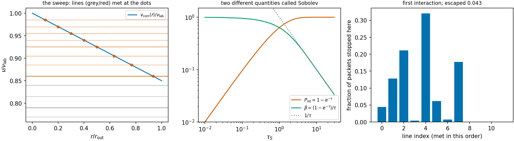

# Expanding ejecta and the Sobolev resonance {#sec-sobolev}

```{python}
#| echo: false
import sys, pathlib
sys.path.insert(0, str(pathlib.Path("../src").resolve()))
from rtedu import results
R = results.load("ch04")
```

## Question

In a medium that expands, a packet's frequency in the frame of the gas
keeps changing. How does the packet find the next line it can interact with,
and what decides whether it does?

## Theory

Kilonova ejecta expand homologously:

$$
v(r,t)=\frac{r}{t}.
$$

A packet of fixed lab-frame frequency $\nu_{\rm lab}$ moving radially
outward sees the gas ahead of it receding, so in the gas frame its frequency
is redshifted,

$$
\nu_{\rm com}(r)\simeq\nu_{\rm lab}\left(1-\frac{\mathbf n\cdot\mathbf v}{c}\right)
=\nu_{\rm lab}\left(1-\frac{r}{ct}\right)
$$

to first order in $v/c$, and it falls monotonically as the packet travels.
The packet therefore sweeps *down* through every line below its launch
frequency, meeting line $\ell$ where

$$
\nu_{\rm com}(r_{\rm res})=\nu_\ell
\quad\Longrightarrow\quad
r_{\rm res}=ct\left(1-\frac{\nu_\ell}{\nu_{\rm lab}}\right),
$$

in order of decreasing $\nu_\ell$, and only if $r_{\rm res}$ lies inside the
ejecta. Because the velocity gradient is large, the resonance is a thin
surface, and the Sobolev approximation gives the line's optical depth there
as a single number, in homologous flow

$$
\tau_S=\frac{\pi e^2}{m_e c}\,f\,n_l\,\lambda_0\,t ,
$$

with $f$ the oscillator strength, $n_l$ the lower-level density and
$\lambda_0$ the rest wavelength. At the resonance the transport flips one
coin,

$$
\boxed{P_{\rm int}=1-e^{-\tau_S}} .
$$

Two different quantities carry the name Sobolev, and E1 keeps them apart:
$P_{\rm int}$ above is the *interaction probability*, the coin; the *escape
probability*

$$
\beta(\tau)=\frac{1-e^{-\tau}}{\tau},
\qquad
\beta\to1\ (\tau\to0),
\qquad
\beta\to\frac1\tau\ (\tau\to\infty),
$$

is the fraction of photons *emitted* in the line that get out of it. The
asymptotes belong to $\beta$, not to $P_{\rm int}$. $\beta$ does not enter
this chapter's transport at all; it enters in Part II, where the atom
re-emits, and "once" per interaction.

## Limiting cases

A line above the launch frequency is never met. A line whose resonance
radius lies beyond the edge is never met. For $\tau_S \ll 1$ the coin is
$P_{\rm int} \simeq \tau_S$; for $\tau_S \gg 1$ the packet interacts with
certainty. The probability of crossing all reachable lines without
interacting is $\prod_\ell e^{-\tau_\ell} = e^{-\sum_\ell \tau_\ell}$.

## Numerical model

A packet of `{python} f"{R['lambda_lab_nm']:.0f}"` nm launched at the
centre at `{python} f"{R['t_days']:.0f}"` d and moving radially outward
through ejecta with edge velocity `{python} f"{R['v_max_c']:.2f}"` $c$, and
`{python} f"{R['n_lines']}"` toy lines below its frequency, each with a toy
$\tau_S$ from a chosen lower-level density. The Doppler shift is first order
in $v/c$ (the production code is exact). The notebook computes the sweep,
the resonance radii, the depths and the coins, and its final exercise is the
E1 exit criterion.

## Demo

::: {.result}
Of the `{python} f"{R['n_lines']}"` lines, `{python} f"{R['n_reachable']}"`
lie within reach before the edge, where the comoving frequency has fallen to
`{python} f"{R['nu_com_edge_over_lab']:.3f}"` of the launch value. Their
Sobolev depths run from `{python} f"{min(R['tau_S']):.3f}"` to
`{python} f"{max(R['tau_S']):.2f}"` and sum to
`{python} f"{R['tau_sum_reachable']:.2f}"`, so a packet escapes all of them
with probability $e^{-\sum\tau}$ = `{python} f"{R['p_escape_exact']:.3f}"`;
`{python} f"{R['n_packets']:,}"` packets escaped with frequency
`{python} f"{R['escaped']:.3f}"`, within the binomial uncertainty
`{python} f"{R['sigma_escape']:.4f}"`. One packet's walk, met line by line:
`{python} "; ".join(f"line {c['line']} at r/r_out {c['r_res_over_r_out']:.2f} (tau {c['tau']:.2f}, P {c['p_int']:.2f}): {'interacted' if c['interacted'] else 'passed'}" for c in R['one_packet'])`.
:::

## Visualization

{#fig-sweep}

```{python}
#| echo: false
from pathlib import Path
from IPython.display import HTML
HTML(Path("../videos/sobolev_sweep.html").read_text())
```

Above: the packet moves outward (top) while its comoving frequency sweeps
down through the lines (bottom); a ring marks a resonance crossed, a star
the one where it interacted.

## Validation

The notebook's from-scratch `find_next_interaction` (the exercise, about
thirty lines) and `rtedu.sobolev.resonance_crossings` are run on the same
random stream and must report the same lines, the same radii and the same
coins; the many-packet escape frequency must match $e^{-\sum\tau}$ within
the binomial uncertainty. The tests are
`tests/test_rtedu_sobolev.py::test_sobolev_interaction_probability`
(the coin, by direct counting within four binomial sigma),
`test_escape_probability_limits` (the asymptotes belong to $\beta$, and
$P_{\rm int} = \tau\beta$ exactly), and
`test_resonance_crossings_in_order_and_only_reachable_lines`.

## What approximation did we introduce?

The Sobolev approximation itself: that the resonance is thin compared with
every scale over which the gas changes, so a line has one optical depth and
one interaction point rather than a profile. The first-order Doppler shift.
No continuum opacity between the lines. And the deliberate stop: what
happens *after* the coin lands is Part II.

## How does this map to revisit_sobolev?

`sobolev/optical_depth.py::tau_sobolev` is this chapter's $\tau_S$ with the
stimulated-emission factor and the level populations of real atoms;
`paper2/phase1/forest_mc.py::ForestAtom.op_p` is the coin,
`-expm1(-op_tau)`, tabulated for every line of a real forest; the crossing
loop of `run_mc` with `relativity="worldline"` is the sweep with the exact
Doppler factor and a clock carried by the packet, and its zoned form walks
the packet through the union of the shells' line sets. The whole of Paper I
in this repository asked how good the Sobolev approximation is against a
resolved line profile; `sobolev/optical_depth.py::sobolev_error` is that
comparison.

## What would fail if our assumption were wrong?

If the lines were not thin, two lines close in frequency would overlap and
the packet could not be assigned to one of them; that is the regime where
the coarse-grained opacities of Paper IV and the redistribution matrix of
Part III have to decide which line absorbed, and it is the information a
binned opacity discards.

## Exercises

1. **The exit criterion.** Without looking at the notebook, write the
   function that takes a packet, a line list with depths, and the ejecta
   edge, and returns the crossings up to the first interaction. Then run the
   notebook's comparison against `resonance_crossings` on your version.
2. Move the edge from `{python} f"{R['v_max_c']:.2f}"` $c$ to $0.3c$. Predict
   which lines become reachable and how the escape probability changes.
3. Double every lower-level density. Predict the escape probability from
   $e^{-\sum\tau}$ before running.
