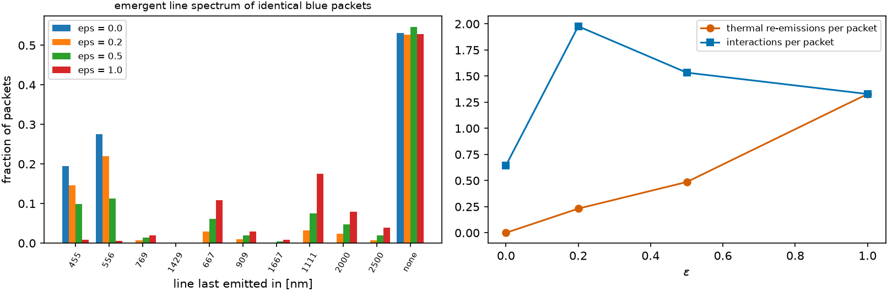

# The scalar ε {#sec-epsilon}

```{python}
#| echo: false
import sys, pathlib
sys.path.insert(0, str(pathlib.Path("../src").resolve()))
from rtedu import results
R = results.load("ch05")
```

## Question

Once a packet has hit a line, what comes out? The simplest answer the
literature gives is a single number, ε. What does that number stand for, and
what does it do to a spectrum?

## Theory

The two-level-atom picture of a line interaction offers two outcomes: the
photon is *scattered* coherently, re-emitted in the same line, or it is
*thermalised*, its energy returned to the gas and re-emitted from the
thermal emissivity. A single parameter interpolates:

$$
R^{(\epsilon)} = (1-\epsilon)\,R_{\rm coherent} + \epsilon\,R_{\rm thermal}.
$$

With $\epsilon = 0$ the line identity never changes at an interaction; with
$\epsilon = 1$ it is forgotten completely and the exit line is drawn from
the emissivity $n_u A_{ul} h\nu_{ul}$ of the gas. In an expanding medium the
sweep of chapter 4 continues after either outcome: a packet re-emitted in
line $\ell$ at radius $r$ has the comoving frequency $\nu_\ell$ there, is
seen in the lab at $\nu_\ell/(1 - r/ct)$, and redshifts on into every line
below $\nu_\ell$.

## Limiting cases

$\epsilon = 0$: frequency changes only through the Doppler sweep, so a
packet launched blue can only move redward, line by line, and can never
reach a line that lies above its current comoving frequency. $\epsilon = 1$:
after one interaction the launch frequency is forgotten; the emergent
spectrum is set by the emissivity and by which lines the re-emitted packet
still has to cross. Thermal re-emission into a *bluer* line restarts the
sweep from higher up, which is why the interaction count is not monotonic
in ε.

## Numerical model

The five-level atom of chapter 6 at the book's standard state:
`{python} f"{R['T']:.0f}"` K, `{python} f"{R['n_total']:.0f}"` atoms per
cubic centimetre, `{python} f"{R['t_days']:.0f}"` d, edge at
`{python} f"{R['v_max_c']:.1f}"` $c$. Identical packets launched just blue of
the `{python} f"{R['launch_nm']:.0f}"` nm line, and the sweep of chapter 4
with the ε rule applied at every interaction. The notebook's ε model is
eight lines.

## Demo

::: {.result}
With `{python} f"{R['n_packets']:,}"` packets per value of ε, the fraction of
packets that leave after last emitting in a line redward of one micron is
`{python} f"{R['red_fraction']['0.0']:.3f}"` at $\epsilon = 0$,
`{python} f"{R['red_fraction']['0.2']:.3f}"` at $\epsilon = 0.2$,
`{python} f"{R['red_fraction']['0.5']:.3f}"` at $\epsilon = 0.5$ and
`{python} f"{R['red_fraction']['1.0']:.3f}"` at $\epsilon = 1$: the single knob moves
a third of the blue packets into the infrared. The interactions per packet
are `{python} f"{R['n_int']['0.0']:.2f}"`, `{python} f"{R['n_int']['0.2']:.2f}"`,
`{python} f"{R['n_int']['0.5']:.2f}"` and `{python} f"{R['n_int']['1.0']:.2f}"`,
highest at small nonzero ε because a thermal re-emission into a bluer line
restarts the sweep; about `{python} f"{R['spectra']['1.0'][-1]:.2f}"` of the
packets cross the whole forest without interacting at all, whatever ε.
:::

## Visualization

{#fig-epsilon}

## Validation

`rtedu.redistribution.EpsilonRedistribution` and `rtedu.transport.run` are
the notebook's two pieces; on the same random stream they give the same
exit line for every packet at ε = 0 and ε = 1 (asserted). The tests are
`tests/test_rtedu_atom.py::test_epsilon_model_limits` (the thermal fraction
is ε within the binomial noise) and
`tests/test_rtedu_transport.py::test_coherent_scattering_keeps_the_line_identity_at_every_interaction`.

## What approximation did we introduce?

Everything about the atom has been replaced by one number and one
emissivity. The thermal emissivity is that of the gas in equilibrium; the
coherent branch ignores that a real line has an escape probability. And the
transport is one-dimensional: no angular redistribution, no trapping. The
teaching point is that

$$
\boxed{\epsilon\text{ is one knob controlling an enormously complicated process.}}
$$

## How does this map to revisit_sobolev?

The `sobolev_tla` and `expansion_tla` modes of `run_mc` are this chapter's
model on a real forest, with `eps` the knob; the thermal modes of Paper IV's
complete-redistribution legs are ε = 1 with the thermal sampler of a real
ion. `docs/epsilon_radiative_transfer_textbook_review_guide.md` is the
textbook background for the parameter.

## What would fail if our assumption were wrong?

If the outcome of an interaction depended on which line absorbed, no
single ε would reproduce it: the same ε would be too thermal for one line
and too coherent for another. That is what chapters 6 to 8 build, and what
Part III measures as the difference between ε and a matrix.

## Exercises

1. Predict the ε = 0 spectrum before running: which lines can a packet
   launched at `{python} f"{R['launch_nm']:.0f}"` nm ever be last emitted in?
2. Launch the packets at the `{python} f"{R['lines_nm'][7]:.0f}"` nm line
   instead. Which value of ε now produces the *bluest* emergent spectrum,
   and why?
