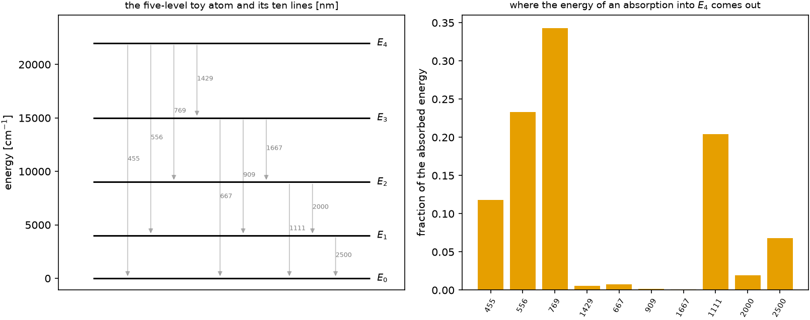

# An atom from first principles {#sec-atom}

```{python}
#| echo: false
import sys, pathlib
sys.path.insert(0, str(pathlib.Path("../src").resolve()))
from rtedu import results
R = results.load("ch06")
```

## Question

Forget kilonovae. What does one atom do with the energy of a photon it has
absorbed, and how many photons come back out?

## Theory

A toy atom with five levels $E_0 < E_1 < \dots < E_4$ and an Einstein
coefficient $A_{ul}$ for every allowed downward transition. From an excited
level $u$ the atom decays by one of its lines with probability

$$
P(u\to l)=\frac{A_{ul}}{\sum_k A_{uk}},
$$

emits a photon of energy $E_u - E_l$, and continues from $l$ until it reaches
the ground. The sequence is a *cascade*; energy is conserved by
construction because the photon energies telescope to $E_u - E_0$. This is
fluorescence at the microscopic level: one photon in, one or more photons
out, at frequencies the atom chooses.

## Limiting cases

If every level had a single downward line the cascade would be
deterministic. If the top level's strongest line went straight to the
ground, most absorptions would be pure scattering. Our atom has one strong
route with a stop-over, $4\to2\to0$, and weaker side branches, so the
photon count varies from cascade to cascade.

## Numerical model

Levels at `{python} ", ".join(f"{e:.0f}" for e in R['levels_cm'])` cm$^{-1}$,
`{python} f"{R['n_lines']}"` lines from
`{python} f"{min(R['lines_nm']):.0f}"` to `{python} f"{max(R['lines_nm']):.0f}"` nm,
Einstein coefficients chosen by hand; the notebook writes the branching and
the cascade in twelve lines and runs `{python} f"{R['n_cascades']:,}"`
cascades from the top level.

## Demo

::: {.result}
From $E_4$ the branching probabilities are
`{python} ", ".join(f"{p:.3f}" for p in R['branching_from_4'])` for the lines to
$E_0$, $E_1$, $E_2$ and $E_3$. The cascades took `{python} f"{R['n_routes']}"`
distinct routes; the three most common were
`{python} "; ".join(f"{k} ({v:.3f})" for k, v in list(R['top_routes'].items())[:3])`,
and the mean number of photons per cascade was
`{python} f"{R['mean_photons_per_cascade']:.2f}"`. The energy absorbed into
$E_4$ comes out `{python} f"{100 * R['energy_fraction_per_line'][2]:.0f}"` per
cent in the `{python} f"{R['lines_nm'][2]:.0f}"` nm line and
`{python} f"{100 * R['energy_fraction_per_line'][7]:.0f}"` per cent in the
`{python} f"{R['lines_nm'][7]:.0f}"` nm line, its two-step route.
:::

## Visualization

{#fig-atom}

```{python}
#| echo: false
from pathlib import Path
from IPython.display import HTML
HTML(Path("../videos/cascade.html").read_text())
```

Above: cascades one at a time; the highlighted level is where the atom is,
the red arrow the transition, the caption the emitted wavelength.

## Validation

`rtedu.atom.ToyAtom.branching` reproduces the notebook's probabilities and
every cascade ends at the ground with its photon energies summing to
$E_4$; the tests are `tests/test_rtedu_atom.py::test_branching_probabilities_sum_to_one`
and `test_cascade_reaches_the_ground_and_conserves_energy`.

## What approximation did we introduce?

No collisions, no upward radiative transitions, no stimulated emission,
unit statistical weights, and a level list chosen for teaching rather than
measured. And the cascade emits photons one at a time; a Monte Carlo
transport that carries *packets* cannot split a packet into two photons of
different frequency, which is exactly the problem chapters 7 and 8 solve.

## How does this map to revisit_sobolev?

The real atoms are the calibrated lanthanide ions of the GSI list and the
Japan–Lithuania list, with thousands of levels and up to a million lines
each (`sobolev/atomic_cache.py`); their branching tables are
`paper2/phase1/forest_mc.py::ForestAtom.branch_cum`. The Ce/Nd/La level
networks play the role of this chapter's five levels in the production
macroatom.

## What would fail if our assumption were wrong?

If the branching ratios depended on the radiation field, through
stimulated emission or radiative pumping, the cascade would not be a
property of the atom alone. Paper IV's radiation-field-driven macroatom
test is the check that its conclusions survive when upward transitions are
allowed under an imposed field.

## Exercises

1. Set $A_{42}$ to zero. Predict the new branching from $E_4$ and the mean
   number of photons per cascade before running.
2. Which single Einstein coefficient, doubled, would move the most energy
   into the infrared lines?
