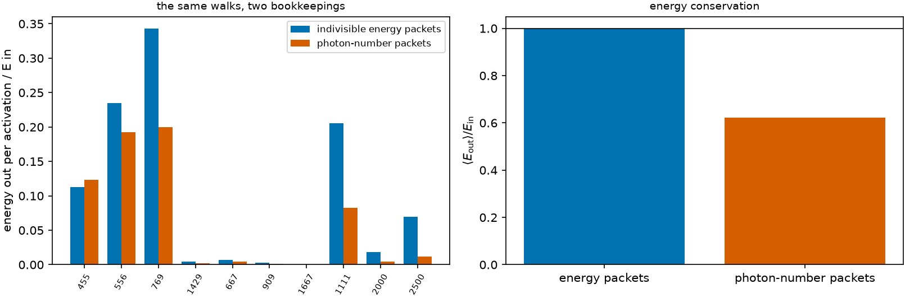

# Photon number versus energy packets {#sec-packets}

```{python}
#| echo: false
import sys, pathlib
sys.path.insert(0, str(pathlib.Path("../src").resolve()))
from rtedu import results
R = results.load("ch07")
```

## Question

A Monte Carlo transport carries packets, not photons. When a packet's atom
re-emits at a different frequency, what stays fixed, the number of photons
the packet represents or its energy? The two answers give different light
curves.

## Theory

A packet absorbed in a line at frequency $\nu$ carries energy $E$ and
represents $w = E/h\nu$ photons. After a cascade the atom re-emits at some
exit line $\nu'$. Two bookkeepings:

- **Photon-number packets** keep $w$ and give every photon the new
  frequency: $E_{\rm out} = w\,h\nu'$, which is less than $E$ whenever
  $\nu' < \nu$. The energy the cascade put into the *other* photons of the
  route is simply lost.
- **Indivisible energy packets** keep $E$ and let the photon number change,
  $w' = E/h\nu'$: energy is conserved event by event, and the exit line is
  chosen with a probability proportional to the *energy* the cascade puts
  into it, not the number of photons.

The second is the contract of the production code
(`sobolev/energy_packets.py`), and the reason this chapter exists is the
finding F50 of this repository: the photon-number bookkeeping mis-stated the
energy-conserving reference by one to two magnitudes and, at grid density,
created energy. Every result of Papers II and III built on it was redone.

## Limiting cases

For a two-level atom the two bookkeepings coincide: $\nu' = \nu$ always.
The difference grows with the asymmetry of the cascade, which is why a
lanthanide with thousands of levels is the worst case.

## Numerical model

The same walks (the macroatom rule of chapter 8, with every escape
probability one) for an absorption at `{python} f"{R['absorbed_nm']:.0f}"` nm
into $E_4$, `{python} f"{R['n']:,}"` times, under both bookkeepings.

## Demo

::: {.result}
Indivisible energy packets return `{python} f"{R['energy']['E_out_mean']:.3f}"`
of the absorbed energy per activation, exactly. Photon-number packets return
`{python} f"{R['photon']['E_out_mean']:.3f}"` on average, between
`{python} f"{R['photon']['E_out_min']:.3f}"` (a walk that left through the
`{python} f"{R['lines_nm'][3]:.0f}"` nm line, keeping the photon count of a
`{python} f"{R['absorbed_nm']:.0f}"` nm packet) and
`{python} f"{R['photon']['E_out_max']:.3f}"`: a deficit of
`{python} f"{R['deficit_percent']:.0f}"` per cent of the energy, lost without
any absorption having happened.
:::

## Visualization

{#fig-packets}

## Validation

`rtedu.macroatom.ToyMacroAtom` in `mode="energy"` returns exactly the
input energy on every activation and in `mode="photon"` reproduces the
notebook's deficit; the test is
`tests/test_rtedu_macroatom.py::test_macroatom_energy_conservation`.

## What approximation did we introduce?

Energy packets conserve the *comoving* energy at each interaction; the
lab-frame energy still changes with the Doppler shift between absorption
and re-emission, and that change is real work done on the expanding gas.
The toy of this chapter ignores it; the production code books it as $W$
and reports it next to the escaped energy.

## How does this map to revisit_sobolev?

`run_mc(packets="energy")` versus `packets="photon"`, and the docstring of
`sobolev/energy_packets.py`, which is the canonical statement of the
contract. F50 in the results report is the measurement of the difference
on a real state; the ladder $R_1 \to R_1^{\rm E} \to R_2$ separates the
bookkeeping from the transition probabilities.

## What would fail if our assumption were wrong?

If energy were not conserved event by event, a light curve could brighten
or fade for reasons that are not physics, and the closure errors of the
coarse opacities of Paper IV would be inseparable from the bookkeeping
error. With energy packets the bookkeeping cannot contribute.

## Exercises

1. Compute by hand the mean energy a photon-number packet returns if the
   only route were $4\to2\to0$.
2. Design a three-level atom for which photon-number packets *gain* energy
   on average.
