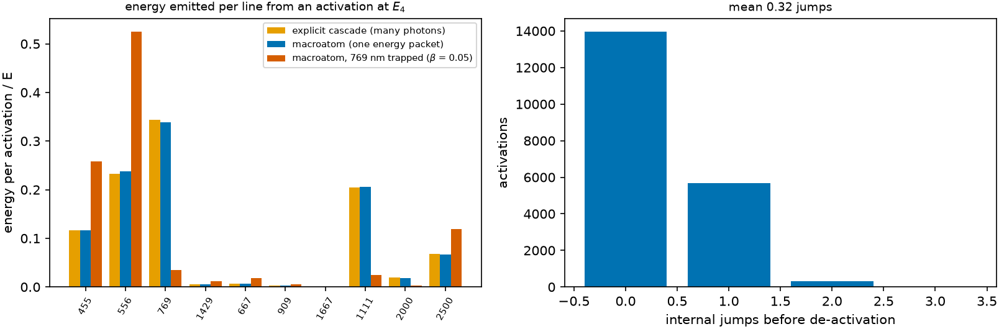

# The macroatom {#sec-macroatom}

```{python}
#| echo: false
import sys, pathlib
sys.path.insert(0, str(pathlib.Path("../src").resolve()))
from rtedu import results
R = results.load("ch08")
```

## Question

How can a transport that carries one indivisible packet reproduce a cascade
that emits several photons? By turning the atom into a Markov process over
its internal states, in which the packet's energy either stays inside or
leaves in one piece.

## Theory

Lucy's macroatom. The packet *activates* the atom at level $i$. At each
step, from level $i$ with energy $\epsilon_i$ above the ground, it either
**de-activates** through the line $i \to j$, with weight

$$
A_{ij}\,\beta_{ij}\,(\epsilon_i-\epsilon_j),
$$

the energy of that line, emitting one packet of its full energy at
$\nu_{ij}$, or **jumps** internally to $j$ with weight

$$
A_{ij}\,\beta_{ij}\,\epsilon_j,
$$

the energy that stays in the atom, and continues from $j$. The escape
probability $\beta_{ij}$ of chapter 4 enters once per emission: a line that
traps its photons is left less often. With every $\beta = 1$ the expected
energy the macroatom emits in each line equals the energy the explicit
cascade of chapter 6 puts there, so the packet transport and the photon
picture agree in expectation while every event conserves energy.

## Limiting cases

From the first excited level the only outcome is de-activation to the
ground. A line with $\beta \to 0$ is never used; its energy takes the other
routes. With no side branches the macroatom reduces to coherent scattering.

## Numerical model

The atom of chapter 6, `{python} f"{R['n_states']}"` states and
`{python} f"{R['n_transitions']}"` transitions; `activate`, `step`,
`deactivate` in the notebook's fifteen lines; `{python} f"{R['n']:,}"`
activations at $E_4$, then the same with the
`{python} f"{R['trapped_line_nm']:.0f}"` nm line given
$\beta = $ `{python} f"{R['beta_trap']:.2f}"`.

## Demo

::: {.result}
From $E_4$ the de-activation probabilities are
`{python} ", ".join(f"{p:.3f}" for p in R['p_deactivate_from_4'])` and the
jump probabilities `{python} ", ".join(f"{p:.3f}" for p in R['p_jump_from_4'])`.
A walk makes `{python} f"{R['mean_jumps']:.2f}"` internal jumps on average
before it de-activates. The energy per line agrees with the explicit
cascade to `{python} f"{R['max_dev_macro_cascade']:.3f}"` at worst (the Monte
Carlo noise). Trapping the `{python} f"{R['trapped_line_nm']:.0f}"` nm line
lowers the energy leaving through it from
`{python} f"{R['E_line_macro'][2]:.3f}"` to `{python} f"{R['E_line_trapped'][2]:.3f}"`,
with the total still one.
:::

## Visualization

{#fig-macroatom}

```{python}
#| echo: false
from pathlib import Path
from IPython.display import HTML
HTML(Path("../videos/macroatom.html").read_text())
```

Above: the macroatom walking; a blue arrow is an internal jump, a red one
the de-activation that takes the whole energy out.

## Validation

`rtedu.macroatom.ToyMacroAtom.probabilities` equals the notebook's weights
and its energy per line agrees with the cascade; the tests are
`test_macroatom_probabilities_sum_to_one_and_use_the_lucy_weights`,
`test_macroatom_reproduces_the_cascade_energy_per_line` and
`test_beta_once_changes_the_exit_distribution`.

## What approximation did we introduce?

Downward transitions only, no collisions, $\beta$ from a prescribed line
list rather than from the transport itself, and an imposed activation
level. This is the *downward macroatom* of the production code; the full
Lucy macroatom adds upward radiative jumps under the local radiation field,
which the production code carries only as a robustness test with an
imposed field.

## How does this map to revisit_sobolev?

`sobolev/macroatom.py::DownwardMacroAtom` uses exactly these weights on
the real level networks, tabulated per level; its docstring states "beta
once" and the dead-end rule; `MacroAtom` adds the upward jumps. The
`*_dmacro` modes of `run_mc` are the fluorescence legs of Paper IV.

## What would fail if our assumption were wrong?

If the de-activation weights were the photon-number branching of chapter
6 rather than the energy weights, the packet would leave through the wrong
line too often and the energy per line would not match the cascade; that
is the "transition probabilities" half of F50. The test that the macroatom
reproduces the cascade energy is the guard.

## Exercises

1. Work out by hand the de-activation and jump probabilities from $E_3$.
2. Give every line $\beta = 0.5$. Predict whether the exit distribution
   changes at all, then run.
