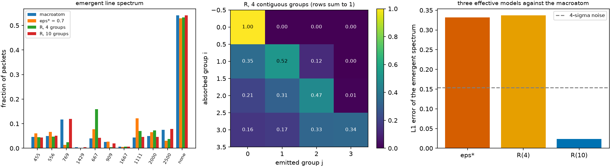

# Build $R_{ij}$ from the macroatom {#sec-matrix}

```{python}
#| echo: false
import sys, pathlib
sys.path.insert(0, str(pathlib.Path("../src").resolve()))
from rtedu import results
R = results.load("ch09")
```

## Question

If the atom decides what comes out of an interaction, can we record what
it decides, throw the atom away, and keep only the record? This is the
idea of the effective redistribution matrix, and the educational version
of the Paper B experiment.

## Theory

Cut the frequency axis into $N_g$ groups. Run the macroatom transport and
count, for every interaction, the group $i$ of the absorbed line and the
group $j$ of the emitted line:

$$
\boxed{R_{ij}=\frac{N(i\to j)}{\sum_k N(i\to k)}} .
$$

Since every packet carries the same energy, $R_{ij}$ is the fraction of the
energy absorbed in group $i$ that leaves in group $j$. A transport that
uses $R$ alone draws the exit group from row $i$ and then, because it no
longer knows which line inside the group the atom would have chosen, draws
a line inside the group from a fixed weight, the thermal emissivity. That
within-group draw is exactly the information the binning discarded. The
comparison is always three-way:

$$
\epsilon^\star
\quad\text{versus}\quad
R
\quad\text{versus}\quad
\text{macroatom},
$$

with the macroatom as the reference and $\epsilon^\star$ the single number
that fits it best.

## Limiting cases

With one group, $R = 1$ and the model is ε = 1 with the emissivity: pure
thermalisation. With one group per line nothing is discarded and the
$R$ transport must reproduce the macroatom within the Monte Carlo noise.
Between the two, the error is the price of the binning.

## Numerical model

The standard state, `{python} f"{R['n']:,}"` blue packets, the macroatom in
the transport with β from the line list, `{python} f"{R['n_events']:,}"`
interaction events (`{python} f"{R['nint_macro']:.1f}"` per packet, since
a re-emission into a bluer line restarts the sweep). The matrix is built
at `{python} f"{R['n_g']}"` contiguous groups and at ten; ε* is the best of
eleven values on a grid.

## Demo

::: {.result}
The `{python} f"{R['n_g']}"`-group matrix has rows
`{python} "; ".join("[" + ", ".join(f"{v:.2f}" for v in row) + "]" for row in R['R'])`.
Against the macroatom's emergent spectrum, the L1 errors are
`{python} f"{R['err']['eps']:.3f}"` for ε* = `{python} f"{R['eps_star']:.1f}"`,
`{python} f"{R['err']['R4']:.3f}"` for $R$ with `{python} f"{R['n_g']}"` groups and
`{python} f"{R['err']['R10']:.3f}"` for $R$ with ten, where the four-sigma noise
level is `{python} f"{R['noise']:.3f}"`. The models store
`{python} f"{R['params']['eps']}"`, `{python} f"{R['params']['R4']}"`,
`{python} f"{R['params']['R10']}"` and `{python} f"{R['params']['macro']}"` numbers
respectively (the last being levels plus lines of the atom); the macroatom
transport costs the most because every interaction walks the level
network, the other two only draw from a table. In colour, ε* misses the
macroatom's $i - J$ by `{python} f"{R['dcol']['eps']['i-J']:+.2f}"` mag and the
four-group $R$ by `{python} f"{R['dcol']['R4']['i-J']:+.2f}"` mag.
:::

## Visualization

{#fig-matrix}

```{python}
#| echo: false
from pathlib import Path
from IPython.display import HTML
HTML(Path("../videos/compare_models.html").read_text())
```

Above: one packet's line history under ε, under $R$ and under the
macroatom, interaction by interaction.

## Validation

`rtedu.matrix.build_R` reproduces the notebook's six-line matrix; the tests
are `tests/test_rtedu_matrix.py::test_R_rows_sum_to_one` and
`test_R_reproduces_macroatom_distribution`, which requires the ten-group
transport to match the macroatom within four sigma and the two-group one
not to.

## What approximation did we introduce?

The matrix is a property of the state it was built in (chapter 11), the
within-group draw is a choice (the emissivity, here), and the groups are
contiguous in frequency. Everything the atom knows about *which* line
absorbed is gone.

## How does this map to revisit_sobolev?

`paper3/redistribution/kernel.py::RedistributionKernel.from_branching_mc`
builds $R$ from the production transport's events in exactly this way, on
log-spaced groups, with energy rows and a within-group discrete-line draw;
the `sobolev_group` mode of `run_mc` transports with it. Paper III's
compression sweep and rank analysis are chapter 10 on real ions.

## What would fail if our assumption were wrong?

If the atom's choice of exit line depended on which line absorbed *within*
a group, no within-group weight could recover it and the error would not
fall with the number of groups until the groups were single lines. Whether
the real lanthanide forests behave that way is the question Paper B asks.

## Exercises

1. Predict the one-group matrix before building it, and which ε it equals.
2. Build $R$ with the *photon-number* packets of chapter 7 instead. Which
   rows change, and in which direction?
