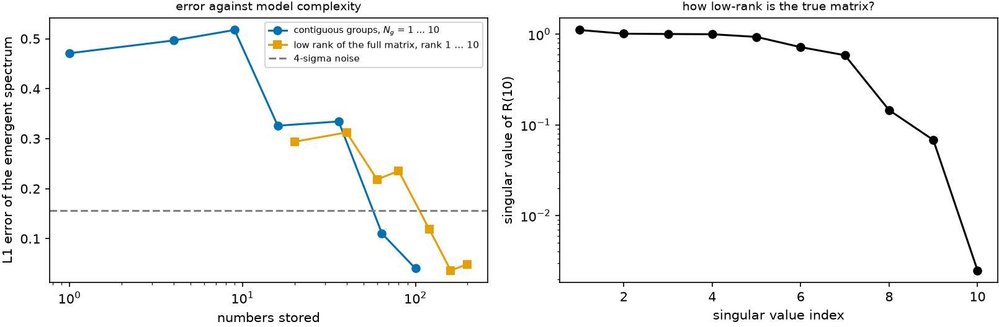

# Why the matrix works or fails {#sec-resolution}

```{python}
#| echo: false
import sys, pathlib
sys.path.insert(0, str(pathlib.Path("../src").resolve()))
from rtedu import results
R = results.load("ch10")
```

## Question

How many numbers does the effective model need, and does it matter
whether they are spent on finer frequency groups or on more components of
a low-rank factorisation?

## Theory

Two ways to compress a matrix of redistribution. *Contiguous grouping*
keeps frequency locality: the $N_g \times N_g$ matrix at coarser resolution.
*Low rank* keeps the leading structure: the truncated singular value
decomposition of the full ten-line matrix, clipped to be non-negative and
renormalised, with $2 \times 10 \times k$ numbers at rank $k$. The two
spend their numbers differently, and the error against the reference
tells which information the transport actually needs.

## Limiting cases

One group is pure thermalisation; ten groups is exact. Rank one is a
single outer product, every row the same up to scale; rank ten is exact.

## Numerical model

The standard state, `{python} f"{R['n']:,}"` packets per model, the macroatom
as reference, $N_g$ = `{python} ", ".join(str(v) for v in R['Ngs'])` and
rank `{python} ", ".join(str(v) for v in R['ranks'])`.

## Demo

::: {.result}
The error of the grouped matrix falls from `{python} f"{R['err_resolution'][0]:.3f}"`
at one group to `{python} f"{R['err_resolution'][-1]:.3f}"` at ten, crossing
the four-sigma noise level `{python} f"{R['noise']:.3f}"` at
`{python} f"{R['first_below_noise_Ng']}"` groups. The low-rank approximation
falls from `{python} f"{R['err_rank'][0]:.3f}"` at rank one to
`{python} f"{R['err_rank'][-1]:.3f}"` at rank ten, crossing the noise at rank
`{python} f"{R['first_below_noise_rank']}"`. The singular values of the full
matrix are `{python} ", ".join(f"{v:.2f}" for v in R['singular_values'][:5])`
and smaller: the matrix is far from rank one.
:::

## Visualization

{#fig-resolution}

## Validation

`rtedu.matrix.low_rank` returns non-negative rows summing to one and is
exact at full rank; the test is
`tests/test_rtedu_matrix.py::test_low_rank_and_interpolation_keep_rows_normalised`.

## What approximation did we introduce?

The clipped SVD is a stand-in for a proper non-negative factorisation; the
groups are contiguous by construction. The error metric is the L1
distance of the emergent line spectrum, one of several one could choose.

## How does this map to revisit_sobolev?

Paper III's `paper3/phase1_groups/compression.py` sweeps the group count
from 4 to 128 on real ions and `paper3/phase7_rank/rank.py` measures the
non-negative rank of the group-to-group structure; this chapter is the
same experiment on ten lines, where the answer can be read by eye.

## What would fail if our assumption were wrong?

If the true redistribution were low rank and non-local, the low-rank curve
would fall faster than the grouping curve, and the right effective model
would be a factorisation rather than a band matrix. The error-versus-
complexity figure is the central figure of the Paper B plan for exactly
that reason.

## Exercises

1. Before running, guess the rank at which the low-rank error first falls
   below the noise. Explain it from the singular values afterwards.
2. Replace the L1 error by a colour error ($i - J$). Does the ranking of
   the two compressions change?
