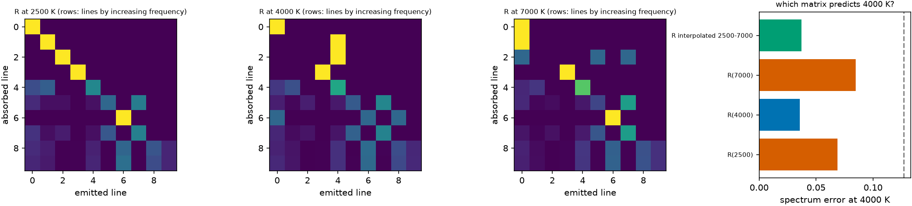

# State dependence {#sec-state}

```{python}
#| echo: false
import sys, pathlib
sys.path.insert(0, str(pathlib.Path("../src").resolve()))
from rtedu import results
R = results.load("ch11")
```

## Question

The matrix was built in one state. What happens when the gas is hotter or
cooler, and can a matrix built elsewhere, or between two others, stand in?

## Theory

The macroatom's weights carry the escape probabilities $\beta_{ij}$, and
those depend on the line depths, which depend on the level populations,
which depend on the temperature. So $R = R(T)$ (and, in general, of the
density and the radiation field). Three choices for a state not in the
table: use the nearest tabulated matrix, interpolate row by row in
$\log T$ between the two neighbours, or learn the map (chapter 12).

## Limiting cases

At very low temperature only the ground level is populated, the lines
from excited levels vanish, and $R$ tends to a fixed matrix; at very high
temperature every line is thick and $\beta \to 1/\tau$ reweights every
route. Between the two the matrix moves smoothly.

## Numerical model

Matrices at `{python} ", ".join(f"{v:.0f}" for v in R['Ts'])` K at full
resolution, one group per line (`{python} f"{R['n_g']}"` groups), so that
the binning error of chapter 10 is absent and only the state matters;
`{python} f"{R['n']:,}"` packets each; the test state is
`{python} f"{R['T_test']:.0f}"` K, transported with each matrix and with the
interpolation between the two outer temperatures.

## Demo

::: {.result}
At `{python} f"{R['T_test']:.0f}"` K the matrix built there gives a spectrum
error of `{python} f"{R['errs']['R(4000)']:.3f}"` (the noise level is
`{python} f"{R['noise']:.3f}"`); the `{python} f"{R['Ts'][0]:.0f}"` K matrix
gives `{python} f"{R['errs']['R(2500)']:.3f}"`, the `{python} f"{R['Ts'][2]:.0f}"` K
matrix `{python} f"{R['errs']['R(7000)']:.3f}"`, and the interpolation between
them `{python} f"{R['errs']['R interpolated 2500-7000']:.3f}"`. The row errors
against the true matrix are `{python} f"{R['row_err']['R(2500)']:.3f}"`,
`{python} f"{R['row_err']['R(7000)']:.3f}"` and
`{python} f"{R['row_err']['R interpolated 2500-7000']:.3f}"`.
:::

## Visualization

{#fig-state}

```{python}
#| echo: false
from pathlib import Path
from IPython.display import HTML
HTML(Path("../videos/matrix_T.html").read_text())
```

Above: the matrix morphing as the temperature rises.

## Validation

`rtedu.matrix.interpolate_R` keeps rows normalised and clamps at the table
ends; the test is
`tests/test_rtedu_matrix.py::test_low_rank_and_interpolation_keep_rows_normalised`.

## What approximation did we introduce?

Only the temperature varies; density and the radiation field are held
fixed, and the populations are Boltzmann. In the production code the
state is $(T, \rho, J_\nu)$ and the populations can be Saha–Boltzmann.

## How does this map to revisit_sobolev?

Paper III's temperature and epoch transfer tests are this chapter on real
ions; the Paper B plan's transferability test is the same question with
whole states held out, which is chapter 12's split.

## What would fail if our assumption were wrong?

If $R$ changed abruptly with temperature, through a level that populates
suddenly, interpolation in $\log T$ would miss it and a tabulation would
need to be dense there; the smoothness of the animation is the evidence
that the toy does not do that.

## Exercises

1. Which group's row changes most between the coldest and hottest matrix,
   and which line is responsible?
2. Interpolate between the two *nearest* temperatures instead of the two
   outer ones and predict whether the error falls.
