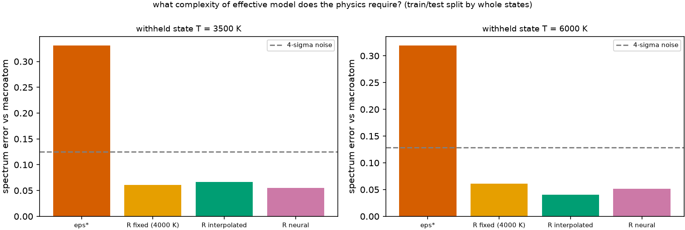

# A neural surrogate, and whether it is needed {#sec-surrogate}

```{python}
#| echo: false
import sys, pathlib
sys.path.insert(0, str(pathlib.Path("../src").resolve()))
from rtedu import results
R = results.load("ch12")
```

## Question

Only now do we bring in a learned model. Not because networks are better,
but to ask a precise question: what complexity of effective model does the
physics actually require?

## Theory

A network maps the state and the absorbed group to a row of $R$:

$$
(\log T,\ i)\ \longrightarrow\ P(j).
$$

Ours is two layers of numpy: a hidden layer of tanh units, a softmax
output, cross-entropy against the tabulated rows, and gradient descent
written out. It is compared with three models that need no training:
$\epsilon^\star$ (the best single number on the training states), $R$
fixed at one state, and $R$ interpolated between neighbours. The split is
by *whole physical states*: every row of a held-out temperature is absent
from training. A random split of events would leak the held-out state
into the training set and would test interpolation between neighbouring
rows, not transfer between states.

## Limiting cases

With the held-out temperature between two training temperatures, the
interpolation is a strong baseline and a network can at best match it.
With extrapolation beyond the table, interpolation clamps and a network
extrapolates its own way; neither is trustworthy.

## Numerical model

Matrices at `{python} f"{len(R['T_grid'])}"` temperatures from
`{python} f"{R['T_grid'][0]:.0f}"` to `{python} f"{R['T_grid'][-1]:.0f}"` K at full
resolution (`{python} f"{R['n_g']}"` groups, one per line, so the map to be
learned is the state dependence alone); `{python} ", ".join(f"{v:.0f}" for v in R['held_out'])` K withheld;
a network of `{python} f"{R['n_hidden']}"` hidden units and
`{python} f"{R['n_weights']}"` weights trained on the remaining
`{python} f"{R['n_train_states']}"` states; the error measured through the
transport, `{python} f"{R['n']:,}"` packets per model.

## Demo

::: {.result}
At the withheld `{python} f"{R['held_out'][0]:.0f}"` K the spectrum errors are
`{python} f"{R['results']['3500']['errs']['eps*']:.3f}"` for ε*,
`{python} f"{R['results']['3500']['errs']['R fixed (4000 K)']:.3f}"` for the fixed matrix,
`{python} f"{R['results']['3500']['errs']['R interpolated']:.3f}"` for the interpolated one and
`{python} f"{R['results']['3500']['errs']['R neural']:.3f}"` for the network, against a
noise level of `{python} f"{R['results']['3500']['noise']:.3f}"`. At
`{python} f"{R['held_out'][1]:.0f}"` K they are
`{python} f"{R['results']['6000']['errs']['eps*']:.3f}"`,
`{python} f"{R['results']['6000']['errs']['R fixed (4000 K)']:.3f}"`,
`{python} f"{R['results']['6000']['errs']['R interpolated']:.3f}"` and
`{python} f"{R['results']['6000']['errs']['R neural']:.3f}"` (noise
`{python} f"{R['results']['6000']['noise']:.3f}"`). The row errors of the
interpolated and the learned matrices against the true one are
`{python} f"{R['results']['3500']['rows']['R interpolated']:.3f}"` and
`{python} f"{R['results']['3500']['rows']['R neural']:.3f}"` at the first state.
:::

## Visualization

{#fig-surrogate}

## Validation

`rtedu.surrogate.MLP` is the notebook's network; the test
`tests/test_rtedu_matrix.py::test_surrogate_learns_a_table_and_holds_out_whole_states`
checks that the loss falls, that a withheld state is absent from training,
and that the prediction there is within a stated row error.

## What approximation did we introduce?

A tiny network on a tiny table; no density or radiation-field axis; one
random initialisation. The conclusion to draw is not about networks but
about the map: on this atom the map from temperature to matrix is smooth
enough that interpolation does as well as learning, so the extra
complexity is not required by the physics.

## How does this map to revisit_sobolev?

There is no learned model in the production code yet. The Paper B plan's
emulator question is this chapter with $(T, \rho, J_\nu)$ as the state and
real ions; its test design, whole states withheld, is fixed here.

## What would fail if our assumption were wrong?

If the true map were not smooth in the state, interpolation would fail
where the network might not, and that difference, on withheld states,
would be the justification for a learned model. Without it there is none.

## Exercises

1. Withhold the *lowest* temperature instead. Which model degrades most,
   and why is that an extrapolation for both?
2. Split the events at random instead of by state and watch the network's
   error fall: explain why that number would be meaningless.
