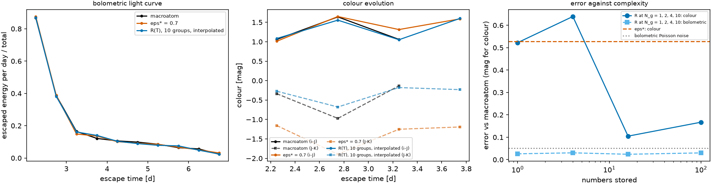

# A miniature end-to-end transport {#sec-mini}

```{python}
#| echo: false
import sys, pathlib
sys.path.insert(0, str(pathlib.Path("../src").resolve()))
from rtedu import results
R = results.load("ch13")
```

## Question

Put everything back together: sources, propagation in three dimensions
with time, Sobolev interactions, redistribution, escape. Run it three ways
from the same launch, with ε*, with $R(T)$ and with the macroatom, and ask
what a light curve and its colours can tell the three apart. This is the
miniature Paper B.

## Theory

Along any straight ray in homologous flow the comoving frequency falls
linearly with the path length,
$\nu_{\rm com}(s) = \nu_{\rm lab}\,(1 - (\mathbf x\cdot\mathbf n + s)/ct)$,
so chapter 4's sweep holds in three dimensions whatever the direction. A
packet meets line $\ell$ at $s_\ell = ct(1 - \nu_\ell/\nu_{\rm lab}) - \mathbf x\cdot\mathbf n$
if that point lies ahead of it and inside the sphere of radius $v_{\max}t$.
After an interaction it is re-emitted isotropically, which is where
*trapping* comes from: a packet can now move inward and take longer to
leave. Its clock advances by $s/c$; the gas it meets is evaluated at its
own time, with $\rho \propto t^{-3}$ so $\tau \propto t^{-2}$, and a
prescribed temperature $T(t) = T_0 (t/t_0)^{-\alpha}$. The sources are a
stored field at $t_0$ and radioactive heating $\propto t^{-1.3}$; the light
curve is the escaped energy per unit escape time; the bands are top hats
over the ten lines. There is no gas energy equation and the Doppler shift
is first order: this is the same loop as the production light curves, on
ten lines, and not a kilonova model.

## Limiting cases

With every line removed the packets free-stream out over the light-crossing
time of the sphere and the light curve is the source's time profile smeared
by that crossing. With every line thick the packets are trapped and the
light curve is delayed and broadened; the colours then depend on which
lines the packets are last emitted in, which is the redistribution.

## Numerical model

`{python} f"{R['n_init']:,}"` stored-field packets at `{python} f"{R['t0_d']:.0f}"` d
and `{python} f"{R['n_heat']:,}"` heating packets over
`{python} f"{R['t0_d']:.0f}"` to `{python} f"{R['t1_d']:.0f}"` d, the same launch for
every model; temperature from `{python} f"{R['T0']:.0f}"` K falling to
`{python} f"{R['T_end']:.0f}"` K; the edge at `{python} f"{R['v_max_c']:.1f}"` $c$.
The three models: ε* = `{python} f"{R['eps_star']:.1f}"` from chapter 9,
$R(T)$ at full resolution interpolated in a table of
`{python} f"{len(R['T_grid'])}"` temperatures, and the macroatom with β from
the line list at the packet's own time.

## Demo

::: {.result}
All three light curves peak at `{python} f"{R['t_peak_d']['macroatom']:.2f}"` d
with about `{python} f"{R['n_int']['macroatom']:.1f}"` interactions per packet,
and no packet reached the interaction cap. Bolometrically the closures are
indistinguishable: the L1 distance of the ε* curve from the macroatom's is
`{python} f"{R['err']['eps']:.3f}"` and of the $R(T)$ curve
`{python} f"{R['err']['R']:.3f}"`, both below the Poisson noise
`{python} f"{R['noise_lc']:.3f}"` of the reference. The colours are not. Over
the `{python} f"{R['n_colour_bins']}"` time bins with enough packets to
measure them, ε* misses the macroatom's $J - K$ by
`{python} f"{R['dcol']['eps']['J-K']:.2f}"` mag on average and its $i - J$ by
`{python} f"{R['dcol']['eps']['i-J']:.2f}"` mag, while $R(T)$ misses them by
`{python} f"{R['dcol']['R']['J-K']:.2f}"` and `{python} f"{R['dcol']['R']['i-J']:.2f}"` mag.
Against complexity, the mean colour error of a matrix built at the launch
state is `{python} f"{R['complexity']['1']['err_colour']:.2f}"` mag with one
group, `{python} f"{R['complexity']['2']['err_colour']:.2f}"` with two,
`{python} f"{R['complexity']['4']['err_colour']:.2f}"` with four and
`{python} f"{R['complexity']['10']['err_colour']:.2f}"` with ten, while the
bolometric error stays at `{python} f"{R['complexity']['1']['err_bol']:.3f}"` to
`{python} f"{R['complexity']['2']['err_bol']:.3f}"` throughout.
:::

## Visualization

{#fig-mini}

```{python}
#| echo: false
from pathlib import Path
from IPython.display import HTML
HTML(Path("../videos/full_packet.html").read_text())
```

Above: one packet from creation to escape under the macroatom, its path in
the growing sphere and the line it sits in against its own clock.

## Validation

`tests/test_rtedu_transport3d.py`: with every line removed every packet
escapes within the light-crossing time with its frequency unchanged; with
lines the packets are trapped and the binned light curve conserves the
escaped energy. The chapter-9 matrix and the chapter-8 macroatom are the
models, unchanged.

## What approximation did we introduce?

Everything the chapter already listed: first-order Doppler, no expansion
work booked, a prescribed temperature and no gas energy equation, a state
frozen for each flight, ten lines, top-hat bands, and a colour measurement
that the fading light curve supports in only a few time bins.

## How does this map to revisit_sobolev?

This is Paper IV's light-curve experiment on ten lines: `run_mc` in time
slabs with the packets' own clocks (`t_stop`, `resume`, `launch_energy`),
`sobolev/timeslab.py`, and `paper4/phase10_fontes/lightcurve.py`, with the
three treatments being opacity closures there and redistribution closures
here. The result rhymes with the paper's finding F66: bolometric agreement
does not imply spectral agreement.

## What would fail if our assumption were wrong?

If the colours of the three models had agreed as well as their bolometric
curves, the redistribution would be irrelevant to the observable and a
scalar ε would do; the colour residuals are the evidence that it is not,
and they are the quantity the Paper B experiment will read.

## Exercises

1. Set the heating to zero and predict the light curve from chapter 2's
   free-streaming argument before running.
2. Halve the edge velocity. Which model's colours change most, and why does
   the bolometric curve barely notice?
